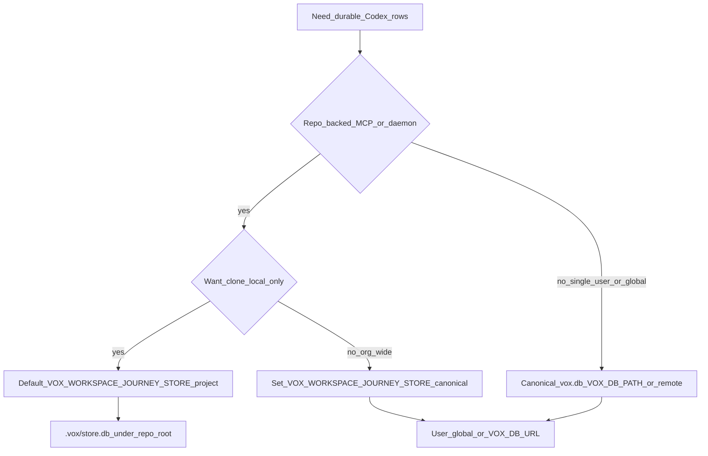

# VoxDB connection policy (SSOT)

Surfaces must pick an explicit policy so Codex is never **silently** dropped on critical paths while optional tools can degrade with clear remediation.

## Policy types

| Policy | When | Behavior |
|--------|------|----------|
| **Strict** | Runtime, most CLI commands | `VoxDb::connect` / `connect_canonical_strict`; propagate `StoreError`. |
| **Degraded optional** | MCP stdio, optional cloud throughput | `vox_db::connect_canonical_optional` with `DbConnectSurface`; `None` + structured `tracing::warn`. |
| **Legacy primary (training)** | Mens training DB thread only | `VoxDb::connect_default`; `LegacySchemaChain` until primary is migrated (no automatic `vox_training_telemetry.db` attach). |

**Telemetry availability:** surfaces using **degraded optional** connect (`None` when Codex is absent) do not append Codex rows (`research_metrics`, `populi_control_event`, completion ingest, and similar). That is expected; it is not silent misconfiguration. Operator-oriented telemetry SSOT: [telemetry-trust-ssot](telemetry-trust-ssot.md).

Remediation string: `vox_db::REMEDIATION_CANONICAL_DB` (`crates/vox-db/src/connect_policy.rs`).

## Callsites (inventory)

| Surface | Crate / entry | Policy | Notes |
|---------|----------------|--------|-------|
| MCP server | `vox-mcp/src/main.rs` | Degraded optional | Persistence off when DB missing; agent keeps running. |
| Populi cloud resolver | `vox-populi/.../cloud/resolver.rs` | Degraded optional | Throughput profiles empty when DB absent; providers still work. |
| Mens training DB thread | `vox-populi/.../candle_qlora_train/db_thread.rs` | Canonical `connect_default` | Fails closed on legacy primary until [voxdb cutover runbook](../operations/voxdb-cutover-runbook.md). |
| `vox-runtime` | `vox-populi` / `vox-runtime/src/db.rs` | Strict | Fails fast on connect errors. |
| CLI research / DB / publication | `vox-cli` (many `connect_default`) | Strict | Errors bubble to user. |
| Orchestrator | `vox-orchestrator` | Optional `Arc<VoxDb>` | Features skip when `db` missing. |

## Adding new callsites

1. Choose policy from the table above.
2. Use [`connect_canonical_optional`](../../../crates/vox-db/src/connect_policy.rs) or [`connect_canonical_strict`]; avoid ad-hoc `.ok()` on `connect_default` unless the surface is explicitly optional and logs remediation.

## Which store should I use? (decision tree)

- **Default (`project`):** interactive journeys write to `.vox/store.db` under the discovered repo root — good for per-clone isolation.
- **`canonical`:** same env resolution as user-global Codex (`VOX_DB_*`); use when operators want one remote Turso / one `vox.db` across many working copies.
- **`vox codex verify`** prints workspace journey mode, a **redacted** summary of the canonical config used by that command, baseline `schema_version` digest, and a pointer to the [voxdb cutover runbook](../operations/voxdb-cutover-runbook.md) for legacy primaries.

## Related

- Canonical store env: `docs/src/reference/env-vars.md` — `VOX_DB_PATH`, Turso URL/token.
- Mens training: `docs/src/reference/mens-training.md` — canonical `connect_default` + legacy migration.
- Cutover: [`docs/src/operations/voxdb-cutover-runbook.md`](../operations/voxdb-cutover-runbook.md).

