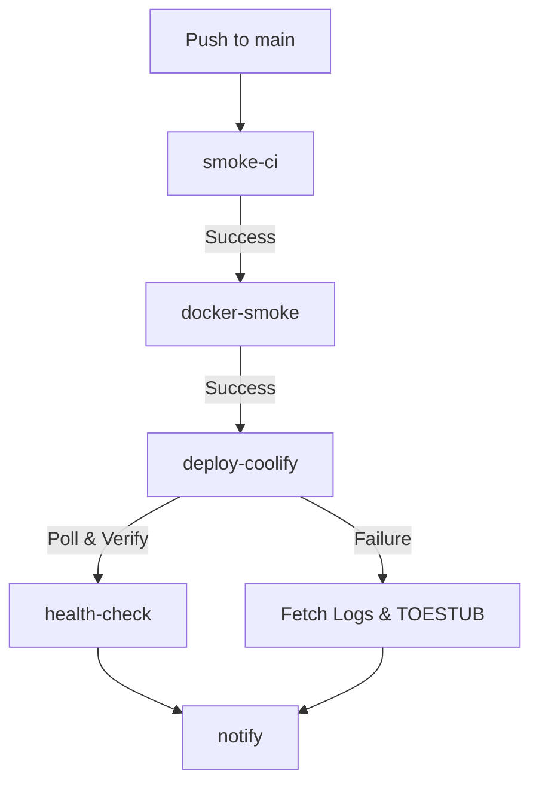

# Coolify Deployment Contract

This document outlines the deployment contract and automated CI/CD pipeline for the Vox ecosystem deployed to the Hetzner VPS via Coolify.

## Pipeline Overview

Deploys are managed by the `.github/workflows/deploy-hetzner.yml` GitHub Actions workflow. The workflow is triggered automatically on `push: main`.

## Secrets (Clavis Managed)

The `vox-foundation/vox` repository requires the following GitHub Secrets, which are also securely mapped into the `vox-clavis` registry for local CLI operations (`vox deploy --target coolify`).

| Clavis Secret ID | GHA Secret Name | Description |
|---|---|---|
| `CoolifyWebhookUrl` | `COOLIFY_WEBHOOK_URL` | The deploy trigger URL from Coolify. |
| `CoolifyBaseUrl` | `COOLIFY_BASE_URL` | Base URL of the Coolify dashboard (e.g. `http://...:8000`). |
| `CoolifyToken` | `COOLIFY_TOKEN` | Bearer API token with `deploy` permissions. |
| `CoolifyAppUuid` | `COOLIFY_APP_UUID` | Target application UUID to poll and pull logs from. |

*Note: Accessing these secrets via raw `std::env::var` in Rust source code is prohibited. Use `vox_clavis::resolve_secret(SecretId::CoolifyToken)` instead.*

## AI Auto-Healing Loop

Instead of blindly failing CI and requiring manual GitHub inspection, the deployment workflow implements a passive AI feedback loop:

1. **Upload Status**: `deploy-hetzner.yml` uploads a `deploy-status.json` artifact and writes full Docker error logs to the Job Summary.
2. **Local Sync**: The CLI command `vox ci deploy-status` pulls the latest run summary via the GitHub API and writes it to `~/.vox/deploy-status.md`.
3. **Passive Read**: Agentic tools automatically read `~/.vox/deploy-status.md` to identify failures and recommend self-healing fixes.

## Coolify Mitigations

- **Webhook Race Conditions**: Coolify sometimes triggers before an image is available. The `deploy-coolify` job mitigates this by actively polling the `/api/v1/deployments/{uuid}` endpoint rather than using a blind `sleep 90`.
- **Missing UI Logs**: Failed Coolify builds sometimes drop logs in the web UI. We mitigate this by programmatically fetching the API logs *and* running a fallback `docker logs` command via the runner.
