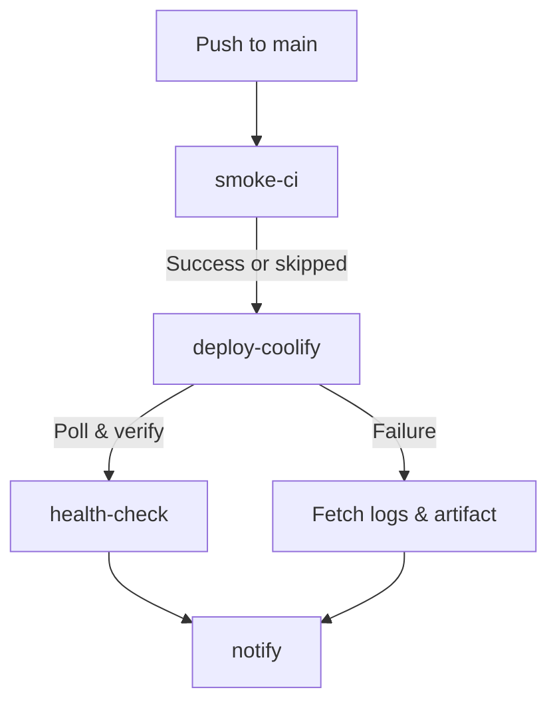

# Coolify Deployment Contract

This document outlines the deployment contract and automated CI/CD pipeline for the Vox ecosystem deployed to the Hetzner VPS via Coolify.

## Pipeline Overview

Deploys are managed by the `.github/workflows/deploy-hetzner.yml` GitHub Actions workflow. The workflow is triggered automatically on `push: main`.

## Deploy trigger (Coolify API)

Gate 2 triggers deploy in this order (Bearer **`COOLIFY_TOKEN`** on each HTTP call unless noted):

1. **`GET`** [`…/api/v1/deploy?uuid={application_uuid}`](https://coolify.io/docs/api-reference/api/operations/deploy-by-tag-or-uuid) — intended to work with an API token that has **Deploy** scope (Coolify returns **`deployments[0].deployment_uuid`**).
2. **`GET`** [`…/api/v1/applications/{uuid}/start?instant_deploy=true`](https://coolify.io/docs/api-reference/api/operations/start-application-by-uuid) — used when the token also has **Write** (single-object **`deployment_uuid`**).
3. Optional **`COOLIFY_WEBHOOK_URL`**: unauthenticated **`GET`** first (manual webhook style), then **`GET`** with **`Authorization: Bearer`**.
4. **`GET`** `…/api/v1/applications/{uuid}/deployments` — newest **`uuid`** when the response is an array or wraps rows under **`data`**.

Webhook and login HTML responses are ignored for JSON parsing so the job can still reach the deployments list fallback.

## Secrets (Clavis Managed)

The `vox-foundation/vox` repository requires the following GitHub Secrets, which are also securely mapped into the `vox-clavis` registry for local CLI operations (`vox deploy --target coolify`).

| Clavis Secret ID | GHA Secret Name | Description |
|---|---|---|
| `CoolifyWebhookUrl` | `COOLIFY_WEBHOOK_URL` | Optional fallback if **`/api/v1/deploy`** and **`/start`** do not return a UUID (manual-style URL may work without Bearer). |
| `CoolifyBaseUrl` | `COOLIFY_BASE_URL` | Origin of the Coolify instance **without** a trailing slash (e.g. `http://...:8000`). Requests use `…/api/v1/…`. |
| `CoolifyToken` | `COOLIFY_TOKEN` | Bearer API token with **Deploy** (for **`/api/v1/deploy`**) **and Read** (for **`GET /api/v1/deployments/…`**, list, and logs). Deploy-only tokens time out in Gate 2 with HTTP **403** `Missing required permissions: read`. |
| `CoolifyAppUuid` | `COOLIFY_APP_UUID` | Target application UUID to poll and pull logs from. |

*Note: Accessing these secrets via raw `std::env::var` in Rust source code is prohibited. Use `vox_clavis::resolve_secret(SecretId::CoolifyToken)` instead.*

### Operator checklist (GitHub Secrets + Coolify UI)

When Gate 2 fails authentication or polling, verify **in Coolify first**, then mirror into **GitHub repository secrets**:

- **API token scopes:** Use **Deploy** (to trigger **`GET /api/v1/deploy`**) **and Read** (to poll **`GET /api/v1/deployments/{uuid}`**, list deployments, and fetch logs). A **Deploy-only** token produces **HTTP 403** `Missing required permissions: read` on polling. **`/applications/{uuid}/start`** may still require **Write**; the workflow tries **`/deploy`** first.
- **`COOLIFY_BASE_URL`:** Public origin only, **no trailing slash**, and must resolve to your Coolify **API host** (not a random proxy path).
- **`COOLIFY_APP_UUID`:** The **application** resource UUID in Coolify (same app you poll in the UI).
- **`COOLIFY_WEBHOOK_URL`:** Optional. Must be the **Deploy Webhook** URL for that resource—not the dashboard `/login` page. An HTML redirect to **`/login`** in workflow logs usually means this secret is wrong.
- **`COOLIFY_WEBHOOK_URL` + Bearer:** If Coolify expects this URL **without** an `Authorization` header, rely on step 3 of Gate 2 (unauthenticated **`GET`** is attempted before Bearer).

## AI Auto-Healing Loop

Instead of blindly failing CI and requiring manual GitHub inspection, the deployment workflow implements a passive AI feedback loop:

1. **Upload Status**: `deploy-hetzner.yml` uploads a `deploy-status.json` artifact and writes full Docker error logs to the Job Summary.
2. **Local Sync**: The CLI command `vox ci deploy-status` pulls the latest run summary via the GitHub API and writes it to `~/.vox/deploy-status.md`.
3. **Passive Read**: Agentic tools automatically read `~/.vox/deploy-status.md` to identify failures and recommend self-healing fixes.

## Coolify Mitigations

- **Stale deploy identity**: Gate 2 tries **`/api/v1/deploy?uuid=`** first, then **`/applications/{uuid}/start`**, then webhooks, then listing recent deployments, before polling **`/api/v1/deployments/{uuid}`**.
- **Missing UI Logs**: Failed Coolify builds sometimes drop logs in the web UI. We mitigate this by programmatically fetching the API logs *and* running a fallback `docker logs` command via the runner.
