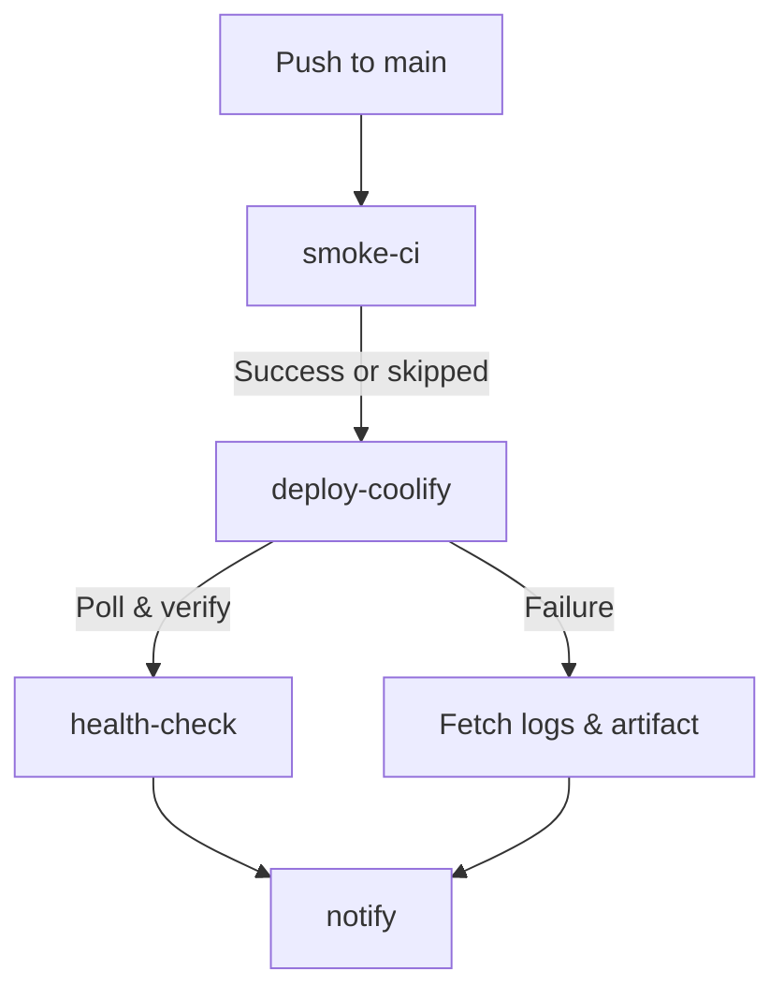

# Coolify Deployment Contract

This document outlines the deployment contract and automated CI/CD pipeline for the Vox ecosystem deployed to the Hetzner VPS via Coolify.

## Pipeline Overview

Deploys are managed by the `.github/workflows/deploy-hetzner.yml` GitHub Actions workflow. The workflow is triggered automatically on `push: main`.

## Gate 3 — Production HTTPS (eval sandbox)

Compose SSOT for this stack lives at **[`vox-eval.compose.yml`](../../../vox-eval.compose.yml)** (mirror under **`docker/vox-eval.compose.yml`** for compose paths rooted in **`docker/`**). Operators should ensure **`COOLIFY_APP_UUID`** is the Coolify **Docker Compose** application that serves **`eval.vox-lang.org`** (not another app on the same instance). Use **`vox ci coolify-eval discover`** locally with repository secrets mirrored into env to confirm **`uuid`**, **`fqdn`**, and **`docker_compose_raw`** before relying on Gate 3. Full topology and DNS: **[eval sandbox deployment](../architecture/eval-sandbox-deployment.md)**.

After Coolify reports a finished deployment, **`deploy-hetzner.yml`** verifies:

1. **`GET`** `COOLIFY_BASE_URL/api/v1/applications/{COOLIFY_APP_UUID}` with a read-capable token returns **HTTP 200**.
2. **Public routing + TLS:** **`curl`** (Ubuntu/OpenSSL CA store, **no** `-k`) against **`https://eval.vox-lang.org/health`** until **HTTP 200** or timeout (~4 minutes, 24 × 10s). This confirms the hostname is bound in Traefik, a trusted certificate chain is presented, and a healthy backend responds.

Optional repository secret **`COOLIFY_PUBLIC_EVAL_HEALTH_URL`** overrides the default URL (same checks).

Manual **`workflow_dispatch`** may set **`skip_public_health_probe: true`** only for incidents — default is strict.

### When Gate 3 fails (operator cheatsheet)

| Symptom | Likely cause |
|--------|----------------|
| **`curl: (60)` / untrusted certificate / self-signed** | Edge TLS not using Let’s Encrypt (or wrong resolver); fix Coolify **Generate TLS Certificates** / Traefik **`certresolver`** for `eval.vox-lang.org`. |
| **HTTP 503** body **`no available server`** | Traefik has no reachable backend (container stopped, failing healthcheck, or router **`Host`** rule mismatch). |
| **HTTP 404** on plain **HTTP** while HTTPS misconfigured | Confirm Coolify routes port **443** for this service and HTTP→HTTPS redirect middleware exists. |

Live probes should use **`curl`** with default verification (not **`curl -k`**) before declaring production healthy.

**Provisioning:** From a checkout with Coolify credentials in the environment (or resolved via vox-secrets locally), **`vox ci coolify-eval sync-compose`** pushes the composed YAML from **`vox-eval.compose.yml`** to **`PATCH /api/v1/applications/{uuid}`** and can trigger deploy. Optional workflow: **[`.github/workflows/coolify-eval-sync.yml`](../../../.github/workflows/coolify-eval-sync.yml)** (`workflow_dispatch`: discover-only vs sync).

## Deploy trigger (Coolify API)

Gate 2 triggers deploy in this order (**`COOLIFY_TOKEN`** Bearer for triggers; **`${COOLIFY_READ_TOKEN:-$COOLIFY_TOKEN}`** for read-only fallback steps 4+, polling, logs, Gate 3 when **`COOLIFY_READ_TOKEN`** is set):

1. **`GET`** [`…/api/v1/deploy?uuid={application_uuid}`](https://coolify.io/docs/api-reference/api/operations/deploy-by-tag-or-uuid) — intended to work with an API token that has **Deploy** scope (Coolify returns **`deployments[0].deployment_uuid`**).
2. **`GET`** [`…/api/v1/applications/{uuid}/start?instant_deploy=true`](https://coolify.io/docs/api-reference/api/operations/start-application-by-uuid) — used when the token also has **Write** (single-object **`deployment_uuid`**).
3. Optional **`COOLIFY_WEBHOOK_URL`**: unauthenticated **`GET`** first (manual webhook style), then **`GET`** with **`Authorization: Bearer`**.
4. **`GET`** `…/api/v1/applications/{uuid}/deployments` — newest **`uuid`** when the response is an array or wraps rows under **`data`** (uses read-capable token as above).

Webhook and login HTML responses are ignored for JSON parsing so the job can still reach the deployments list fallback.

## Secrets (vox-secrets Managed)

The `vox-foundation/vox` repository requires the following GitHub Secrets, which are also securely mapped into the `vox-secrets` registry for local CLI operations (`vox deploy --target coolify`).

| Secret ID | GHA Secret Name | Description |
|---|---|---|
| `CoolifyWebhookUrl` | `COOLIFY_WEBHOOK_URL` | Optional fallback if **`/api/v1/deploy`** and **`/start`** do not return a UUID (manual-style URL may work without Bearer). |
| `CoolifyBaseUrl` | `COOLIFY_BASE_URL` | Origin of the Coolify instance **without** a trailing slash (e.g. `http://...:8000`). Requests use `…/api/v1/…`. |
| `CoolifyToken` | `COOLIFY_TOKEN` | Bearer for **Deploy** (**`/api/v1/deploy`**, **`/start`**, webhooks). Should also include **Read** unless you set **`COOLIFY_READ_TOKEN`**. Deploy-only **`COOLIFY_TOKEN`** without **`COOLIFY_READ_TOKEN`** fails Gate 2 with HTTP **403** `Missing required permissions: read`. |
| `CoolifyReadToken` | `COOLIFY_READ_TOKEN` | Optional. Bearer with **Read** for listing deployments, **`GET /api/v1/deployments/{uuid}`**, deployment/application logs, and Gate 3 application probe. When unset, **`COOLIFY_TOKEN`** is used for those calls. |
| `CoolifyAppUuid` | `COOLIFY_APP_UUID` | Target application UUID to poll and pull logs from. For Gate 3 this must be the **eval** compose app that terminates **`eval.vox-lang.org`** (verify with **`vox ci coolify-eval discover`** if unsure). |
| _(optional)_ | `COOLIFY_PUBLIC_EVAL_HEALTH_URL` | Overrides **`https://eval.vox-lang.org/health`** for Gate 3 public HTTPS + TLS verification. |

*Note: Accessing these secrets via raw `std::env::var` in Rust source code is prohibited. Use `vox_secrets::resolve_secret(SecretId::CoolifyToken)` and, when splitting read vs deploy credentials, `SecretId::CoolifyReadToken`.*

### Operator checklist (GitHub Secrets + Coolify UI)

When Gate 2 fails authentication or polling, verify **in Coolify first**, then mirror into **GitHub repository secrets**:

- **API token scopes:** Either (a) one token with **Deploy + Read** in **`COOLIFY_TOKEN`**, or (b) **Deploy** in **`COOLIFY_TOKEN`** and **Read** in **`COOLIFY_READ_TOKEN`**. A **Deploy-only** **`COOLIFY_TOKEN`** with no read secret fails polling with **HTTP 403** `Missing required permissions: read`. **`/applications/{uuid}/start`** may still require **Write**; the workflow tries **`/deploy`** first.
- **`COOLIFY_BASE_URL`:** Public origin only, **no trailing slash**, and must resolve to your Coolify **API host** (not a random proxy path).
- **`COOLIFY_APP_UUID`:** The **application** resource UUID in Coolify (same app you poll in the UI).
- **`COOLIFY_WEBHOOK_URL`:** Optional. Must be the **Deploy Webhook** URL for that resource—not the dashboard `/login` page. An HTML redirect to **`/login`** in workflow logs usually means this secret is wrong.
- **`COOLIFY_WEBHOOK_URL` + Bearer:** If Coolify expects this URL **without** an `Authorization` header, rely on step 3 of Gate 2 (unauthenticated **`GET`** is attempted before Bearer).
- **Re-run deploy:** GitHub Actions → **Deploy Hetzner (Coolify)** → **Run workflow**, or locally: `gh workflow run "Deploy Hetzner (Coolify)" -f skip_tests=true` (omit `-f skip_tests` to run Rust smoke gates first). Use **`skip_public_health_probe=true`** only during incidents when the public eval URL is intentionally broken — default keeps verified **`curl`** HTTPS checks.

## AI Auto-Healing Loop

Instead of blindly failing CI and requiring manual GitHub inspection, the deployment workflow implements a passive AI feedback loop:

1. **Upload Status**: `deploy-hetzner.yml` uploads a `deploy-status.json` artifact and writes full Docker error logs to the Job Summary.
2. **Local Sync**: The CLI command `vox ci deploy-status` pulls the latest run summary via the GitHub API and writes it to `~/.vox/deploy-status.md`.
3. **Passive Read**: Agentic tools automatically read `~/.vox/deploy-status.md` to identify failures and recommend self-healing fixes.

## Coolify Mitigations

- **Stale deploy identity**: Gate 2 tries **`/api/v1/deploy?uuid=`** first, then **`/applications/{uuid}/start`**, then webhooks, then listing recent deployments, before polling **`/api/v1/deployments/{uuid}`**.
- **Missing UI Logs**: Failed Coolify builds sometimes drop logs in the web UI. We mitigate this by programmatically fetching the API logs *and* running a fallback `docker logs` command via the runner.
