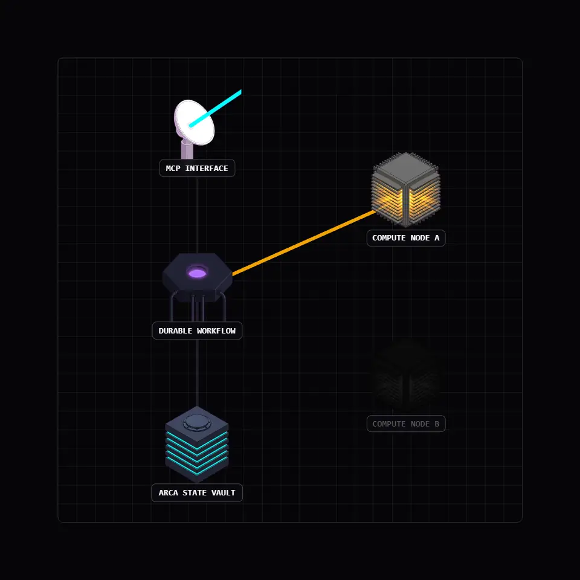

# Compiler Architecture

The Vox compiler follows a modular pipeline architecture with conceptual stages. The current implementation is consolidated under `crates/vox-compiler/src/`, where each stage is represented by explicit modules.

Current implementation note: the practical pipeline is currently consolidated under `crates/vox-compiler/src/` for lexer, parser, AST, HIR, typecheck, and emitters. This document keeps conceptual stage boundaries while implementation modules may live in one crate.

---

## Pipeline Overview

```text
Source Code (.vox)
    │
    ▼
┌────────────────┐
│     Lexer      │  Tokenization (logos)
└──────┬─────────┘
       │ Vec<Token>
       ▼
┌────────────────┐
│     Parser     │  Recursive descent parser → AST Module
└──────┬─────────┘
       │ Module (AST root)
       ▼
┌────────────────┐
│      AST       │  Strongly-typed AST wrappers
└──────┬─────────┘
       │ Module (Decl, Expr, Stmt, Pattern)
       ▼
┌────────────────┐
│      HIR       │  Desugaring + name resolution + dead code detection
└──────┬─────────┘
       │ HirModule
       ▼
┌────────────────┐
│    Typeck      │  Bidirectional type checking + HM inference
└──────┬─────────┘
       │ Typed HIR + Vec<Diagnostic>
       ▼
┌────────────────┐
│     Web IR     │  HIR→WebIR lower + validate
└──────┬─────────┘
       │ WebIrModule
       ▼
┌────────────────┐
│  App Contract  │  HIR→AppContract (HTTP/RPC/server config)
└──────┬─────────┘
       │ AppContractModule
       ▼
┌────────────────┐
│ Runtime Proj   │  HIR→RuntimeProjection (DB/task capability hints)
└──────┬─────────┘
       │ RuntimeProjectionModule
       ▼
┌──────────────────┬─────────────────────┐
│ vox-codegen-rust │  vox-codegen-ts     │
│  (quote! → .rs)  │  (string → .ts/tsx) │
└──────────────────┴─────────────────────┘
```

Current path note:

- `codegen_ts` is still the production TS emitter path.
- `VOX_WEBIR_VALIDATE` defaults **on** (WebIR lower/validate gate); set `=0` / `false` / `no` / `off` to skip.
- `app_contract::project_app_contract` is the SSOT for route/RPC/server-config codegen inputs (via [`projection_bundle`](../../../crates/vox-codegen/src/projection_bundle.rs) in emit paths).
- `runtime_projection::project_runtime_from_hir` is the SSOT for orchestration-facing DB capability projection (also bundled).
- Reactive `view:` uses the Web IR TSX bridge when validation is clean; **`VOX_WEBIR_EMIT_REACTIVE_VIEWS` was removed** — there is no legacy-only emit path (see [`reactive.rs`](../../../crates/vox-codegen-ts/src/reactive/mod.rs)).

---

## ML Training Pipeline

Vox has a native ML training loop powered by [Burn](https://burn.dev) (a pure-Rust deep learning framework):

```text
docs/src/*.md + examples/*.vox
    │
    ▼
vox mens corpus extract   # produces validated.jsonl
    │
    ▼
vox mens corpus pairs     # produces train.jsonl (instruction-response pairs)
    │
    ▼
vox mens train            # native Burn / HF path (default CLI features)
    │
    ▼
mens/runs/v1/model_final.bin
```

The training loop is defined in `crates/vox-cli/src/training/native.rs`.

---

## Stage Details

### 1. Lexer (`vox-compiler::lexer`)

**Purpose**: Converts source text into a flat stream of tokens.

**Implementation**: Uses the [`logos`](https://docs.rs/logos) crate for high-performance, zero-copy tokenization.

**Output**: `Vec<Token>` — each token carries its kind and span.

---

### 2. Parser (`vox-compiler::parser`)

**Purpose**: Transforms a token stream into an AST module.

**Implementation**: A hand-written recursive descent parser producing `ast::decl::Module`. The parser is **resilient to errors**, meaning it continues parsing after encountering invalid syntax — this is critical for LSP support, where the user is actively typing.

**Key features**:
- Error recovery with synchronization points
- Trailing comma support in parameter lists
- Duplicate parameter name detection
- Indentation-aware formatting (`indent.rs`)

See `crates/vox-compiler/src/parser/descent/mod.rs` for the implementation entrypoint.

**Output**: `Module` (AST root) with source spans on declarations and expressions.

---

### 3. AST (`vox-compiler::ast`)

**Purpose**: Strongly-typed wrappers around the untyped CST nodes.

See `crates/vox-ast/src/` for the node hierarchy.

---

### 6. Code Generation

#### Rust Codegen (`vox-compiler::codegen_rust`)

Emits Rust source using the [`quote!`](https://docs.rs/quote) macro. Each decorator maps to specific Rust constructs:

| Vox | Generated Rust |
|-----|---------------|
| `query`/`mutation`/`server` fn | Axum handler + route registration |
| `table type` | Struct + SQLite schema |
| `@test fn` | `#[test]` function |
| `@deprecated` | `#[deprecated]` attribute |
| `actor` | Tokio task + mpsc mailbox |
| `workflow` | Plain async function today; interpreted runtime provides partial durable step recording |

#### TypeScript Codegen (`vox-compiler::codegen_ts`)

Emits TypeScript/TSX in modular files:

| Module | Output |
|--------|--------|
| `jsx.rs` | React JSX components |
| `component.rs` | Component declarations and hooks |
| `activity.rs` | Activity/workflow client wrappers |
| `emitter.rs` | TanStack Router trees, optional server fns, islands metadata |
| `adt.rs` | TypeScript discriminated union types |

Normative strategy for reducing frontend emitter complexity while preserving React interop:
[ADR 012 — Internal web IR strategy](../adr/012-internal-web-ir-strategy.md).
Detailed implementation sequencing and weighted task quotas:
[Internal Web IR implementation blueprint](../archive/research-2026-q1/internal-web-ir-implementation-blueprint.md).
Ordered file-by-file execution map:
[WebIR operations catalog](../archive/research-2026-q1/internal-web-ir-implementation-blueprint.md).
Canonical current-vs-target representation mapping:
[Internal Web IR side-by-side schema](../archive/research-2026-q1/internal-web-ir-implementation-blueprint.md).
Quantified K-complexity delta for the canonical worked app:
[WebIR K-complexity quantification](../archive/research-2026-q1/internal-web-ir-implementation-blueprint.md).
Reproducible per-token-class computation:
[WebIR K-metric appendix](../archive/research-2026-q1/internal-web-ir-implementation-blueprint.md).

---

## Supporting Crates

| Crate | Purpose |
|-------|---------|
| `vox-cli` | `vox` command-line entry point — see [`ref-cli.md`](../reference/cli.md) for the implemented subcommand set |
| `vox-lsp` | Language Server Protocol implementation |
| `vox-actor-runtime` | Tokio/Axum runtime: actors, scheduler, subscriptions, storage |
| `vox-package` | Package manager: CAS store, dependency resolution, caching |
| `vox-db` | Database abstraction layer |
| `vox-gamify` | Gamification system |
| `vox-orchestrator` | Multi-agent orchestration |
| `vox-code-audit` | AI anti-pattern detector |
| `vox-tensor` | Native ML tensors via Burn 0.19 (Wgpu/NdArray backends) |
| `vox-eval` | Automated evaluation of training data quality |
| `vox-doc-pipeline` | Rust-native doc extraction + SUMMARY.md generation |
| `vox-integration-tests` | End-to-end pipeline tests |

---

## Adding a Language Feature

The full checklist for adding a new language construct:

1. **Lexer** — Add tokens to `crates/vox-compiler/src/lexer/token.rs`
2. **Parser** — Add grammar rules in `crates/vox-compiler/src/parser/descent/`
3. **AST** — Add node types in `crates/vox-ast/src/`
4. **HIR** — Map AST → HIR in `crates/vox-compiler/src/hir/lower/`
5. **Type Check** — Add inference rules in `crates/vox-compiler/src/typeck/`
6. **WebIR** — Add/update lowering + validation semantics in `crates/vox-codegen/src/web_ir/` when the feature affects web-facing behavior
7. **Codegen** — Emit code in both `crates/vox-compiler/src/codegen_rust/` and `crates/vox-codegen-ts/src/`
8. **Test** — Add integration coverage in `vox-integration-tests/tests/` and WebIR/parity coverage where applicable
9. **Docs** — Add frontmatter + code example in `docs/src/`
10. **Training** — Run `vox mens corpus extract` to include the new construct in ML data

---

## The five pillars

<div align="center">
  
  <p>
    <strong>Unified Compilation from a Single Source</strong><br />
    Vox uses a single .vox file to derive the entire technology stack. The compiler uses this unified source of truth to generate synchronized database schemas, API servers, and reactive UI components simultaneously.
  </p>
</div>

### Pillar 1: One source of truth

```vox
table Task {
    title: str
    done:  bool
    owner: str
}
```

The declaration is the [schema](https://github.com/vox-foundation/vox/tree/main/crates/vox-db/), the [wire format](https://github.com/vox-foundation/vox/tree/main/crates/vox-protocol/), and the typed client. `index Task.by_owner on (owner)` lives next to it. [Migrations](https://github.com/vox-foundation/vox/tree/main/crates/vox-db/) come from the diff against the previous schema.

→ [`table` reference](../reference/ref-decorators.md) · [migration guide](../how-to/how-to-database.md)

### Pillar 2: Errors in the type system

```vox
query recent_tasks() to list[Task] {
    return db.Task.where({ done: false }).limit(10).unwrap()
}

mutation add_task(title: str, owner: str) to Result[Id[Task]] {
    if title is "" {
        return Error("title required")
    }

    return db.Task.insert({
        title: title,
        done: false,
        owner: owner
    })
}
```

A `Result[T]` caller must handle both arms — no exceptions, no `null`, no implicit propagation. The compiler refuses to build code that drops `Error`. [`vox-lsp`](https://github.com/vox-foundation/vox/tree/main/crates/vox-lsp/) surfaces the same diagnostics live in the editor.

`query`, `mutation`, and `server` are the three endpoint kinds. They replace the previous `@endpoint(kind: …)` form (deprecated 2026-05-23; auto-migrated by `vox fmt`).

→ [decorator reference](../reference/ref-decorators.md)

### Pillar 3: One file → running deployment

```vox
component TaskPage(tasks: list[Task]) {
    view: column() {
        tasks.map(fn(t) { 
            row() { 
                text() { t.title } 
            } 
        })
    }
}

routes { 
    "/" to TaskPage 
}
```

`vox build` emits [React](https://react.dev/)/[TSX](https://www.typescriptlang.org/) components, a generated `vox-client.ts` RPC bridge, and — via [`vox-deploy-codegen`](https://github.com/vox-foundation/vox/tree/main/crates/vox-deploy-codegen/) — Dockerfile, Compose, Kubernetes, Fly, Coolify, and systemd targets, all derived from the same module graph. External React, TanStack, or mobile apps can import the emitted components or call the endpoints over the bridge.

→ [external interop plan](../architecture/external-frontend-interop-plan-2026.md) · [deployment](../reference/deployment-compose.md)

### Pillar 4: Agents, MCP, and the orchestrator

`tool` and `resource` expose typed functions to any [Model Context Protocol](https://modelcontextprotocol.io) client. The tool description, parameter schema, and return type are all derived from the function signature.

```vox
tool "Process a checkout for the given amount" checkout(amount: int) to Result[str] {
    if amount > 1000 {
        return Error("amount too large")
    }
    return Ok("tx_123")
}

resource "vox://tasks/open" "Open tasks right now" open_tasks_resource() to list[Task] {
    return db.Task.where({ done: false }).limit(10).unwrap()
}
```

[`vox-orchestrator`](https://github.com/vox-foundation/vox/tree/main/crates/vox-orchestrator/) routes work to agents by file affinity and ten policy modules (tier cascade, plan-mode trigger, risk matrix, budget gate, circuit breaker, calibration, …). Capabilities are extensible: dozens of first-party plugins (compiler, git, memory, RAG, testing, Mens-Candle-CUDA/Metal, WASM and OCI runtimes) load through [`vox-plugin-host`](https://github.com/vox-foundation/vox/tree/main/crates/vox-plugin-host/) behind a stable ABI.

<div align="center">
  
  <div style="max-width: 600px; text-align: left; margin-top: 15px;">
    <h3>Durable execution</h3>
    <p>
      <code>workflow</code> and <code>activity</code> are keywords, not a library. The runtime in <a href="https://github.com/vox-foundation/vox/tree/main/crates/vox-workflow-runtime/"><code>vox-workflow-runtime</code></a> checkpoints every <code>activity</code> result to a per-run journal (<a href="../adr/019-durable-workflow-journal-contract-v1.md">ADR-019, v1 contract</a>). A crash mid-run resumes on restart with the completed activities replayed from the journal; only the remaining steps re-execute. <code>@scheduled</code> functions run on a persistent scheduler loop with crash-safe state. Supported subset documented in <a href="../adr/021-generated-workflow-durability-parity.md">ADR-021</a>; completion ADR is <a href="../adr/041-durable-functions-completion-2026.md">ADR-041</a>. The supported subset ships today; unrestricted control-flow replay remains future work.
    </p>
  </div>
</div>

→ [orchestration policy research](../architecture/autonomous-orchestration-policy-research-2026.md) · [`vox-skills`](https://github.com/vox-foundation/vox/tree/main/crates/vox-skills/) · [ADR-041: durable functions completion](../adr/041-durable-functions-completion-2026.md)

### Pillar 5: Built for LLM authorship

The shape of the four pillars above is downstream of one decision: *design the language after the model*. Three subsystems make that concrete.

- **Grammar-constrained decoding.** [`vox-constrained-gen`](https://github.com/vox-foundation/vox/tree/main/crates/vox-constrained-gen/) is an Earley/PDA decoder with a deadlock watchdog. Token-stream constraint, not post-hoc validation — invalid Vox cannot be sampled.
- **Measurable detectors.** Rules live in [`rules.v1.yaml`](https://github.com/vox-foundation/vox/blob/main/crates/vox-rule-pack/rules/rules.v1.yaml) with a JSON Schema and an [F1 bench scorer](https://en.wikipedia.org/wiki/F-score) over fixture corpora. Stub, hollow-fn, victory-claim, AI-laziness, secret, magic-value, deprecated-symbol, and effect-system rules are all scored against ground truth, not vibes.
- **Local training.** Vox is new; mainstream languages saturate the public training corpus, Vox doesn't. `vox populi` runs QLoRA fine-tunes and OpenAI-compatible serving on detected CUDA / Metal / WebGPU — [Burn](https://github.com/tracel-ai/burn) + [Candle](https://github.com/huggingface/candle), no Python. Requires the `gpu` cargo feature.

→ [`examples/golden/`](https://github.com/vox-foundation/vox/tree/main/examples/golden/) · [Rosetta comparison](expl-rosetta-inventory.md) · [why Vox for AI](why-vox-for-ai.md)

### Touches you'll see everywhere

A few language-level decisions show up in almost every snippet:

**Phonetic operators.** Vox spells comparisons and booleans as words: `is`, `isnt`, `and`, `or`, `not`. The bare `!=` form parses, but the lexer emits a diagnostic pointing at `isnt`. Words appear in language-model training data far more often than punctuation patterns — so a model is more likely to predict the word than the symbol, and a human reads it aloud unambiguously.

```vox
fn classify(score: int, override: bool, calibrated: bool) to str {
    if override is true { return "admin" }
    if score >= 90 and score isnt 100 { return "expert" }
    if score < 50 or not calibrated { return "novice" }
    return "regular"
}
```

**Opaque ID types.** `Id[User]` and `Id[Post]` are distinct types. Passing the wrong-table ID to `db.Post.find(user_id)` is a compile error, not a 4 AM runtime crash.

**`?` propagation + `match` exhaustiveness.** The `?` postfix unwraps `Ok(value)` or short-circuits the function with the `Error`. The only way to consume a `Result` is `match`, and `match` arms must cover both `Ok` and `Error` — the compiler refuses to build silent error-swallowing code.

**Sandboxed execution.** Script-shaped files run under the HIR interpreter by default ([ADR-048](../adr/048-interpreter-is-the-execution-and-sandbox-tier.md)). Isolation is capability denial plus counted bounds (steps, heap, depth, output, disk bytes, file counts), imposed by the receiver via repeatable `--caps`. [`vox-bounded-fs`](https://github.com/vox-foundation/vox/tree/main/crates/vox-bounded-fs/) caps reads by size; [`vox-exec-grammar`](https://github.com/vox-foundation/vox/tree/main/crates/vox-exec-grammar/) classifies shell-out risk before execution. Native compile is an explicit hatch (`--mode script`), not a sandbox.

**`vox audit`** runs the [rule pack](https://github.com/vox-foundation/vox/blob/main/crates/vox-rule-pack/rules/rules.v1.yaml) — stub, hollow-fn, victory-claim, AI-laziness, secret, magic-value, deprecated-symbol, and effect-system detectors — each [F1-scored](https://en.wikipedia.org/wiki/F-score) against fixture corpora. Rules are calibrated, not vibes.

### Engineering invariants

Properties enforced on the project itself, invisible from the language surface:

- **Layered crate graph.** All 101 workspace crates declare a layer (L0 pure types → L5 surfaces) in [`layers.toml`](../architecture/layers.toml). [`vox-arch-check`](https://github.com/vox-foundation/vox/tree/main/crates/vox-arch-check/) blocks inversions, fan-in violations, LoC budget overruns, and orphaned modules.
- **Sandboxed execution.** The HIR interpreter is the isolation tier ([ADR-048](../adr/048-interpreter-is-the-execution-and-sandbox-tier.md)). [`vox-bounded-fs`](https://github.com/vox-foundation/vox/tree/main/crates/vox-bounded-fs/) (size-capped reads), [`vox-exec-grammar`](https://github.com/vox-foundation/vox/tree/main/crates/vox-exec-grammar/) (shell risk classifier). Caps are repeatable `--caps` on `vox run`.
- **Declared capabilities.** [`vox-capability-registry`](https://github.com/vox-foundation/vox/tree/main/crates/vox-capability-registry/) gates what tools can do; [`vox-identity`](https://github.com/vox-foundation/vox/tree/main/crates/vox-identity/) signs with [ed25519](https://en.wikipedia.org/wiki/EdDSA#Ed25519) against a trust ledger; [`vox-secrets`](https://github.com/vox-foundation/vox/tree/main/crates/vox-secrets/) is the only path to a secret value.

---

## Next Steps

- [Language Reference](../reference/ref-syntax.md) — Full syntax and feature reference
- [Actors & Workflows](expl-actors-workflows.md) — Workflow durability and actor persistence
- [Ecosystem & Tooling](../how-to/how-to-cli-ecosystem.md) — CLI commands, package manager, LSP
- [Web IR operations catalog](../archive/research-2026-q1/internal-web-ir-implementation-blueprint.md) — numbered compiler/emitter tasks **OP-0001–OP-0320** + supplemental **OP-S049–OP-S220** batch map
- [Web IR acceptance gates G1–G6](../archive/research-2026-q1/internal-web-ir-implementation-blueprint.md) — parser, K-metric, parity, and rollout thresholds


