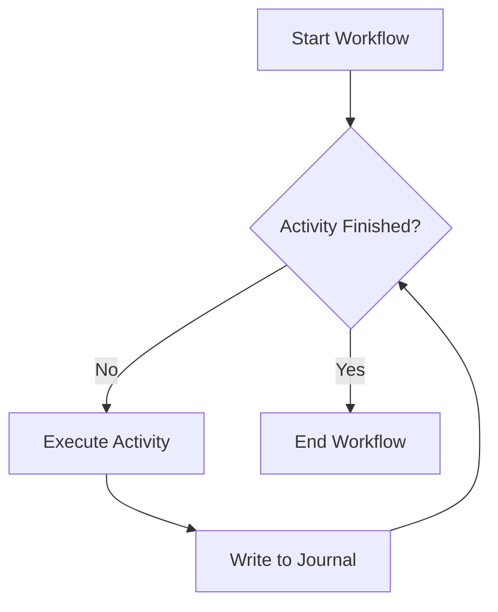

# Explanation: Durable Execution

Understand how Vox ensures that your business logic survives crashes, network failures, and server restarts without manual recovery.

## 1. The Journal System

Every `@workflow` in Vox is backed by an append-only **Journal**. When a workflow executes an `@activity`, the runtime records the timestamp, inputs, and the eventual output in the journal.

## 2. Recovery via Replay

If the server crashes mid-workflow, the recovery engine:
1. Spawns a new instance of the workflow.
2. Reads the journal from `vox.db`.
3. Replays the logic. When it reaches a step already recorded in the journal, it **returns the recorded value immediately** instead of re-executing the activity.
4. Resumes normal execution once the journal is exhausted.

## 3. Exactly-Once Semantics

Because activities are only re-executed if their result isn't in the journal, they are guaranteed to have "Exactly-Once" effect on the system state, provided the activity itself is idempotent or handles retries gracefully.

## 4. Determinism Requirements

For replay to work, the workflow body MUST be deterministic.
- **BAD**: `let d = Date.now()` (Time changes on replay)
- **GOOD**: `let d = get_current_time()` (Wrap non-deterministic calls in an `@activity`)

## 5. Storage Backend

By default, journals are stored in the `sqlite_vox_journal` table. For high-scale deployments, Vox supports external storage providers like PostgreSQL or DynamoDB.

---

**Related Reference**:
- [Workflow Tutorial](../tutorials/tut-workflow-durability.md) — Build your first durable process.
- [Language Reference](../reference/ref-language.md) — Syntax for workflows and activities.
