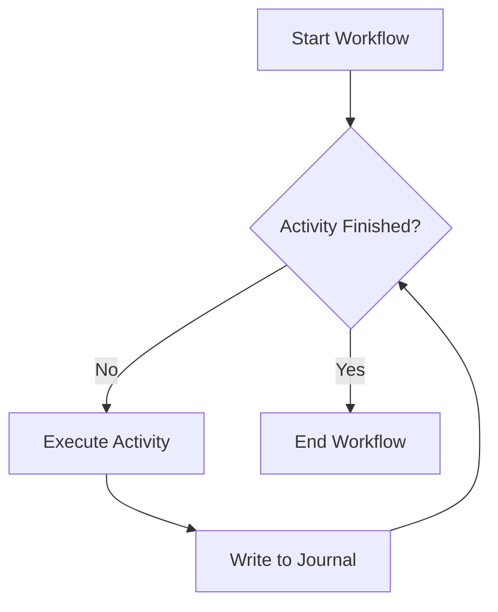

# Explanation: Durable Execution

Understand the current durability boundary in Vox. Today, durable execution is a workflow feature of the interpreted runtime used by `vox mens workflow ...`, not a blanket guarantee for every compiled Vox program.

> [!NOTE]
> **Interpreted Durability vs Compiled Async**: The durable path today specifically relies on the interpreted `vox mens workflow` runner to track execution steps in the journal. Workflows compiled to Rust under standard operation (`vox build`) currently execute as standard `async fn` constructs without the automatic state machine generation built in.

## 1. The Journal System

In the interpreted workflow runtime, Vox records workflow progress as activity steps complete. The durable truth today is step-oriented: the runtime tracks which `activity_id` values have already completed for a workflow run and stores the completed step result payload so it can replay that result after a restart.

## 2. Recovery via Replay

If the interpreted runtime crashes mid-workflow, recovery currently works like this:

1. Restart the workflow runner with the same workflow, durable `run_id`, and stable activity ids.
2. Read durable workflow tracking data from Codex / `VoxDb`.
3. Load stored results for activities that were already recorded as completed for that run.
4. Continue with the remaining steps.

This is narrower than a full workflow virtual machine. Generated Rust workflows do **not** yet replay arbitrary local variables, control-flow decisions, or stack state as a durable state machine.

## 3. Exactly-Once Semantics

Treat the current model as **durable step deduplication**, not a universal exactly-once guarantee.

- If an activity step was already recorded as completed for the same run, the interpreted runtime can skip it on resume.
- For linear interpreted workflows, the runtime can also replay the stored step result payload into the new journal stream.
- External side effects are only safe when the activity itself is **idempotent**, meaning it can tolerate retries without corrupting state.
- If you need a stronger guarantee, design the activity to accept an explicit idempotency key such as `activity_id`.

## 4. Determinism Requirements

For replay to work, the workflow body should stay deterministic.

- **BAD**: `let d = Date.now()` (Time changes on replay)
- **GOOD**: `let d = get_current_time()` (Wrap non-deterministic calls in an `@activity`)

## 5. Storage Backend

The current durable workflow tracking path uses Codex / `VoxDb` tables such as `workflow_activity_log` and `workflow_run_log`. These tables store durable run identity, step completion status, replayable result payloads, and run lifecycle state for the interpreted workflow path, including single-owner run lease fields used to avoid split-brain execution on the same `run_id`.

Older docs referenced `_vox_journal`, `sqlite_vox_journal`, PostgreSQL, or DynamoDB; treat those as stale unless a newer implementation page says otherwise.

## 6. Journal Contract (v1)

The interpreted workflow journal now carries **`journal_version: 1`** on event objects emitted by the workflow runtime.

Current event families:

- Lifecycle: `WorkflowStarted`, `WorkflowCompleted`
- Step execution: `ActivityStarted`, `ActivityCompleted`
- Step replay: `ActivityReplayed`, followed by the stored step payload
- Retry support: `ActivityAttemptRecovered`, `ActivityAttemptFailed`, `ActivityRetryScheduled`
- Step payloads: `LocalActivity`, `MeshActivity`, `MeshActivitySkipped`
- Legacy fallback: `ActivitySkipped` when a step is marked complete but no replayable result payload is available

The current SSOT for this contract is the interpreted workflow runtime in:

- [crates/vox-workflow-runtime/src/workflow/run.rs](../../../crates/vox-workflow-runtime/src/workflow/run.rs)
- [crates/vox-db/src/facade/workflow.rs](../../../crates/vox-db/src/facade/workflow.rs)
- [crates/vox-db/src/workflow_journal.rs](../../../crates/vox-db/src/workflow_journal.rs)
- [contracts/workflow/workflow-journal.v1.schema.json](../../../contracts/workflow/workflow-journal.v1.schema.json)
- [docs/src/adr/019-durable-workflow-journal-contract-v1.md](../adr/019-durable-workflow-journal-contract-v1.md)
- [docs/src/adr/021-generated-workflow-durability-parity.md](../adr/021-generated-workflow-durability-parity.md)

Codex append for interpreted workflow journals is **enabled by default when DB config resolves** and can be disabled with `VOX_WORKFLOW_JOURNAL_CODEX_OFF=1`.

## 7. Durability Taxonomy

Use these terms distinctly:

- **Durable execution**: workflow step replay in the interpreted workflow runtime
- **Durable state**: actor persistence through `state_load` / `state_save`
- **Durable delivery**: inbox/outbox, queue, and lease/ack message semantics
- **Durable jobs**: background workers or scheduled work surviving restarts
- **Durable history / audit**: oplogs, lineage, and analytics journals

This keeps Vox from accidentally using one word for several different guarantees.

## 8. Current Scope

- **Supported durable path today:** interpreted workflows run through `vox mens workflow ...`
- **Supported today:** stored step-result replay for linear interpreted workflows, deterministic `if` branch decision recording for literal-expression conditions, durable `workflow_wait(<duration>)` timer replay, durable `workflow_wait_signal(\"key\")` signal gating, cancellation-state enforcement for cancelled runs, and retry/backoff for interpreted `mesh_*` activity execution
- **Partially implemented:** workflow syntax, generated Rust lowering, and broader orchestration semantics
- **Not yet true:** durable execution for arbitrary compiled Vox programs or generated Rust workflow state machines
- **Deferred on purpose:** generated-workflow parity, arbitrary-process replay, and general branching/loop replay until Vox has a formal replay model and ADR for those features

---

**Related Reference**:

- [Workflow Tutorial](../tutorials/tut-workflow-durability.md) — Build your first durable process.
- [Actors & Workflows](expl-actors-workflows.md) — Current implementation boundary and supported workflow semantics.
- [Vox Language Reference](../reference/ref-syntax.md) — Syntax for workflows and activities.
