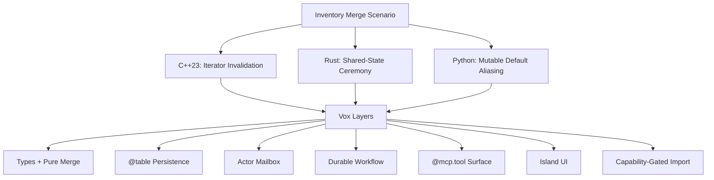

# Rosetta Inventory: One Scenario, Four Languages

At 2:13 a.m., a player drags six potions onto a stack of seven.

The correct answer is boring:

- the main stack becomes `10`
- the overflow stack becomes `3`
- a sword does not mysteriously merge with a potion
- a crashed trade settlement does not charge twice
- the UI shows the same truth the server just committed

The interesting part is how many different ways a "tiny inventory merge" can turn into a personality test for your language.

We already have the isolated feature tours elsewhere:

- [Why Vox: Compiler-Verified AI Code](why-vox-for-ai.md) handles the LLM/runtime argument.
- [Golden Examples](../examples/golden.md) catalogs the standalone Vox features.

This page keeps one scenario on stage and lets each language embarrass itself in a different way.

## The Scenario

We will keep the same request all the way through:

| Input | Value |
| --- | --- |
| existing stack | `Potion x7 / max 10` |
| incoming stack | `Potion x6 / max 10` |
| expected result | `Potion x10` plus overflow `Potion x3` |
| invalid cases | wrong kind, invalid cap, restart mid-trade |

Each language gets exactly one signature failure mode. No repeating the same sermon with different punctuation.

## One Joke Each

| Act | Language | Owned pain point |
| --- | --- | --- |
| 1 | C++23 | The container bites back while business logic is still talking. |
| 2 | Rust | Correctness expands to include everyone you invited to the locking ceremony. |
| 3 | Python | The code is so welcoming it also welcomes yesterday's state. |
| 4 | Vox | The language keeps eating the "glue layers" one by one. |



## C++23: The Backpack With Loose Screws

The first version looks respectable. It has structs. It has `std::vector`. It has the confident posture of code that has ruined at least one weekend before.

```cpp
// vox:skip
struct Stack {
    std::string kind;
    int qty;
    int max_stack;
};

void merge_first_fit(std::vector<Stack>& stash, Stack incoming) {
    for (auto it = stash.begin(); it != stash.end(); ++it) {
        if (it->kind != incoming.kind) continue;

        int room = it->max_stack - it->qty;
        int moved = std::min(room, incoming.qty);
        it->qty += moved;
        incoming.qty -= moved;

        if (incoming.qty > 0) {
            stash.push_back(incoming); // reallocation may invalidate `it`
        }
        return;
    }

    stash.push_back(incoming);
}
```

That last line is the whole genre in miniature. The inventory math is fine. The footgun is not in the domain model. The footgun is in the furniture. Your potion merge now depends on remembering what `push_back` thinks about reallocation today.

## Rust: The Backpack With Committee Minutes

Rust takes the sharp object away, which is excellent. Then the game designer says, "Great, now make two players merge into the same guild chest at once," and the tiny merge helper graduates into a governance structure.

```rust
// vox:skip
use std::sync::{Arc, Mutex};

#[derive(Clone)]
struct Stack {
    kind: String,
    qty: u32,
    max_stack: u32,
}

type SharedStash = Arc<Mutex<Vec<Stack>>>;

fn merge(stash: &SharedStash, incoming: Stack) -> Result<Option<Stack>, String> {
    let mut guard = stash.lock().map_err(|_| "lock poisoned".to_string())?;
    if let Some(slot) = guard.iter_mut().find(|s| s.kind == incoming.kind) {
        let room = slot.max_stack - slot.qty;
        let moved = room.min(incoming.qty);
        slot.qty += moved;
        let overflow = incoming.qty - moved;
        return Ok((overflow > 0).then_some(Stack { qty: overflow, ..incoming }));
    }
    guard.push(incoming);
    Ok(None)
}
```

Rust is doing its job. That is the joke. The merge logic is no longer the entire story; the story now includes lock acquisition, poison handling, cloned state, return envelopes, and the quiet understanding that the nice pure function left the building three minutes ago.

## Python: The Backpack That Remembers Everyone

Python arrives smiling, already halfway done, promising that all of this can be handled in seven charming lines. Python is not lying. Python is simply omitting the sequel.

```python
# vox:skip
def merge_stack(kind, qty, stash={"Potion": [{"qty": 7, "max_stack": 10}]}):
    slot = stash.setdefault(kind, [{"qty": 0, "max_stack": 10}])[0]
    moved = min(slot["max_stack"] - slot["qty"], qty)
    slot["qty"] += moved
    return stash, qty - moved

alice_stash, overflow = merge_stack("Potion", 6)
bob_stash, _ = merge_stack("Potion", 1)
# Bob did not ask to inherit Alice's backpack, but here we all are.
```

The bug is not theatrical. That is what makes it lethal. Nobody gets a dramatic compiler speech. Two callers just start sharing yesterday's state like a cursed communal lunch.

## Vox: The Language That Keeps Closing Tabs

Vox does not win this comparison by shouting louder. It wins by reducing how many places the same idea needs to be true.

Start with the merge. Then keep adding reality without switching languages, frameworks, job systems, schema files, tool manifests, or "temporary" UI glue that will apparently live forever.

### Layer 1: Types + Pure Merge

The first repair is not heroic. It is simply explicit. Wrong kinds and invalid caps are values in the language, not comments in the margin.

```vox
{{#include ../../../examples/golden/inventory_rosetta_core.vox:types_and_merge}}
```

### Layer 2: `@table` Persistence

Now the backpack stops being a rumor. The stack shape becomes schema, query surface, and mutation boundary in one place.

```vox
{{#include ../../../examples/golden/inventory_rosetta_core.vox:table_layer}}
```

### Layer 3: Actor Mailbox

Rust needed a summit meeting about shared mutable state. Vox answers with a mailbox: one place receives the merge request, one place owns the sequencing.

```vox
{{#include ../../../examples/golden/inventory_rosetta_platform.vox:actor_layer}}
```

### Layer 4: Durable Workflow

Once a merge becomes a trade, the problem changes again. You are no longer merging numbers; you are surviving interruption without charging twice and without inventing a folklore document called `trade_retry_final_v2.rs`.

```vox
{{#include ../../../examples/golden/inventory_rosetta_platform.vox:workflow_layer}}
```

### Layer 5: MCP Tool Surface

If an agent wants to propose the merge, the same language surface can expose it as a tool instead of forcing you to maintain a second ceremony in JSON-schema cosplay.

```vox
{{#include ../../../examples/golden/inventory_rosetta_platform.vox:mcp_layer}}
```

### Layer 6: UI Island

Eventually someone asks to see the stash. In a lot of stacks, this is where the story forks into a second language and a pile of politely drifting types. Here it stays in the same orbit.

```vox
{{#include ../../../examples/golden/inventory_rosetta_platform.vox:ui_layer}}
```

### Layer 7: Capability-Gated Import

And when the backpack finally meets the outside world, the boundary is explicit. Importing loot from a file is not smuggled in as ambient permission; it is named, checked, and therefore discussable.

```vox
{{#include ../../../examples/golden/inventory_rosetta_platform.vox:capability_layer}}
```

The capability model details are covered in [How-To: System I/O and Capabilities](../how-to/how-to-system-io.md).

## Why This Page Exists

This is not "Vox does everything and therefore everything must be shown at once." It is a staged reveal:

1. C++ shows how low-level container behavior can leak into domain logic.
2. Rust shows how concurrency correctness expands the surface area around simple logic.
3. Python shows how short code can quietly preserve the wrong state.
4. Vox keeps answering the new problem without changing the fundamental shape of the program.

If you want the feature-by-feature catalog, use [Golden Examples](../examples/golden.md). If you want the AI/compiler argument, use [Why Vox: Compiler-Verified AI Code](why-vox-for-ai.md). If you want the formal syntax and decorator surface, use [Reference: Language Syntax](../reference/ref-syntax.md) and [Reference: Decorator Registry](../reference/ref-decorators.md).
