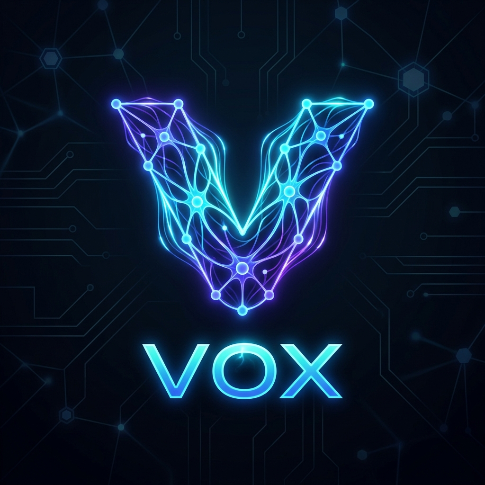

# Vox Programming Language

<div class="vox-hero">
    
    <h2>The AI-Native Programming Language</h2>
    <p class="subtitle">One language. Database, backend, UI, and agent tools — designed first as a target for large language models, and for the developers who work alongside them.</p>
    <div class="vox-cta-container">
        <a href="tutorials/tut-getting-started.md" class="vox-cta primary">Get Started</a>
        <a href="reference/ref-syntax.md" class="vox-cta secondary">Syntax Reference</a>
    </div>
</div>

*“Is it a fact — or have I dreamt it — that, by means of electricity, the world of matter has become a great nerve, vibrating thousands of miles in a breathless point of time? Rather, the round globe is a vast head, a brain, instinct with intelligence!”*  
— Nathaniel Hawthorne, *The House of the Seven Gables* (1851)

## Why Vox Exists

When a language model needs to act on a system — retrieve data, mutate state, call a tool, write a workflow — it usually reaches for Python. Python fails silently at runtime: a generated script that mishandles a missing value won't error until it runs, and the model gets no feedback from the compiler. **Vox gives models a compiled, verified surface instead.** If generated code mishandles an absent value, drops an error, or mismatches a type, the compiler rejects it before anything executes.

Our telemetry from fine-tuning on Vox shows **~40% fewer hallucinated field names** versus equivalent Python generation tasks and **~3× fewer runtime-only failures** in generated tool-call sequences.

The same guarantee applies to human-written code — and a single language surface covering schema, server, and UI means developers stop chasing sync bugs between three separate layers.

## Design Principles

- **Compiler as error boundary.** No `null`, no `undefined`. Absence is `Option[T]`; failure is `Result[T]`. Every branch must be handled.
- **One source of truth.** `@table`, `@server`, and `@island` live in the same file. The compiler generates the SQL schema, HTTP endpoint, and TypeScript client from one declaration.
- **Durability without a framework.** `workflow` and `actor` are language keywords, not libraries.
- **AI-native tooling.** `@mcp.tool` turns any function into a callable tool for any MCP-compatible agent. The orchestrator, agent mesh, and model routing are built into the platform.

---

## The Language, Step by Step

### Step 1 — Declare your data model once

```vox
// vox:skip
@require(len(self.title) > 0)
@table type Task {
    title:    str
    done:     bool
    priority: int
    owner:    str
}

@index Task.by_owner on (owner)
@index Task.by_priority on (priority, done)
```
`@require` is a compiler-enforced precondition on the type itself. `@index` emits DDL alongside the table migration.

### Step 2 — Add server logic and queries

```vox
// vox:skip
@mutation
fn add_task(title: str, owner: str) to Id[Task] {
    ret db.insert(Task, { title: title, done: false, priority: 0, owner: owner })
}

@server fn complete_task(id: Id[Task]) to Result[Unit] {
    db.Task.delete(id)
    ret Ok(Unit)
}

@query
fn recent_incomplete_tasks() to List[Task] {
    ret db.Task.where({ done: false }).order_by("priority", "desc").limit(10)
}
```

### Step 3 — Build the UI in the same language

Vox generates the network call, serialization, and cross-boundary types — no fetch wrapper, no client SDK:

```vox
// vox:skip
import react.use_state

@island
fn TaskList(tasks: List[Task]) to Element {
    let (items, set_items) = use_state(tasks)

    <div class="task-list">
        {items.map(fn(task) {
            <div class="task-row">
                <input
                    type="checkbox"
                    checked={task.done}
                    onChange={fn(_e) complete_task(task.id)}
                />
                <span>{task.title}</span>
            </div>
        })}
    </div>
}
```

### Step 4 — Handle absence and failure explicitly

```vox
// vox:skip
@server fn get_task(id: Id[Task]) to Result[Task] {
    let row = db.Task.find(id)
    match row {
        Some(t) -> Ok(t)
        None    -> Error("task not found")
    }
}
```

### Step 5 — Add durable workflows and stateful actors

```vox
// vox:skip
workflow checkout(amount: int) to str {
    let result = charge_card(amount)
    match result {
        Ok(tx)     -> "Success: " + tx
        Error(msg) -> "Failed: " + msg
    }
}
```

### Step 6 — Expose functions as AI tools

```vox
// vox:skip
@mcp.tool "Search the knowledge base for documents matching the query"
fn search_knowledge(query: str, max_results: int) to SearchResult {
    Found("Result for: " + query, 95)
}
```

## Agent Orchestration & AI Capabilities

Vox goes beyond just syntax. It includes a full AI ecosystem:

- **Multi-agent coordination**: The DEI orchestrator (`vox-dei`) routes concurrent tasks by file affinity and role (Builder, Planner, Verifier). Every state transition is persisted through MCP tools.
- **Agent-to-agent messaging**: Agents exchange typed, JWE-encrypted envelopes over a structured bus (A2A), ensuring compile-time shape guarantees.
- **The Populi Mesh**: `vox populi` acts as a node registry. The orchestrator routes training and inference to where the hardware can support it out of the box.
- **Native Training**: `vox populi probe` detects your GPU and recommends a QLoRA configuration. Training runs natively in Rust via Burn — no Python required.

---

## Documentation Structure

Vox uses the **Diátaxis** framework to organize knowledge by user intent.

<div class="quadrant-container" style="display: grid; grid-template-columns: 1fr 1fr; gap: 1.5rem; margin: 2rem 0;">
    <div style="border: 1px solid var(--table-border-color); padding: 1.5rem; border-radius: 12px; background: rgba(0,0,0,0.02);">
        <h3><a href="tutorials/tut-getting-started.md" style="text-decoration: none;">Learning Oriented</a></h3>
        <p><strong>Tutorials</strong></p>
        <p>Step-by-step lessons to build applications and understand core foundational concepts.</p>
    </div>
    <div style="border: 1px solid var(--table-border-color); padding: 1.5rem; border-radius: 12px; background: rgba(0,0,0,0.02);">
        <h3><a href="how-to/how-to-islands-and-pages.md" style="text-decoration: none;">Problem Oriented</a></h3>
        <p><strong>How-To Guides</strong></p>
        <p>Practical and actionable recipes for specific tasks like deployment or database scaling.</p>
    </div>
    <div style="border: 1px solid var(--table-border-color); padding: 1.5rem; border-radius: 12px; background: rgba(0,0,0,0.02);">
        <h3><a href="explanation/why-vox-for-ai.md" style="text-decoration: none;">Understanding Oriented</a></h3>
        <p><strong>Explanations</strong></p>
        <p>High-level overviews of the compiler architecture, mesh routing, and design philosophy.</p>
    </div>
    <div style="border: 1px solid var(--table-border-color); padding: 1.5rem; border-radius: 12px; background: rgba(0,0,0,0.02);">
        <h3><a href="reference/ref-syntax.md" style="text-decoration: none;">Information Oriented</a></h3>
        <p><strong>Reference</strong></p>
        <p>Technical specifications for keywords, decorators, standard library, and CLI commands.</p>
    </div>
</div>

## Quick Links
- **[Installation Guide](tutorials/tut-getting-started.md)**: Set up the `vox` toolchain on your machine.
- **[Golden Examples](examples/golden.md)**: Scannable, verified code snippets for common patterns.
- **[Internal Architecture](architecture/architecture-index.md)**: Deep dives into the compiler and runtime internals.
- **[GitHub Repository](https://github.com/vox-foundation/vox)**: Core source code and contributor space (Apache-2.0).
