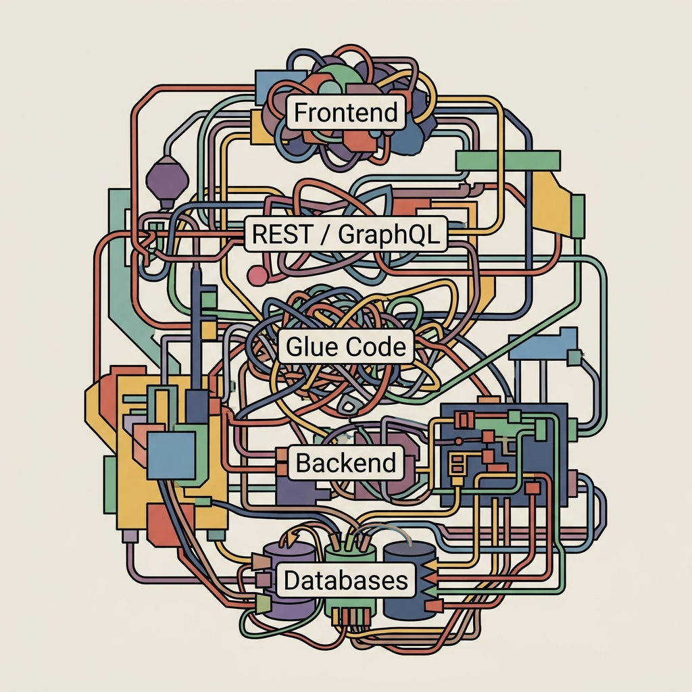

import VoxPlayground from '../../docs-astro/src/components/VoxPlayground.astro';

<div style="text-align: center; padding: 1.5rem 0 0.5rem;">
  <h1 style="font-size: 2.25rem; line-height: 1.15; margin-bottom: 0.75rem;">The Language That Speaks First to LLMs</h1>
  <p style="font-size: 1.15rem; color: var(--sl-color-gray-2); max-width: 42rem; margin: 0 auto 1.5rem;">One <code>.vox</code> file. Auto-generated database, server, and browser UI — with zero nulls, no boilerplate, and a built-in AI training pipeline.</p>
  <div style="display: flex; gap: 0.75rem; justify-content: center; flex-wrap: wrap;">
    <a href="/tutorials/tut-getting-started/" style="background: var(--sl-color-accent); color: var(--sl-color-black); padding: 0.6rem 1.25rem; border-radius: 6px; font-weight: 600; text-decoration: none;">Get Started →</a>
    <a href="/reference/ref-syntax/" style="border: 1px solid var(--sl-color-gray-5); padding: 0.6rem 1.25rem; border-radius: 6px; text-decoration: none;">Syntax Reference</a>
    <a href="https://github.com/vox-foundation/vox" style="padding: 0.6rem 1.25rem; border-radius: 6px; text-decoration: none; color: var(--sl-color-gray-2);">GitHub ↗</a>
  </div>
</div>

---

{/* SYNC-FROM-README: why_vox */}
## Why Vox

Mainstream languages predate LLMs by decades. They tolerate implicit state — nulls, exceptions, schemas restated three times across the stack. That's tractable for a person; it's a minefield for a statistical code generator. A million-token context window doesn't help when most of it is integration boilerplate.

<div align="center">
  
  <p>
    <strong>Fragmentation in Traditional Web Development</strong><br />
    Traditional development requires restating data models and logic across frontend, API, backend, and database layers. This duplication creates significant maintenance overhead and increases the risk of integration drift.
  </p>
</div>

Vox is what falls out when you design the language *after* the model: collapse the duplications, push errors into the type system, draw the browser/server boundary in one place, and build durability and tool exposure into the grammar instead of layering them on top.
{/* SYNC-END: why_vox */}

> *"Is it a fact — or have I dreamt it — that, by means of electricity, the world of matter has become a great nerve, vibrating thousands of miles in a breathless point of time?"*
> — Nathaniel Hawthorne, *The House of the Seven Gables* (1851)

---

## Try it live

Write and execute Vox code directly from the browser — no install required.

<VoxPlayground initialCode={`// Compile-time safety, zero nulls.
table Task {
    title: str
    done: bool
}

fn main() {
    print("Welcome to Vox.")
    print("Type-safe execution environment online.")
}`} />

---

{/* condensed pillar grid — full detail: /explanation/expl-architecture/ */}
## How Vox works

One `.vox` file drives the whole stack — database schema, typed server, and browser UI compile from the same declarations. Five pillars make that possible:

<div style="display: grid; grid-template-columns: repeat(auto-fit, minmax(190px, 1fr)); gap: 1rem; margin: 1.5rem 0;">
  <div style="border: 1px solid var(--sl-color-gray-5); border-radius: 8px; padding: 1rem;">
    <h3 style="margin-top: 0; font-size: 1.05rem;">Schema</h3>
    <p style="margin-bottom: 0;">One source of truth: one declaration becomes SQL schema, wire format, typed client.</p>
  </div>
  <div style="border: 1px solid var(--sl-color-gray-5); border-radius: 8px; padding: 1rem;">
    <h3 style="margin-top: 0; font-size: 1.05rem;">Errors</h3>
    <p style="margin-bottom: 0;">In the type system: <code>Result[T]</code> + exhaustive <code>match</code>; the compiler refuses code that drops an <code>Error</code>.</p>
  </div>
  <div style="border: 1px solid var(--sl-color-gray-5); border-radius: 8px; padding: 1rem;">
    <h3 style="margin-top: 0; font-size: 1.05rem;">Deploy</h3>
    <p style="margin-bottom: 0;">One file → running deployment: <code>vox build</code> emits React/TSX, a typed RPC bridge, and Docker/K8s/Fly targets.</p>
  </div>
  <div style="border: 1px solid var(--sl-color-gray-5); border-radius: 8px; padding: 1rem;">
    <h3 style="margin-top: 0; font-size: 1.05rem;">Agents</h3>
    <p style="margin-bottom: 0;">MCP-native: <code>tool</code>/<code>resource</code> expose typed functions to any Model Context Protocol client.</p>
  </div>
  <div style="border: 1px solid var(--sl-color-gray-5); border-radius: 8px; padding: 1rem;">
    <h3 style="margin-top: 0; font-size: 1.05rem;">Training</h3>
    <p style="margin-bottom: 0;">Built for LLM authorship: grammar-constrained decoding plus a local QLoRA training pipeline.</p>
  </div>
</div>

For example, the schema pillar in code:

```vox
table Task {
    title: str
    done:  bool
    owner: str
}
```

→ Full five-pillar walkthrough, with all code samples: [Compiler Architecture](/explanation/expl-architecture/)

---

## Stability

{/* condensed status strip — full matrix: /reference/stability/ */}
Vox is marching toward a production-hardened v1.0 release. Surfaces are graded by their architectural stability and proximity to the v1 criteria — a representative slice:

| Feature Area | Status |
|:---|:---|
| Compiler & LSP | 🟣 Mature |
| Database Engine | 🔵 Stable |
| Durable Runtime | 🔵 Stable (interpreter) / 🟡 Preview (codegen) |
| Native GUI (Tauri) | 🟡 Preview |
| Distributed Mesh | 🟠 Emergent |

→ Full per-surface matrix, all tiers explained: [Stability Matrix](/reference/stability/)

---

## Documentation

Organized by the [Diátaxis framework](https://diataxis.fr/) — structured by user intent, not by feature.

| Intent | Start here |
|---|---|
| **Learning** | [Getting Started](/tutorials/tut-getting-started/) · [First full-stack app](/tutorials/tut-first-app/) |
| **Task recipes** | [How-To Guides](/how-to/) · [AI Agents & MCP](/how-to/how-to-ai-agents/) |
| **Understanding** | [Why Vox for AI](/explanation/why-vox-for-ai/) · [Compiler architecture](/explanation/expl-architecture/) |
| **Reference** | [CLI](/reference/cli/) · [Decorators](/reference/ref-decorators/) · [Stability Matrix](/reference/stability/) |
| **Architecture** | [Where things live](/architecture/where-things-live/) · [Contributor hub](/contributors/contributor-hub/) |

---

## Community, Backing & License

**Open Collective.** Community-backed via [Open Collective](https://opencollective.com/vox-foundation) — every dollar raised and spent is public.

**License.** Apache 2.0 — commercial use permitted, patent rights granted, modifications allowed with attribution.

**Get involved.** [GitHub Discussions](https://github.com/vox-foundation/vox/discussions) · [RSS Feed](https://voxlang.org/feed.xml) · [Contributor Hub](/contributors/contributor-hub/)
