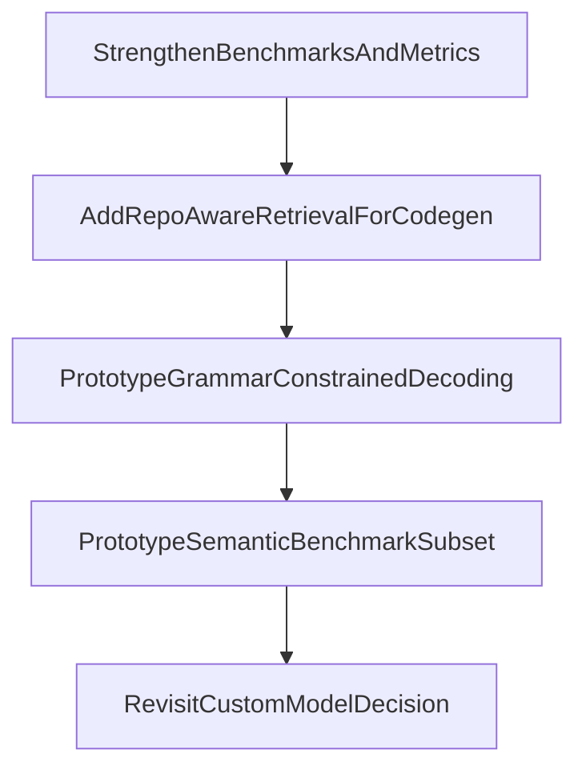

# Mens external technology options

This document translates current external research into a shortlist of realistic options for VoxMens.

The goal is not to collect every possible technique. The goal is to identify which ideas are actually adoptable in this repo, in this architecture, with a plausible implementation and maintenance cost.

## Adoption criteria

An option belongs on the shortlist only if it satisfies most of these:

- fits the Rust/Candle/MCP ecosystem already present in Vox,
- can be measured through the emerging VoxMens scorecard and runtime metrics,
- improves the code-only `.vox` lane without requiring an immediate full custom model,
- does not require throwing away the existing QLoRA lane,
- has a bounded integration surface.

## External references used

### Constrained decoding

- [Flexible and Efficient Grammar-Constrained Decoding](https://proceedings.mlr.press/v267/park25l.html)
- [Guiding LLMs The Right Way: Fast, Non-Invasive Constrained Generation](https://arxiv.org/html/2403.06988v1)
- [Constrained Decoding: Grammar-Guided Generation for Structured LLM Output](https://mbrenndoerfer.com/writing/constrained-decoding-structured-llm-output)

### Evaluation and code benchmarks

- [LiveCodeBench](https://github.com/LiveCodeBench/LiveCodeBench)
- [COMPASS: A Multi-Dimensional Benchmark for Evaluating Code Generation in Large Language Models](https://arxiv.org/html/2508.13757)

### Retrieval/documentation for code generation

- [CodeRAG-Bench](https://code-rag-bench.github.io/)

## Adopt now

These options are realistic for immediate or near-immediate adoption within the current Vox ecosystem.

### 1. Compiler-grounded benchmark expansion

External lesson:

- code-model evaluation improves when correctness is measured through execution or strong downstream validation, not just text similarity.

Vox-compatible interpretation:

- use compiler/HIR validation as the primary correctness gate now,
- add task-level checks where possible,
- treat current pass@k and scorecard results as the base layer of a stronger benchmark contract.

Why this is adoptable:

- the repo already has `eval-local`, scorecard scaffolding, and compiler validation paths,
- this extends existing mechanisms rather than replacing them.

Expected value:

- high,
- low architecture risk,
- directly improves decision quality for QLoRA vs custom-model questions.

### 2. Retrieval-assisted code generation from repo-aware sources

External lesson from CodeRAG-Bench:

- high-quality retrieved context can materially improve code generation,
- but retrieval only helps when the retrieved context is actually relevant and structurally useful.

Vox-compatible interpretation:

- use documentation and code inventory as retrieval sources for generation,
- but retrieve into the **prompt context**, not into the **training target** for the code-only lane.

Why this is adoptable:

- Vox already has rich docs, compiler validation, and repo-aware paths,
- retrieval can be introduced without changing the core training objective,
- this helps the code-only lane without teaching the model prose outputs.

Expected value:

- high for repo-aware tasks,
- moderate implementation complexity,
- lower risk than training a custom model immediately.

### 3. Multi-dimensional code evaluation

External lesson from COMPASS and adjacent work:

- correctness alone is not enough,
- speed, maintainability, and repair burden matter.

Vox-compatible interpretation:

- extend scorecard and runtime metrics to track:
  - compile success,
  - canonical success,
  - repair cost,
  - latency,
  - selected semantic/golden-task outcomes.

Why this is adoptable:

- it maps naturally onto the existing scorecard and benchmark artifacts.

Expected value:

- high,
- especially important for deciding whether more complex decoding or a custom model is worth it.

## Prototype next

These options are promising, but should be prototyped before they are promoted to the mainline architecture.

### 4. Real grammar-constrained decoding for Vox surface syntax

External lesson:

- grammar-guided decoding can substantially reduce invalid structured outputs,
- but tokenizer/grammar alignment and runtime overhead are the main implementation challenges.

Vox-compatible interpretation:

- move beyond prompt-only grammar hints,
- use a practical first layer of grammar or surface masking for Vox syntax-sensitive tokens,
- keep the repair loop as fallback.

Why this is only a prototype now:

- current VoxMens inference surfaces are not yet wired for full token-mask infrastructure,
- grammar constraints must align with the tokenizer used by the active serving path,
- there is a real risk of building a decoding subsystem that works in one runtime and not another.

Expected value:

- potentially very high for first-pass compileability,
- moderate to high implementation cost,
- should be judged using `CompilePass@1`, `RepairStallRate`, and `TimeToFirstValidMs`.

### 5. Structured retrieval for docs/code grounding

External lesson from CodeRAG-Bench and related structured-RAG work:

- retrieval helps codegen most when context is high quality and relationship-aware.

Vox-compatible interpretation:

- do not just chunk docs randomly,
- retrieve:
  - nearby code examples,
  - concept definitions,
  - linked `.vox` artifacts,
  - command/reference snippets,
- prefer structurally meaningful retrieval over pure vector similarity.

Why this is prototype-stage:

- the repo already has useful graph-like structure in docs and language artifacts,
- but a durable retrieval contract has not yet been defined.

Expected value:

- medium to high for repo-aware generation and future docs/chat lanes,
- lower risk than a new base model,
- requires careful lane separation so retrieved docs do not pollute code-only outputs.

### 6. Stronger semantic benchmark subsets

External lesson:

- codegen evaluation improves when it moves beyond syntax and surface correctness.

Vox-compatible interpretation:

- create curated benchmark subsets where generated `.vox` must satisfy stronger conditions:
  - route shape,
  - actor method structure,
  - workflow contract,
  - selected golden output or runtime behavior.

Why this is prototype-stage:

- strong semantic evaluation is valuable but easy to overbuild,
- should begin with a small curated set, not a giant framework.

Expected value:

- medium,
- but strategically important because syntax-only wins can otherwise mislead the project.

## Watchlist

These are interesting, but they should not lead the next implementation wave.

### 7. Full custom decoding stack with aggressive backtracking

Research trend:

- some newer constrained decoding methods use more advanced search or backtracking to preserve semantics while enforcing constraints.

Why it is watchlist-only:

- very promising in theory,
- but more invasive than the repo currently needs,
- and harder to justify before the simpler scorecard/repair/constraint improvements are fully measured.

### 8. Immediate jump to a custom foundation model

Why it is watchlist-only for now:

- the current evidence base still does not cleanly separate:
  - data-lane contamination issues,
  - benchmark/measurement blindness,
  - missing decoding constraints,
  - genuine backbone limitations.

Until those are untangled, a custom model could improve some things while obscuring the real causes of failure.

### 9. Heavy external evaluation frameworks as direct drop-ins

Why it is watchlist-only:

- useful as inspiration,
- but Vox needs a language-specific benchmark contract grounded in parser/typecheck/HIR behavior.

Borrow the ideas, not the benchmark wholesale.

## Constraint-specific recommendations for Vox

### What to adopt conceptually

For constrained decoding, the research suggests a layered approach:

1. low-cost surface constraints,
2. stronger grammar-sensitive masking,
3. fallback repair loop,
4. benchmark whether the new layer reduces total time to valid output.

That layered approach fits Vox very well because the repo already has:

- surface normalization,
- compiler validation,
- repair loops,
- a scorecard path.

### What not to do

Do not make constrained decoding the sole solution.

Even strong syntax constraints do not solve:

- semantic misuse of Vox constructs,
- bad repo grounding,
- wrong route or workflow logic,
- documentation contamination,
- weak benchmark design.

## Documentation-to-code recommendations for Vox

The strongest external lesson here is subtle but important:

**Documentation is often more valuable as retrieval context than as direct code-generation supervision unless it is explicitly converted into code-shaped targets.**

For Vox, that means:

- use docs-derived **code blocks** as code-only supervision,
- use docs-derived prose as a separate docs/chat lane,
- use docs retrieval during inference to improve task grounding for code generation,
- do not assume that because docs are helpful to humans they are automatically helpful as response targets for the code-only model.

## Recommended adoption sequence

## Practical shortlist

### Adopt now

- strengthen compiler-grounded benchmarking,
- add repo-aware retrieval for code generation contexts,
- expand multi-dimensional scorecard metrics.

### Prototype

- practical grammar-constrained decoding,
- structured retrieval grounded in Vox docs/code links,
- stronger semantic benchmark subsets.

### Watchlist

- advanced backtracking decode stacks,
- immediate custom foundation model investment,
- wholesale external benchmark adoption without Vox adaptation.

## Conclusion

The most realistic path in this ecosystem is not:

- “train a custom model immediately,”

but rather:

- “improve grounding, metrics, and output constraints until the remaining failure surface is clearly structural.”

If the remaining failures are still dominated by:

- syntax instability,
- prose leakage,
- repair-loop cost,
- poor repo grounding,

then the next investment should still be in **architecture around the model**, not necessarily a new model.

If those are largely solved and the model still cannot reason in Vox-specific ways, then the case for a more custom model lane becomes much stronger.
