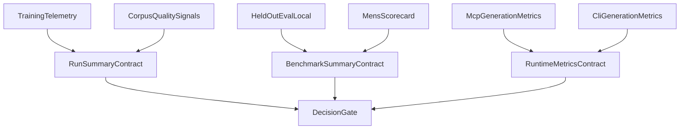

# Mens measurement gap analysis

This document defines the measurement groundwork needed to judge whether VoxMens is getting closer to the real product goal:

> Emit the most accurate `.vox` code possible, with the lowest error rate, at the highest practical speed.

The current codebase measures many useful things, but it does **not** yet measure that full objective coherently.

## Core diagnosis

Today, VoxMens has three broad measurement layers:

1. **training telemetry**
2. **corpus/data quality telemetry**
3. **generation/evaluation telemetry**

All three matter, but they are not equivalent.

The main problem is that the system still treats some upstream proxies as if they were downstream product truth.

Examples:

- training loss is treated as if it were close to code correctness,
- corpus parse rate is treated as if it were close to generation quality,
- benchmark strictness heuristics are treated as if they were canonical output guarantees.

Those are useful signals. They are not the top-line KPI.

## Current measurement surfaces

### Training-time metrics

Primary sources:

- [`crates/vox-populi/src/mens/tensor/telemetry_schema.rs`](../../../crates/vox-populi/src/mens/tensor/telemetry_schema.rs)
- [`crates/vox-populi/src/mens/tensor/candle_qlora_train/training_loop.rs`](../../../crates/vox-populi/src/mens/tensor/candle_qlora_train/training_loop.rs)
- [`crates/vox-populi/src/mens/tensor/candle_qlora_train/epoch_boundary.rs`](../../../crates/vox-populi/src/mens/tensor/candle_qlora_train/epoch_boundary.rs)
- [`crates/vox-populi/src/mens/tensor/candle_qlora_train/finalize.rs`](../../../crates/vox-populi/src/mens/tensor/candle_qlora_train/finalize.rs)
- [`crates/vox-db/src/training_run.rs`](../../../crates/vox-db/src/training_run.rs)

What these surfaces currently measure well:

- train loss,
- validation loss,
- step progress,
- checkpoint progress,
- some skip/error categories during training,
- wall-clock training progress.

What they do **not** directly measure:

- whether the resulting model emits valid `.vox`,
- whether emitted `.vox` is canonical,
- whether repair loops are shrinking,
- whether serving is getting faster,
- whether task outcomes are semantically improving.

### Corpus/data metrics

Primary source:

- [`crates/vox-cli/src/commands/corpus/stats.rs`](../../../crates/vox-cli/src/commands/corpus/stats.rs)

What this layer measures well:

- training-data parseability,
- construct coverage,
- format validity of corpus artifacts,
- some safety/quality proxies for the corpus.

What it does **not** measure:

- model output quality,
- model repair burden,
- inference throughput,
- semantic success of generated programs.

### Generation/eval metrics

Primary sources:

- [`crates/vox-cli/src/commands/mens/eval_local.rs`](../../../crates/vox-cli/src/commands/mens/eval_local.rs)
- [`crates/vox-cli/src/commands/mens/eval_gate/check_run.rs`](../../../crates/vox-cli/src/commands/mens/eval_gate/check_run.rs)
- [`crates/vox-cli/src/commands/ci/mens_scorecard.rs`](../../../crates/vox-cli/src/commands/ci/mens_scorecard.rs)
- [`crates/vox-cli/src/commands/ai/generate.rs`](../../../crates/vox-cli/src/commands/ai/generate.rs)
- [`crates/vox-mcp/src/tools/compiler_tools.rs`](../../../crates/vox-mcp/src/tools/compiler_tools.rs)

What this layer measures reasonably well already:

- pass@1 / pass@k for held-out eval-local benches,
- first-pass compileability,
- compileability after retries,
- repair depth,
- latency (partially),
- a first approximation of strictness.

What it still misses:

- tokenizer-true token counts and throughput,
- stable error taxonomy at aggregate level,
- semantic correctness beyond parse/typecheck,
- HIR-level structure comparison or canonical IR comparison,
- a unified “time-to-first-valid-Vox” KPI,
- a single benchmark artifact contract used by all surfaces.

## Producer/consumer drift map

One of the most important findings is that producer and consumer surfaces still disagree about field names and ownership.

### Drift: training telemetry vs eval gate

Relevant files:

- producer: [`crates/vox-populi/src/mens/tensor/candle_qlora_train/training_loop.rs`](../../../crates/vox-populi/src/mens/tensor/candle_qlora_train/training_loop.rs)
- consumer: [`crates/vox-cli/src/commands/mens/eval_gate/check_run.rs`](../../../crates/vox-cli/src/commands/mens/eval_gate/check_run.rs)

Observed drift:

- gate code looks for `metrics.jsonl`,
- training now centers on `telemetry.jsonl`,
- gate expects `tokens_per_sec`,
- training prominently emits `steps_per_sec_ema`,
- gate looks for `supervised_ratio_pct`,
- training paths do not consistently publish the fields needed to compute that ratio in a durable way.

This means the gate can be logically correct but practically underfed.

### Drift: benchmark artifacts vs strategic decision artifact

Relevant files:

- [`crates/vox-cli/src/commands/mens/eval_local.rs`](../../../crates/vox-cli/src/commands/mens/eval_local.rs)
- [`crates/vox-cli/src/commands/ci/mens_scorecard.rs`](../../../crates/vox-cli/src/commands/ci/mens_scorecard.rs)

Observed drift:

- `eval_local` writes one style of report,
- `mens_scorecard` writes another,
- strategic decisions now need both,
- there is not yet one stable summary contract that joins them.

### Drift: repair-loop evidence across CLI and MCP

Relevant files:

- [`crates/vox-cli/src/commands/ai/generate.rs`](../../../crates/vox-cli/src/commands/ai/generate.rs)
- [`crates/vox-mcp/src/tools/compiler_tools.rs`](../../../crates/vox-mcp/src/tools/compiler_tools.rs)

Observed drift:

- both now do diagnostics-informed retries,
- only one path returns richer structured repair metadata,
- strictness and canonicalization accounting are still not normalized into one shared analytics schema.

## KPI contract v0

The second pass should treat the following as the **required top-line KPIs** for code-generation success.

### Tier 1: product KPIs

These are the metrics that should decide whether VoxMens is materially better.

| KPI | Meaning | Why it matters |
|---|---|---|
| `CompilePass@1` | valid `.vox` on first attempt | Best direct measure of raw model correctness |
| `CompilePass@N` | valid `.vox` within bounded repair budget | Measures practical recoverability |
| `CanonicalPass@1` | output canonicalizes and still validates | Measures whether output matches strict serializer goals |
| `TaskSuccess` | generated program satisfies task-level expected behavior | Prevents overfitting to syntax-only wins |
| `TimeToFirstValidMs` | wall-clock latency to first valid `.vox` | Combines model speed with repair cost |
| `ServeTokensPerSec` | inference throughput using real tokenizer counts | Needed for deployment tradeoffs |
| `RepairStallRate` | percent of tasks where retries stop making progress | Important operational pain signal |

### Tier 2: diagnostic KPIs

These are needed to explain changes in Tier 1, not to replace them.

| KPI | Meaning |
|---|---|
| `RepairDepthMean` | mean retries among tasks that eventually pass |
| `DiagnosticCategoryHistogram` | distribution of error categories |
| `StrictnessFailureRate` | prose wrappers / markdown fences / extra narration |
| `ValLossLastEpoch` | training-side model fitness proxy |
| `NoSupervisedSkipRate` | training-data supervision efficiency |
| `TruncationFraction` | lost supervision due to context cap |

### Tier 3: contextual metrics

These help interpret experiments but should not drive the main decision gate by themselves.

| Metric | Why it is contextual only |
|---|---|
| train loss | useful but indirect |
| validation loss | useful but indirect |
| corpus parse rate | data quality, not model quality |
| construct coverage | diversity signal, not product success |
| whitespace token counts | weak proxy for real token economics |

## Metrics that should be demoted

The following are currently worth keeping, but they should be explicitly demoted from decision-driving metrics:

### `quality_proxy`

This belongs to corpus/data QA, not to model quality. It should not be read as a direct measure of model improvement.

### `construct_coverage`

Important for understanding data breadth, but not enough to indicate that the model can correctly use those constructs under prompt conditions.

### heuristic strictness alone

Strictness without compiler validation or canonicalization is not enough. The target is not “looks like code.” The target is “canonical valid Vox.”

### raw loss curves alone

Loss curves can help rank training runs, but they should not be used as the final justification for shipping or for deciding whether a custom model is needed.

## What we are not measuring but need to measure

### 1. Time to first valid Vox

This is arguably the most important missing operational metric.

Why:

- a slower model that succeeds first-pass can beat a faster model that needs three repair rounds,
- raw latency and repair depth need to be composed into one observable.

Where to instrument:

- MCP generation path,
- CLI generation path,
- scorecard benchmark output.

### 2. Semantic success beyond compiler validity

Parse/typecheck success is necessary. It is not sufficient.

Needed next:

- golden behavioral checks for a curated subset,
- expected-shape verification at the HIR or route/component/workflow level,
- later, executable or snapshot-based validation for selected tasks.

### 3. Diagnostic taxonomy as a first-class metric

Current counts tell us that something failed. They do not tell us which failure classes dominate:

- syntax punctuation,
- indentation/layout confusion,
- type mismatches,
- invalid imports,
- route/schema mismatches,
- actor/workflow misuse.

Without that histogram, targeted data or decoding improvements remain guesswork.

### 4. Real inference throughput

We need true tokenizer-backed token counts and throughput rather than whitespace approximations.

Otherwise, model comparisons can be directionally wrong.

### 5. Lane contamination metrics

If VoxMens is going to become multi-lane, we need to measure when one lane degrades another.

Examples:

- prose leakage into code-only lane,
- code-only compactness loss after docs/chat blending,
- repair-loop burden increase after introducing more general conversational data.

## Proposed measurement architecture

## Minimal durable contracts needed in second pass

The second pass should not try to measure everything at once. It should create three stable contracts:

1. **Run summary contract**
   - training-oriented,
   - one artifact per run,
   - includes pointers to telemetry and benchmark outputs.

2. **Benchmark summary contract**
   - model-vs-model comparable,
   - includes compile, canonical, task, repair, speed, strictness.

3. **Runtime generation metrics contract**
   - per-request or aggregated,
   - used by both CLI and MCP,
   - records time-to-first-valid and stall behavior,
   - initial schema path: `contracts/eval/runtime-generation-kpi.schema.json`.
   - `vox_mens_scorecard_summary_v1` artifacts may include optional `kpi_contract_alignment`, which pins the same `vox_runtime_generation_kpi_v1` schema id alongside the mens scorecard event schema `$id` for downstream eval joins.

## Recommended metric backlog order

### Highest priority

1. align training telemetry with gate readers,
2. add `TimeToFirstValidMs`,
3. add true token accounting to runtime generation,
4. add structured repair outcome aggregation,
5. create one benchmark summary schema.

### Medium priority

1. add diagnostic taxonomy histograms,
2. add semantic golden checks for a curated subset,
3. demote weak proxies in docs and dashboards.

### Lower priority

1. expand category/context breakdowns,
2. add richer per-lane contamination monitoring once lanes are split cleanly.

## Measurement conclusion

The current system already measures enough to know that VoxMens is moving in the right direction.

It does **not** yet measure enough to answer the bigger strategic question with confidence:

> Is QLoRA sufficient, or are the remaining failures structural enough that Vox needs a more custom model path?

To answer that question, the next pass must stop treating upstream proxies as final truth and instead build one end-to-end KPI chain around:

- valid `.vox`,
- canonical `.vox`,
- task success,
- repair burden,
- real runtime cost.
