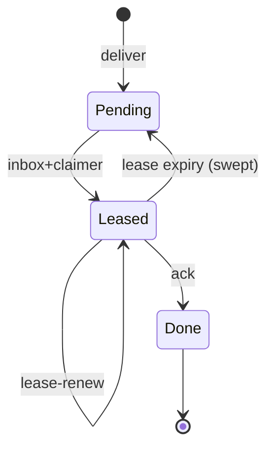

# Mesh / Populi SSOT (CPU-first)

The **mesh** (Populi) layer is **opt-in at runtime**: default single-node behaviour is unchanged until operators set the variables below or use `vox populi` (requires `vox-cli` Cargo feature **`populi`**; enables `vox-populi` in the CLI binary).

## A2A acknowledgment vs Ludus notification ACK

- **Populi A2A** **`ack`** paths (inbox claimer / message ACK) acknowledge **mesh-delivered agent mail** and task handoff plumbing. They are **unrelated** to **Vox Ludus** `gamify_notifications` read state.
- **Ludus** notification ACK is **`vox_ludus_notification_ack`** / **`vox_ludus_notifications_ack_all`** on Codex (`gamify_notifications`). Operators should not confuse mesh **message** lifecycle with **gamify** UX inbox.

Optional future work: correlate mesh task outcomes with Ludus `remote_task_*`-style events for cross-node reputation (**design-only spike**; not implied by current ACK semantics).

## Environment variables

| Variable | Meaning |
| -------- | ------- |
| `VOX_MESH_ENABLED` | `1` or `true` enables mens hooks (registry publish, interpreted workflow mens steps). |
| `VOX_MESH_NODE_ID` | Stable node id; generated if unset when publishing. |
| `VOX_MESH_LABELS` | Comma-separated labels merged into [`TaskCapabilityHints`](orchestration-unified.md) `labels`. |
| `VOX_MESH_CONTROL_ADDR` | HTTP control plane URL, e.g. `http://127.0.0.1:9847` or `http://mens-ctrl:9847` (scheme optional in clients; normalise to `http://` when missing). |
| `VOX_MESH_ADVERTISE_GPU` | `1` / `true` sets agent `gpu_cuda` in probes (**legacy** workstation advertisement; not a Vulkan/Android probe). See [mobile / edge AI SSOT](mobile-edge-ai.md). |
| `VOX_MESH_ADVERTISE_VULKAN` | `1` / `true` sets `gpu_vulkan` on the host capability snapshot. |
| `VOX_MESH_ADVERTISE_WEBGPU` | `1` / `true` sets `gpu_webgpu`. |
| `VOX_MESH_ADVERTISE_NPU` | `1` / `true` sets `npu`. |
| `VOX_MESH_DEVICE_CLASS` | Optional label (`server`, `desktop`, `mobile`, `browser`, …) → `TaskCapabilityHints.device_class`. |
| `VOX_MESH_REGISTRY_PATH` | Override path for the local JSON registry (default `~/.vox/cache/mens/local-registry.json`). |
| `VOX_MESH_TOKEN` | Legacy **full-access** mesh bearer. When **any** mesh-class secret resolves (this and/or worker/submitter/admin tokens via Clavis), protected routes require `Authorization: Bearer <value>` that matches **one** configured token. **Never log** bearer material. |
| `VOX_MESH_WORKER_TOKEN` | Restricted bearer: join / heartbeat / leave / list / A2A inbox+ack (not deliver). |
| `VOX_MESH_SUBMITTER_TOKEN` | Restricted bearer: **`POST /v1/populi/a2a/deliver`** only. |
| `VOX_MESH_ADMIN_TOKEN` | Full mirror of legacy mesh privileges on all routes. |
| `VOX_MESH_JWT_HMAC_SECRET` | Optional HS256 secret: clients may use `Authorization: Bearer <jwt>` with claims **`role`** (`mesh` / `worker` / `submitter` / `admin`), **`jti`** (replay guard), **`exp`**. |
| `VOX_MESH_WORKER_RESULT_VERIFY_KEY` | Optional Ed25519 public key (hex or Standard base64): when set, **`job_result`** / **`job_fail`** deliveries may include `payload_blake3_hex` + `worker_ed25519_sig_b64` (signature over raw 32-byte BLAKE3 digest). |
| `VOX_MESH_A2A_LEASE_MS` | Duration for inbox **claimer** leases and **remote execution** leases (`/v1/populi/exec/lease/*`); default **120000**, clamped **1000 … 3600000**. |
| `VOX_MESH_BOOTSTRAP_TOKEN` | Optional short-lived one-time token used by `POST /v1/populi/bootstrap/exchange` to exchange join credentials without sharing long-lived `VOX_MESH_TOKEN` out-of-band. Generated by `vox populi up` when secure mode is enabled. |
| `VOX_MESH_BOOTSTRAP_EXPIRES_UNIX_MS` | Epoch milliseconds after which bootstrap exchange is rejected (`410 Gone`). Pair with `VOX_MESH_BOOTSTRAP_TOKEN`. |
| `VOX_MESH_SCOPE_ID` | Opaque cluster / tenancy id. When set on **`vox populi serve`**, **`POST /v1/populi/join`** and **`POST /v1/populi/heartbeat`** require the JSON [`NodeRecord`](../../../crates/vox-populi/src/lib.rs) `scope_id` field to match. Clients pick it up from the same env when building records via **`node_record_for_current_process`**. Use the **same** value for every process that should share a mens; omit for backward-compatible local-only dev. |
| `VOX_MESH_CODEX_TELEMETRY` | When `1` / `true`, append Codex `populi_control_event` rows (see [orchestration unified SSOT](orchestration-unified.md)). |
| `VOX_MESH_MAX_STALE_MS` | Optional client-side staleness threshold (e.g. MCP mens snapshots); compare with `last_seen_unix_ms` from the control plane (see [orchestration unified SSOT](orchestration-unified.md)). |
| `VOX_MESH_HTTP_JOIN` | When `0` / `false`, skip MCP **`vox-mcp`** HTTP **`POST /v1/populi/join`** even if a client-suitable control URL is set. Default: join when **`VOX_ORCHESTRATOR_MESH_CONTROL_URL`** or **`VOX_MESH_CONTROL_ADDR`** normalizes to a non-bind-all `http(s)://` base. |
| `VOX_MESH_HTTP_HEARTBEAT_SECS` | Interval for MCP background **`POST /v1/populi/heartbeat`** after a successful join (`0` = join only, no loop). Default **30**. Uses **`VOX_ORCHESTRATOR_MESH_HTTP_TIMEOUT_MS`** (min 500ms, default **15000**) for request timeouts. |
| `VOX_MESH_HTTP_MAX_BODY_BYTES` | Optional cap on JSON request bodies for the HTTP control plane (allowed range per process **2 KiB … 8 MiB**; default **512 KiB**). Oversized bodies get **413 Payload Too Large**. |
| `VOX_MESH_SERVER_STALE_PRUNE_MS` | Optional server-side filter for **`GET /v1/populi/nodes`**: omit nodes whose `last_seen_unix_ms` is older than this many milliseconds vs server wall clock. `0` / unset = list full registry (backward compatible). |
| `VOX_MESH_A2A_MAX_MESSAGES` | Max in-memory A2A relay rows before oldest deliveries are dropped and the optional store file is rewritten (default **50 000**, clamped **1 … 500 000**). |

## Extension-first compatibility

- **No parallel `v2` namespace:** mesh behaviour evolves through **additive** JSON fields on `NodeRecord`, A2A structs, and this OpenAPI file; clients must ignore unknown fields.
- **`x-populi-feature` response header:** informational comma-separated tokens (e.g. `jwt-bearer-v1`, `exec-lease-v1`, `exec-lease-persist-v1`, `a2a-inbox-limit-v1`, `result-attest-v1`) — not a semver; use for staged rollout observability only.
- **Public worker caveat:** nodes that declare `visibility=public` cannot claim A2A rows tagged `privacy_class` `private`, `trusted`, or `trusted_only` (server-side enforcement).
- **Hybrid / synthetic workers:** set optional `NodeRecord.provider` (for example `runpod`, `vast`) so operators can treat cloud capacity like first-class mesh nodes under the same join + lease semantics.

## Local registry file

`PopuliRegistryFile` JSON (`schema_version`, `nodes[]`) is stored at the path resolved by `vox_populi::local_registry_path()` / `VOX_MESH_REGISTRY_PATH` — suitable for a **shared Docker volume** between a control-plane service and workers (dev/CI).

## HTTP control plane (Phase 3 baseline)

Implemented in **`vox-populi`** feature **`transport`**:

Run transport integration tests with **`cargo test -p vox-populi --features transport`** (the `http_control_plane` target declares `required-features = ["transport"]` in `crates/vox-populi/Cargo.toml`).

- `GET /health` — process liveness (no bearer required; for load balancers / compose)
- `GET /v1/populi/nodes` — list nodes
- `POST /v1/populi/join` — upsert node
- `POST /v1/populi/heartbeat` — refresh `last_seen` / listen addr
- `POST /v1/populi/leave` — graceful leave (JSON body `{ "id": "<node_id>" }`; `204` removed, `404` unknown id)
- `POST /v1/populi/bootstrap/exchange` — one-time bootstrap exchange (`VOX_MESH_BOOTSTRAP_*`) returning mesh token + scope for join automation
- `POST /v1/populi/a2a/deliver` — enqueue mesh mailbox row (submitter / mesh / admin bearer)
- `POST /v1/populi/a2a/inbox` — list or claim rows for a receiver (`max_messages` + `before_message_id` cursor pagination for non-claimer fetches)
- `POST /v1/populi/a2a/ack` — acknowledge a row
- `POST /v1/populi/a2a/lease-renew` — extend an active inbox lease (same bearer as inbox)
- `POST /v1/populi/exec/lease/grant` — grant or refresh a **remote execution** lease for an opaque `scope_key` (returns `lease_id`; persisted by default in `exec-lease-store.json`). **403** if `claimer_node_id` is unknown, **quarantined**, or **maintenance**.
- `POST /v1/populi/exec/lease/renew` — extend that lease (`204`). Same **403** gate as grant (renew stops once a node is in **maintenance**).
- `POST /v1/populi/exec/lease/release` — drop the lease early (`204`). Holder must match the lease row and the node must still be **joined**; **release is allowed under maintenance/quarantine** so operators can clear `scope_key` during drain.
- `GET /v1/populi/exec/leases` — list active leases after server-side expiry sweep (mesh or admin bearer). MCP can correlate rows with node heartbeats when **`VOX_ORCHESTRATOR_MESH_EXEC_LEASE_RECONCILE`** is enabled, and optionally **`POST /v1/populi/admin/exec-lease/revoke`** per bad holder when **`VOX_ORCHESTRATOR_MESH_EXEC_LEASE_AUTO_REVOKE`** is set (see [env SSOT](env-vars.md)).
- `POST /v1/populi/admin/exec-lease/revoke` — delete a lease row by `lease_id` without holder cooperation (mesh or admin bearer). **404** if unknown or already swept. CLI { **`vox populi admin exec-lease-revoke --lease-id <id>`** (feature **`populi`**).
- `POST /v1/populi/admin/maintenance` — set `NodeRecord.maintenance` and optional **`maintenance_until_unix_ms`** / **`maintenance_for_ms`** (timed auto-clear of drain; mesh or admin bearer). CLI: **`vox populi admin maintenance --node <id> --state on|off [--until-unix-ms … | --for-minutes …]`** (feature **`populi`**; `--control-url` or orchestrator / mesh control env).
- `POST /v1/populi/admin/quarantine` — set `NodeRecord.quarantined` (mesh or admin bearer only; workers cannot clear). CLI: **`vox populi admin quarantine --node <id> --state on|off`**.

**Bearer roles** (when the server resolves any mesh secret via Clavis): **`Mesh`** (`VOX_MESH_TOKEN`) and **`Admin`** (`VOX_MESH_ADMIN_TOKEN`) may call every route; **`Worker`** may not call deliver; **`Submitter`** may call deliver only. **`FromEnv`** mode loads all four secrets once at router build. Clients delivering over A2A may use **`PopuliHttpClient::with_env_deliver_token`** (mesh → submitter → admin precedence).

**A2A deliver wire contract:** `sender_agent_id` and `receiver_agent_id` must be **non-empty decimal digit strings** after trimming (same form as orchestrator `AgentId` / `u64` in JSON). Letters, signs, spaces inside the string, or empty values → **400**. **`idempotency_key`:** when present (non-empty after trim), duplicate delivers for the same sender + receiver + key return the same `message_id` while the row is still pending. When **omitted**, the server assigns a **new** monotonic `message_id` every time and **does not** infer a default key (retries without a client-chosen key are not deduplicated). For deterministic mesh retries, supply a stable key or use **`vox_a2a_send`** with `route: mesh`, which sets a default idempotency key in MCP.

### Non-claimer inbox paging example

Use cursor paging when polling larger inboxes without claiming:

```rust
let mut pager = vox_populi::http_client::A2AInboxPager::new("12", 64);
loop {
    let page = pager.next_page(&client).await?;
    if page.is_empty() {
        break;
    }
    for msg in page {
        // process message (newest-first pages by id)
    }
}
```

You can also call `relay_a2a_inbox_limited(receiver, Some(limit), Some(before_message_id))` directly when you need manual cursor control.

**TLS/mTLS** is an operator concern in front of this API (see ADR 008).

For in-process tests or custom hosts, **`populi_http_app_with_auth`** + **`PopuliHttpAuth`** (`Open`, `Bearer(…)`, `Custom(…)`, or `FromEnv`) avoid relying on ambient `VOX_MESH_TOKEN` in the test process.

### Operator notes (partition / stale nodes)

There is no in-tree gossip TTL yet: treat **`last_seen_unix_ms`** as a hint only. On partition, nodes may disappear from the control-plane view after **`leave`** or process restart; **heartbeats** refresh liveness. For automation, compare `last_seen_unix_ms` to a wall-clock threshold and re-`join` after long gaps. Set **`VOX_MESH_MAX_STALE_MS`** (or rely on MCP snapshot filtering) -> drop visibly stale rows client-side.

**Heartbeats:** prefer a **≥ 15–30s** interval per node in steady state; sustained sub-second heartbeats can amplify load on shared control planes — add rate limits at the edge if operators observe abuse (no default middleware in-tree). On **429/503** or transport errors, clients should **back off exponentially** (jittered) before retrying join/heartbeat; never tight-loop against the control plane.

**Idempotent joins:** repeating **`POST /v1/populi/join`** with the same `id` upserts the row — safe to retry after timeouts.

### Orchestrator federation (read-only) + experimental routing

When **`VOX_ORCHESTRATOR_MESH_CONTROL_URL`** (or TOML `[orchestrator].populi_control_url` / `[mens].control_url`) is set, **`vox-mcp`** polls **`GET /v1/populi/nodes`** on an interval and exposes a cached snapshot on orchestrator status tools. This path is **visibility only** and does **not** execute tasks on remote nodes.

**Experimental:** `VOX_ORCHESTRATOR_MESH_ROUTING_EXPERIMENTAL=1` enables extra **in-process** scoring / tracing in `RoutingService` using cached remote labels (still **no remote execute**). Treat as **best-effort**; may be removed or replaced in a breaking release.

**Experimental remote relay:** `VOX_ORCHESTRATOR_MESH_REMOTE_EXECUTE_EXPERIMENTAL=1` plus `VOX_ORCHESTRATOR_MESH_REMOTE_EXECUTE_RECEIVER_AGENT=<u64>` (and a reachable `VOX_ORCHESTRATOR_MESH_CONTROL_URL`) sends a [`RemoteTaskEnvelope`](../../../crates/vox-orchestrator/src/a2a/envelope.rs) on the populi A2A channel. **Legacy path (no lease gating):** relay is **fire-and-forget after** local enqueue — local agents can still run the task in parallel with remote work. **Lease-gated path:** `VOX_ORCHESTRATOR_MESH_REMOTE_LEASE_GATING_ENABLED=1` and `VOX_ORCHESTRATOR_MESH_REMOTE_LEASE_GATED_ROLES` matching the task’s execution role → relay is **awaited** first; success places the task in **remote-hold** (single owner, no local dequeue); relay failure **falls back** to local enqueue only (no duplicate fire-and-forget relay). **`remote_task_result`** draining uses `vox_orchestrator::a2a::spawn_populi_remote_result_poller` (MCP supplies a join handle slot; other embedders can call the same API). Interval: `VOX_ORCHESTRATOR_MESH_REMOTE_RESULT_POLL_INTERVAL_SECS` (default **5s**; **`0`** disables). **Cancel:** orchestrator `cancel_task` on a remote-held task clears local state and best-effort delivers **`remote_task_cancel`** to the configured receiver when a Tokio runtime is present (workers may treat it as advisory until lease APIs are authoritative).

## Current limitations relative to the GPU-mesh goal

Populi already provides useful **membership**, **visibility**, and **A2A relay** building blocks, but it is **not yet** a seamless local/internet GPU fabric for agent placement or training.

- **Authoritative remote execution is partial:** lease-gated roles can use **single-owner** remote-hold + awaited relay; other tasks still use legacy side-relay. Mesh **lease renew loss** and worker crash semantics remain operator-dependent until fully wired to exec lease APIs.
- **Hardware-truth GPU inventory is optional:** default builds still rely on operator hints (**`VOX_MESH_ADVERTISE_GPU`**, etc.). Enable **`vox-cli` feature `mesh-nvml-probe`** (pulls `vox-populi/nvml-gpu-probe`) so join/heartbeat `NodeRecord` can populate Layer A **`gpu_*`** fields via NVML when the driver is present — see [GPU truth probe spec](../archive/research-2026-q1/populi-gpu-truth-probe-spec.md).
- **No first-class add/remove lifecycle for GPU workers:** join, heartbeat, and leave exist, but there is no built-in drain mode, no-new-work state, in-flight transfer contract, or scheduler-led rebalance when GPUs are added or removed.
- **No unified scheduler across inference, training, and agent tasks:** Populi visibility, orchestrator routing hints, local MENS training, and cloud dispatch are still separate surfaces.
- **No stronger fallback contract than local-first defaults:** Populi falls back cleanly by remaining optional, but it does not yet define authoritative recovery semantics for remote worker loss, partial partitions, or long-running GPU job handoff.
- **No zero-config internet cluster model:** operators still provide the control URL, bearer/JWT, and scope explicitly; secure overlay networking and user-owned remote clusters remain research and future planning work.

Research and architecture framing for these gaps lives in [Populi GPU network research 2026](../archive/research-2026-q1/populi-gpu-network-research-2026.md).

### Roadmap decisions (normative docs)

These documents define **target** behavior for the GPU mesh roadmap; they do **not** assert that authoritative remote execution or probe-backed GPU inventory is already shipped:

- [ADR 017: lease-based authoritative remote execution](../adr/017-populi-lease-remote-execution.md)
- [ADR 018: GPU truth layering](../adr/018-populi-gpu-truth-layering.md)
- [ADR 020: mesh scaling — default transport posture](../adr/020-populi-mesh-scaling-transport-default.md)
- [GPU truth probe spec (NVML)](../archive/research-2026-q1/populi-gpu-truth-probe-spec.md)
- [Node lifecycle & GPU hotplug](../archive/research-2026-q1/populi-node-lifecycle-hotplug.md)
- [Work-type placement policy matrix](populi-work-type-placement-matrix.md) — canonical local / LAN / overlay matrix
- [Populi overlay personal cluster runbook](../operations/populi-overlay-personal-cluster-runbook.md) — WAN boundaries and enrollment
- [Remote execution rollout checklist](../operations/populi-remote-execution-rollout-checklist.md) — go/no-go and kill switches
- [Populi GPU mesh implementation plan 2026](../archive/research-2026-q1/populi-gpu-mesh-implementation-plan-2026.md) — phased sequencing (roadmap)

### Skills / agent labels

For **multi-node** pools, align **`VOX_MESH_LABELS`**, **`[mens].labels`**, and task **`TaskCapabilityHints::labels`** with the same tokens your operators expect on workers (e.g. `pool=train`, `region=us-west`). Skills and MCP training tools should use the same strings as routing hints so federation snapshots and local queues stay comparable.

## Codegen (Rust servers)

`vox-codegen-rust` **does not** open mens listeners or set federation URLs; mens remains **worker / operator env** (`VOX_MESH_*`, `Vox.toml` `[mens]`) when processes should register or call the control plane.

## CLI / MCP

- **`vox populi status` / `vox populi serve`** — [`cli.md`](cli.md), feature **`populi`**.
- **`vox_populi_local_status`** (MCP) — returns env + registry JSON.
- **`vox-mcp` process** — when **`VOX_MESH_ENABLED`**, publishes to the local registry once at startup (`crates/vox-orchestrator/src/mcp_tools/populi_startup.rs`), mirroring **`vox run`**. With a **client-suitable** control URL (**`VOX_ORCHESTRATOR_MESH_CONTROL_URL`** first, else **`VOX_MESH_CONTROL_ADDR`**; bind-all hosts like `0.0.0.0` are skipped via [`normalize_http_control_base`](../../../crates/vox-populi/src/lib.rs)), it also **`POST /v1/populi/join`** and periodically **`POST /v1/populi/heartbeat`** unless disabled (**`VOX_MESH_HTTP_JOIN`**, **`VOX_MESH_HTTP_HEARTBEAT_SECS`**). Optional Codex rows: **`mesh_http_join_ok` / `mesh_http_join_err`** when **`VOX_MESH_CODEX_TELEMETRY`**. Use the same env as workers so the node id matches **`vox run`** / compose peers.
- **Docker** — `Dockerfile` + [`infra/containers/entrypoints/vox-entrypoint.sh`](../../../infra/containers/entrypoints/vox-entrypoint.sh): optional **`VOX_MESH_MESH_SIDECAR=1`** starts **`vox populi serve`** in the background before **`vox mcp`**; set **`VOX_MESH_CONTROL_ADDR`** to the sidecar URL from other containers. Compose profiles and env SSOT: [deployment compose SSOT](deployment-compose.md).

## Observability

- **Tracing target `vox.populi`**: registry publish success logs `path` and `node_id` from **`vox run`** (`crates/vox-cli/src/commands/run.rs`); failures at `debug` only (best-effort).
- **HTTP**: `tower-http` **`TraceLayer`** and **`SetRequestIdLayer`** (`x-request-id`) wrap the control-plane router for request-scoped logs.
- **`vox run`**: mens registry is published once at the start of the shared `run` entrypoint so **app** and **script** modes (and **`vox-compilerd`** `run`) behave consistently when **`VOX_MESH_ENABLED`** is set. When a client-suitable control URL is set (**`VOX_ORCHESTRATOR_MESH_CONTROL_URL`** / **`VOX_MESH_CONTROL_ADDR`**) and **`VOX_MESH_HTTP_JOIN`** is not disabled, it also performs the same **`POST /v1/populi/join`** (+ optional heartbeat) path as **`vox-mcp`** via [`vox_populi::http_lifecycle`](../../../crates/vox-populi/src/http_lifecycle.rs).

### Metrics

- **Today:** structured logs under tracing target **`vox.populi`** (see above) plus optional Codex rows typed **`populi_control_event`** when **`VOX_MESH_CODEX_TELEMETRY`** is enabled — append path in [`populi_registry_telemetry.rs`](../../../crates/vox-db/src/populi_registry_telemetry.rs) / [`populi_control_telemetry.rs`](../../../crates/vox-db/src/populi_control_telemetry.rs).
- **Mesh queues:** `tracing::debug!` lines note **policy skips** when a public worker attempts to claim a private/trusted A2A row (histogram wiring is deferred).
- **Future:** Prometheus-style counters or OpenTelemetry spans on control-plane routes (**`/v1/populi/join`**, etc.) could sit behind the **`transport`** feature and dedicated env toggles if SRE needs SLO dashboards; not required for the baseline CPU-first mens story.

## OpenAPI

Machine-readable contract: [`contracts/populi/control-plane.openapi.yaml`](../../../contracts/populi/control-plane.openapi.yaml) (paths under the served origin; no auth secret in spec). Communication-family inventory and coexistence rules live in [`contracts/communication/protocol-catalog.yaml`](../../../contracts/communication/protocol-catalog.yaml).

## Control-plane HTTP errors (stable text bodies)

| Status | Typical route | Meaning |
| ------ | ------------- | ------- |
| 400 | deliver | `sender_agent_id` / `receiver_agent_id` not a non-empty decimal digit string |
| 400 | lease-renew, exec lease routes, malformed JSON | Missing `claimer_node_id`, `lease_id`, or `scope_key` / invalid body |
| 401 | any protected | Bearer missing or not matching a configured mesh secret |
| 403 | join, heartbeat | `scope_id` mismatch vs server `VOX_MESH_SCOPE_ID` |
| 403 | inbox (claim), exec lease grant/renew/release | Unknown `claimer_node_id` or worker quarantined / maintenance |
| 403 | deliver | Worker token used (submitters only) |
| 403 | join/list/… | Submitter token used |
| 404 | leave | Unknown node id |
| 404 | admin/quarantine | Unknown node id |
| 404 | exec lease renew/release | Unknown `lease_id` or lease expired (swept) |
| 409 | lease-renew, exec lease grant/renew/release | Another node holds the inbox row / `scope_key` or lease |
| 410 | bootstrap | Bootstrap token consumed or expired |
| 413 | any POST | Body over `VOX_MESH_HTTP_MAX_BODY_BYTES` |

Client note { `PopuliHttpClient` surfaces route failures as `PopuliRegistryError::HttpStatus { status, context, .. }`, so callers can branch on numeric status codes (`403` / `404` / `409`) instead of parsing strings.

## A2A job lifecycle (informal)



## Documentation → Mens training pipeline

Mesh/security doc changes must remain **`training_eligible: true`** where appropriate (this page). Before promoting default mesh behaviour:

1. Edit [`docs/src/reference/populi.md`](populi.md) and [`docs/src/reference/clavis-ssot.md`](clavis-ssot.md) first (contract SSOT).
2. Link new pages from [`SUMMARY.md`](../SUMMARY.md).
3. Run the Mens corpus pipeline per [How-To: Contribute — Mens training](../how-to/how-to-contribute-mens.md) (extract → validate → pairs → eval).
4. Record any eval regression in the PR; delay changing defaults until recovery.

## Related

- [Cross-platform Vox — lanes & Docker matrix (SSOT)](../archive/research-2026-q1/vox-cross-platform-runbook.md) — Docker feature matrix vs mobile HTTP mens clients.
- [Communication protocols](communication-protocols.md) — protocol-family inventory and delivery-plane taxonomy.
- [Deployment compose SSOT](deployment-compose.md) — Docker / Compose / Coolify / CI entry point.
- [Orchestration unified SSOT](orchestration-unified.md) — capability probe merge, `VOX_MESH_ADVERTISE_*`.
- [Mobile / edge AI SSOT](mobile-edge-ai.md) — inference profiles, mens GPU/NPU advertisement, training handoff.
- [Populi GPU network research 2026](../archive/research-2026-q1/populi-gpu-network-research-2026.md) — research-only gap analysis and external guidance for the future GPU mesh.
- [ADR 008: mens transport](../adr/008-populi-transport.md) — HTTP-first control plane, future TLS/quic.
- [ADR 009: hosted mens BaaS (future)](../adr/009-populi-hosted-baas.md) — trust model vs self-hosted clusters.
- [ADR 017: lease-based remote execution](../adr/017-populi-lease-remote-execution.md), [ADR 018: GPU truth layering](../adr/018-populi-gpu-truth-layering.md)
- [Work-type placement matrix](populi-work-type-placement-matrix.md)

---

## Appendix A — Hardware probe pipeline

The hardware probe pipeline (`vox-populi::mens::hardware::pipeline`) provides structured, testable, observable hardware detection for Populi nodes. This appendix is the authoritative reference for probe names, attribute names, and operator override knobs.

### Architecture

```
  operator Clavis override
     │  (VoxGpuModel + VoxGpuVramMb)
     │  preempts all probing → skip pipeline
     ▼
  ProbePipeline::default_for_platform()
     │
     ├── WinDxgiProbe   (Windows + mens-gpu feature)
     ├── LinuxDrmProbe  (Linux)
     ├── MacosMetalProbe (macOS)
     ├── WgpuProbe      (cross-platform, mens-gpu feature)
     └── NvmlProbe      (nvml-gpu-probe feature)
     │
     ▼
  ProbeReport { summary, attempts }
     │
     └── HardwareRegistryV2 (TTL cache, default 5 min)
```

### Probe names

| Name | Platform | Feature | Source |
|------|----------|---------|--------|
| `win_dxgi` | Windows | `mens-gpu` | DXGI `EnumAdapters` |
| `linux_drm` | Linux | — | `/sys/class/drm` + `/proc/driver/nvidia` |
| `macos_metal` | macOS | — | Static Apple Silicon stub |
| `wgpu` | All | `mens-gpu` | wgpu adapter enumeration |
| `nvml` | All | `nvml-gpu-probe` | NVML `device_by_index(0)` |

### Probe outcomes

| `ProbeOutcome` variant | Meaning |
|------------------------|---------|
| `NotApplicable` | `applicable()` returned `false`; probe skipped. `duration_ms == 0`. |
| `NoDevice` | Probe ran; no matching device found on this machine. |
| `Found(Box<HardwareSummary>)` | Probe succeeded. First `Found` wins as `ProbeReport::summary`. |
| `Failed(String)` | Probe returned an error. Name added to `summary.probe_failures`. |

### `vox.mesh.probe.*` span attributes

Emitted as `tracing::debug!` events on every probe attempt.

| Attribute | Type | Notes |
|-----------|------|-------|
| `vox.mesh.probe.name` | `&str` | Probe name (see table above). |
| `vox.mesh.probe.outcome` | `&str` | One of: `found`, `no_device`, `not_applicable`, `failed`. |
| `vox.mesh.probe.duration_ms` | `u64` | Wall-clock ms; `0` for `not_applicable`. |
| `vox.mesh.probe.error` | `String` | Only on `failed`; the `ProbeError` display string. |

### Operator override (Clavis)

Set both secrets to bypass all probing:

| Secret | Type | Example |
|--------|------|---------|
| `VoxGpuModel` | `String` | `"NVIDIA RTX 4090"` |
| `VoxGpuVramMb` | `u64` as string | `"24576"` |

When both are set, `probe_internal()` returns immediately with `probe_failures: None` and zero attempts.

### Operator probe reorder

To change the probe order without recompiling, call `ProbePipeline::reorder()`:

```rust
// vox:skip
let pipeline = ProbePipeline::default_for_platform()
    .reorder(&["nvml", "linux_drm", "wgpu"]);
let report = pipeline.run().await;
```

Probes not listed are appended in their original relative order.

### Cache TTL

`HardwareRegistryV2` caches the last `ProbeReport::summary` for `DEFAULT_CACHE_TTL` (5 minutes). To force a re-probe:

```rust
// vox:skip
vox_populi::mens::hardware::HardwareRegistry::invalidate_cache();
```

### Live-hardware tests

Live tests require a real GPU. They are gated behind the `hw-probe-live-test` Cargo feature and must **not** be enabled on CI:

```sh
cargo test -p vox-populi --test probe_pipeline_live --features hw-probe-live-test
```

