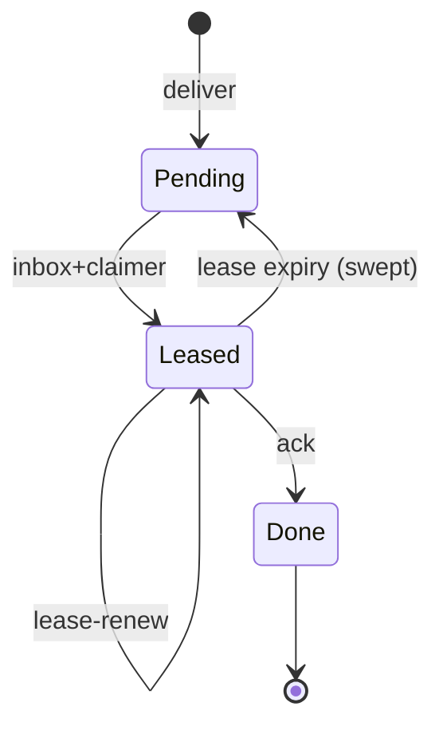

# Mens SSOT (CPU-first)

Vox **mens** is **opt-in at runtime**: default single-node behaviour is unchanged until operators set the variables below or use `vox populi` (requires `vox-cli` Cargo feature **`populi`**; enables `vox-populi` in the CLI binary).

## A2A acknowledgment vs Ludus notification ACK

- **Populi A2A** **`ack`** paths (inbox claimer / message ACK) acknowledge **mesh-delivered agent mail** and task handoff plumbing. They are **unrelated** to **Vox Ludus** `gamify_notifications` read state.
- **Ludus** notification ACK is **`vox_ludus_notification_ack`** / **`vox_ludus_notifications_ack_all`** on Codex (`gamify_notifications`). Operators should not confuse mesh **message** lifecycle with **gamify** UX inbox.

Optional future work: correlate mesh task outcomes with Ludus `remote_task_*`-style events for cross-node reputation (**design-only spike**; not implied by current ACK semantics).

## Environment variables

| Variable | Meaning |
|----------|---------|
| `VOX_MESH_ENABLED` | `1` or `true` enables mens hooks (registry publish, interpreted workflow mens steps). |
| `VOX_MESH_NODE_ID` | Stable node id; generated if unset when publishing. |
| `VOX_MESH_LABELS` | Comma-separated labels merged into [`TaskCapabilityHints`](orchestration-unified.md) `labels`. |
| `VOX_MESH_CONTROL_ADDR` | HTTP control plane URL, e.g. `http://127.0.0.1:9847` or `http://mens-ctrl:9847` (scheme optional in clients; normalise to `http://` when missing). |
| `VOX_MESH_ADVERTISE_GPU` | `1` / `true` sets agent `gpu_cuda` in probes (**legacy** workstation advertisement; not a Vulkan/Android probe). See [mobile / edge AI SSOT](mobile-edge-ai.md). |
| `VOX_MESH_ADVERTISE_VULKAN` | `1` / `true` sets `gpu_vulkan` on the host capability snapshot. |
| `VOX_MESH_ADVERTISE_WEBGPU` | `1` / `true` sets `gpu_webgpu`. |
| `VOX_MESH_ADVERTISE_NPU` | `1` / `true` sets `npu`. |
| `VOX_MESH_DEVICE_CLASS` | Optional label (`server`, `desktop`, `mobile`, `browser`, …) → `TaskCapabilityHints.device_class`. |
| `VOX_MESH_REGISTRY_PATH` | Override path for the local JSON registry (default `~/.vox/cache/mens/local-registry.json`). |
| `VOX_MESH_TOKEN` | Legacy **full-access** mesh bearer. When **any** mesh-class secret resolves (this and/or worker/submitter/admin tokens via Clavis), protected routes require `Authorization: Bearer <value>` that matches **one** configured token. **Never log** bearer material. |
| `VOX_MESH_WORKER_TOKEN` | Restricted bearer: join / heartbeat / leave / list / A2A inbox+ack (not deliver). |
| `VOX_MESH_SUBMITTER_TOKEN` | Restricted bearer: **`POST /v1/populi/a2a/deliver`** only. |
| `VOX_MESH_ADMIN_TOKEN` | Full mirror of legacy mesh privileges on all routes. |
| `VOX_MESH_JWT_HMAC_SECRET` | Optional HS256 secret: clients may use `Authorization: Bearer <jwt>` with claims **`role`** (`mesh` / `worker` / `submitter` / `admin`), **`jti`** (replay guard), **`exp`**. |
| `VOX_MESH_WORKER_RESULT_VERIFY_KEY` | Optional Ed25519 public key (hex or Standard base64): when set, **`job_result`** / **`job_fail`** deliveries may include `payload_blake3_hex` + `worker_ed25519_sig_b64` (signature over raw 32-byte BLAKE3 digest). |
| `VOX_MESH_A2A_LEASE_MS` | Duration for inbox **claimer** leases (numeric agent workloads should set `claimer_node_id` on inbox); default **120000**, clamped **1000 … 3600000**. |
| `VOX_MESH_BOOTSTRAP_TOKEN` | Optional short-lived one-time token used by `POST /v1/populi/bootstrap/exchange` to exchange join credentials without sharing long-lived `VOX_MESH_TOKEN` out-of-band. Generated by `vox populi up` when secure mode is enabled. |
| `VOX_MESH_BOOTSTRAP_EXPIRES_UNIX_MS` | Epoch milliseconds after which bootstrap exchange is rejected (`410 Gone`). Pair with `VOX_MESH_BOOTSTRAP_TOKEN`. |
| `VOX_MESH_SCOPE_ID` | Opaque cluster / tenancy id. When set on **`vox populi serve`**, **`POST /v1/populi/join`** and **`POST /v1/populi/heartbeat`** require the JSON [`NodeRecord`](../../../crates/vox-populi/src/lib.rs) `scope_id` field to match. Clients pick it up from the same env when building records via **`node_record_for_current_process`**. Use the **same** value for every process that should share a mens; omit for backward-compatible local-only dev. |
| `VOX_MESH_CODEX_TELEMETRY` | When `1` / `true`, append Codex `populi_control_event` rows (see [orchestration unified SSOT](orchestration-unified.md)). |
| `VOX_MESH_MAX_STALE_MS` | Optional client-side staleness threshold (e.g. MCP mens snapshots); compare with `last_seen_unix_ms` from the control plane (see [orchestration unified SSOT](orchestration-unified.md)). |
| `VOX_MESH_HTTP_JOIN` | When `0` / `false`, skip MCP **`vox-mcp`** HTTP **`POST /v1/populi/join`** even if a client-suitable control URL is set. Default: join when **`VOX_ORCHESTRATOR_MESH_CONTROL_URL`** or **`VOX_MESH_CONTROL_ADDR`** normalizes to a non-bind-all `http(s)://` base. |
| `VOX_MESH_HTTP_HEARTBEAT_SECS` | Interval for MCP background **`POST /v1/populi/heartbeat`** after a successful join (`0` = join only, no loop). Default **30**. Uses **`VOX_ORCHESTRATOR_MESH_HTTP_TIMEOUT_MS`** (min 500ms, default **15000**) for request timeouts. |
| `VOX_MESH_HTTP_MAX_BODY_BYTES` | Optional cap on JSON request bodies for the HTTP control plane (allowed range per process **2 KiB … 8 MiB**; default **512 KiB**). Oversized bodies get **413 Payload Too Large**. |
| `VOX_MESH_SERVER_STALE_PRUNE_MS` | Optional server-side filter for **`GET /v1/populi/nodes`**: omit nodes whose `last_seen_unix_ms` is older than this many milliseconds vs server wall clock. `0` / unset = list full registry (backward compatible). |
| `VOX_MESH_A2A_MAX_MESSAGES` | Max in-memory A2A relay rows before oldest deliveries are dropped and the optional store file is rewritten (default **50 000**, clamped **1 … 500 000**). |

## Extension-first compatibility

- **No parallel `v2` namespace:** mesh behaviour evolves through **additive** JSON fields on `NodeRecord`, A2A structs, and this OpenAPI file; clients must ignore unknown fields.
- **`x-populi-feature` response header:** informational comma-separated tokens (e.g. `jwt-bearer-v1`, `result-attest-v1`) — not a semver; use for staged rollout observability only.
- **Public worker caveat:** nodes that declare `visibility=public` cannot claim A2A rows tagged `privacy_class` `private`, `trusted`, or `trusted_only` (server-side enforcement).
- **Hybrid / synthetic workers:** set optional `NodeRecord.provider` (for example `runpod`, `vast`) so operators can treat cloud capacity like first-class mesh nodes under the same join + lease semantics.

## Local registry file

`PopuliRegistryFile` JSON (`schema_version`, `nodes[]`) is stored at the path resolved by `vox_populi::local_registry_path()` / `VOX_MESH_REGISTRY_PATH` — suitable for a **shared Docker volume** between a control-plane service and workers (dev/CI).

## HTTP control plane (Phase 3 baseline)

Implemented in **`vox-populi`** feature **`transport`**:

- `GET /health` — process liveness (no bearer required; for load balancers / compose)
- `GET /v1/populi/nodes` — list nodes
- `POST /v1/populi/join` — upsert node
- `POST /v1/populi/heartbeat` — refresh `last_seen` / listen addr
- `POST /v1/populi/leave` — graceful leave (JSON body `{ "id": "<node_id>" }`; `204` removed, `404` unknown id)
- `POST /v1/populi/bootstrap/exchange` — one-time bootstrap exchange (`VOX_MESH_BOOTSTRAP_*`) returning mesh token + scope for join automation
- `POST /v1/populi/a2a/lease-renew` — extend an active inbox lease (same bearer as inbox)
- `POST /v1/populi/admin/quarantine` — set `NodeRecord.quarantined` (mesh or admin bearer only; workers cannot clear)

**Bearer roles** (when the server resolves any mesh secret via Clavis): **`Mesh`** (`VOX_MESH_TOKEN`) and **`Admin`** (`VOX_MESH_ADMIN_TOKEN`) may call every route; **`Worker`** may not call deliver; **`Submitter`** may call deliver only. **`FromEnv`** mode loads all four secrets once at router build. Clients delivering over A2A may use **`PopuliHttpClient::with_env_deliver_token`** (mesh → submitter → admin precedence).

**TLS/mTLS** is an operator concern in front of this API (see ADR 008).

For in-process tests or custom hosts, **`populi_http_app_with_auth`** + **`PopuliHttpAuth`** (`Open`, `Bearer(…)`, `Custom(…)`, or `FromEnv`) avoid relying on ambient `VOX_MESH_TOKEN` in the test process.

### Operator notes (partition / stale nodes)

There is no in-tree gossip TTL yet: treat **`last_seen_unix_ms`** as a hint only. On partition, nodes may disappear from the control-plane view after **`leave`** or process restart; **heartbeats** refresh liveness. For automation, compare `last_seen_unix_ms` to a wall-clock threshold and re-`join` after long gaps. Set **`VOX_MESH_MAX_STALE_MS`** (or rely on MCP snapshot filtering) to drop visibly stale rows client-side.

**Heartbeats:** prefer a **≥ 15–30s** interval per node in steady state; sustained sub-second heartbeats can amplify load on shared control planes — add rate limits at the edge if operators observe abuse (no default middleware in-tree). On **429/503** or transport errors, clients should **back off exponentially** (jittered) before retrying join/heartbeat; never tight-loop against the control plane.

**Idempotent joins:** repeating **`POST /v1/populi/join`** with the same `id` upserts the row — safe to retry after timeouts.

### Orchestrator federation (read-only) + experimental routing

When **`VOX_ORCHESTRATOR_MESH_CONTROL_URL`** (or TOML `[orchestrator].populi_control_url` / `[mens].control_url`) is set, **`vox-mcp`** polls **`GET /v1/populi/nodes`** on an interval and exposes a cached snapshot on orchestrator status tools. This path is **visibility only** and does **not** execute tasks on remote nodes.

**Experimental:** `VOX_ORCHESTRATOR_MESH_ROUTING_EXPERIMENTAL=1` enables extra **in-process** scoring / tracing in `RoutingService` using cached remote labels (still **no remote execute**). Treat as **best-effort**; may be removed or replaced in a breaking release.

**Experimental remote relay:** `VOX_ORCHESTRATOR_MESH_REMOTE_EXECUTE_EXPERIMENTAL=1` plus `VOX_ORCHESTRATOR_MESH_REMOTE_EXECUTE_RECEIVER_AGENT=<u64>` (and a reachable `VOX_ORCHESTRATOR_MESH_CONTROL_URL`) emits a **best-effort** [`RemoteTaskEnvelope`](../../../crates/vox-orchestrator/src/a2a/envelope.rs) on the populi A2A channel **after** the task is enqueued locally. Failures are logged at `debug` only — **local agents still own execution**. **`vox-mcp`** runs a **dedicated** inbox poller for **`remote_task_result`** (default every **5s**, `VOX_ORCHESTRATOR_MESH_REMOTE_RESULT_POLL_INTERVAL_SECS`; use **`0`** to disable) so completions are picked up even when federation node polling is off or slow.

### Skills / agent labels

For **multi-node** pools, align **`VOX_MESH_LABELS`**, **`[mens].labels`**, and task **`TaskCapabilityHints::labels`** with the same tokens your operators expect on workers (e.g. `pool=train`, `region=us-west`). Skills and MCP training tools should use the same strings as routing hints so federation snapshots and local queues stay comparable.

## Codegen (Rust servers)

`vox-codegen-rust` **does not** open mens listeners or set federation URLs; mens remains **worker / operator env** (`VOX_MESH_*`, `Vox.toml` `[mens]`) when processes should register or call the control plane.

## CLI / MCP

- **`vox populi status` / `vox populi serve`** — [`cli.md`](cli.md), feature **`populi`**.
- **`vox_populi_local_status`** (MCP) — returns env + registry JSON.
- **`vox-mcp` process** — when **`VOX_MESH_ENABLED`**, publishes to the local registry once at startup (`crates/vox-mcp/src/populi_startup.rs`), mirroring **`vox run`**. With a **client-suitable** control URL (**`VOX_ORCHESTRATOR_MESH_CONTROL_URL`** first, else **`VOX_MESH_CONTROL_ADDR`**; bind-all hosts like `0.0.0.0` are skipped via [`normalize_http_control_base`](../../../crates/vox-populi/src/lib.rs)), it also **`POST /v1/populi/join`** and periodically **`POST /v1/populi/heartbeat`** unless disabled (**`VOX_MESH_HTTP_JOIN`**, **`VOX_MESH_HTTP_HEARTBEAT_SECS`**). Optional Codex rows: **`mesh_http_join_ok` / `mesh_http_join_err`** when **`VOX_MESH_CODEX_TELEMETRY`**. Use the same env as workers so the node id matches **`vox run`** / compose peers.
- **Docker** — `Dockerfile` + `docker/vox-entrypoint.sh`: optional **`VOX_MESH_MESH_SIDECAR=1`** starts **`vox populi serve`** in the background before **`vox mcp`**; set **`VOX_MESH_CONTROL_ADDR`** to the sidecar URL from other containers. Compose profiles and env SSOT: [deployment compose SSOT](deployment-compose.md).

## Observability

- **Tracing target `vox.mens`**: registry publish success logs `path` and `node_id` from **`vox run`** (`crates/vox-cli/src/commands/run.rs`); failures at `debug` only (best-effort).
- **HTTP**: `tower-http` **`TraceLayer`** and **`SetRequestIdLayer`** (`x-request-id`) wrap the control-plane router for request-scoped logs.
- **`vox run`**: mens registry is published once at the start of the shared `run` entrypoint so **app** and **script** modes (and **`vox-compilerd`** `run`) behave consistently when **`VOX_MESH_ENABLED`** is set. When a client-suitable control URL is set (**`VOX_ORCHESTRATOR_MESH_CONTROL_URL`** / **`VOX_MESH_CONTROL_ADDR`**) and **`VOX_MESH_HTTP_JOIN`** is not disabled, it also performs the same **`POST /v1/populi/join`** (+ optional heartbeat) path as **`vox-mcp`** via [`vox_populi::http_lifecycle`](../../../crates/vox-populi/src/http_lifecycle.rs).

### Metrics

- **Today:** structured logs under tracing target **`vox.mens`** (see above) plus optional Codex rows typed **`populi_control_event`** when **`VOX_MESH_CODEX_TELEMETRY`** is enabled — append path in [`populi_registry_telemetry.rs`](../../../crates/vox-db/src/populi_registry_telemetry.rs) / [`populi_control_telemetry.rs`](../../../crates/vox-db/src/populi_control_telemetry.rs).
- **Mesh queues:** `tracing::debug!` lines note **policy skips** when a public worker attempts to claim a private/trusted A2A row (histogram wiring is deferred).
- **Future:** Prometheus-style counters or OpenTelemetry spans on control-plane routes (**`/v1/populi/join`**, etc.) could sit behind the **`transport`** feature and dedicated env toggles if SRE needs SLO dashboards; not required for the baseline CPU-first mens story.

## OpenAPI

Machine-readable contract: [`schemas/populi-control-plane.openapi.yaml`](../../../schemas/populi-control-plane.openapi.yaml) (paths under the served origin; no auth secret in spec).

## Control-plane HTTP errors (stable text bodies)

| Status | Typical route | Meaning |
|--------|---------------|---------|
| 400 | lease-renew, malformed JSON | Missing `claimer_node_id` / invalid body |
| 401 | any protected | Bearer missing or not matching a configured mesh secret |
| 403 | join, heartbeat | `scope_id` mismatch vs server `VOX_MESH_SCOPE_ID` |
| 403 | inbox (claim) | Unknown `claimer_node_id` or worker quarantined |
| 403 | deliver | Worker token used (submitters only) |
| 403 | join/list/… | Submitter token used |
| 404 | leave | Unknown node id |
| 404 | admin/quarantine | Unknown node id |
| 409 | lease-renew | Another node holds the lease |
| 410 | bootstrap | Bootstrap token consumed or expired |
| 413 | any POST | Body over `VOX_MESH_HTTP_MAX_BODY_BYTES` |

## A2A job lifecycle (informal)

## Documentation → Mens training pipeline

Mesh/security doc changes must remain **`training_eligible: true`** where appropriate (this page). Before promoting default mesh behaviour:

1. Edit [`docs/src/reference/populi.md`](populi.md) and [`docs/src/reference/clavis-ssot.md`](clavis-ssot.md) first (contract SSOT).
2. Link new pages from [`SUMMARY.md`](../SUMMARY.md).
3. Run the Mens corpus pipeline per [How-To: Contribute — Mens training](../how-to/how-to-contribute-mens.md) (extract → validate → pairs → eval).
4. Record any eval regression in the PR; delay changing defaults until recovery.

## Related

- [Cross-platform Vox — lanes & Docker matrix (SSOT)](../architecture/vox-cross-platform-runbook.md) — Docker feature matrix vs mobile HTTP mens clients.
- [Deployment compose SSOT](deployment-compose.md) — Docker / Compose / Coolify / CI entry point.
- [Orchestration unified SSOT](orchestration-unified.md) — capability probe merge, `VOX_MESH_ADVERTISE_*`.
- [Mobile / edge AI SSOT](mobile-edge-ai.md) — inference profiles, mens GPU/NPU advertisement, training handoff.
- [ADR 008: mens transport](../adr/008-mens-transport.md) — HTTP-first control plane, future TLS/quic.
- [ADR 009: hosted mens BaaS (future)](../adr/009-mens-hosted-baas.md) — trust model vs self-hosted clusters.
