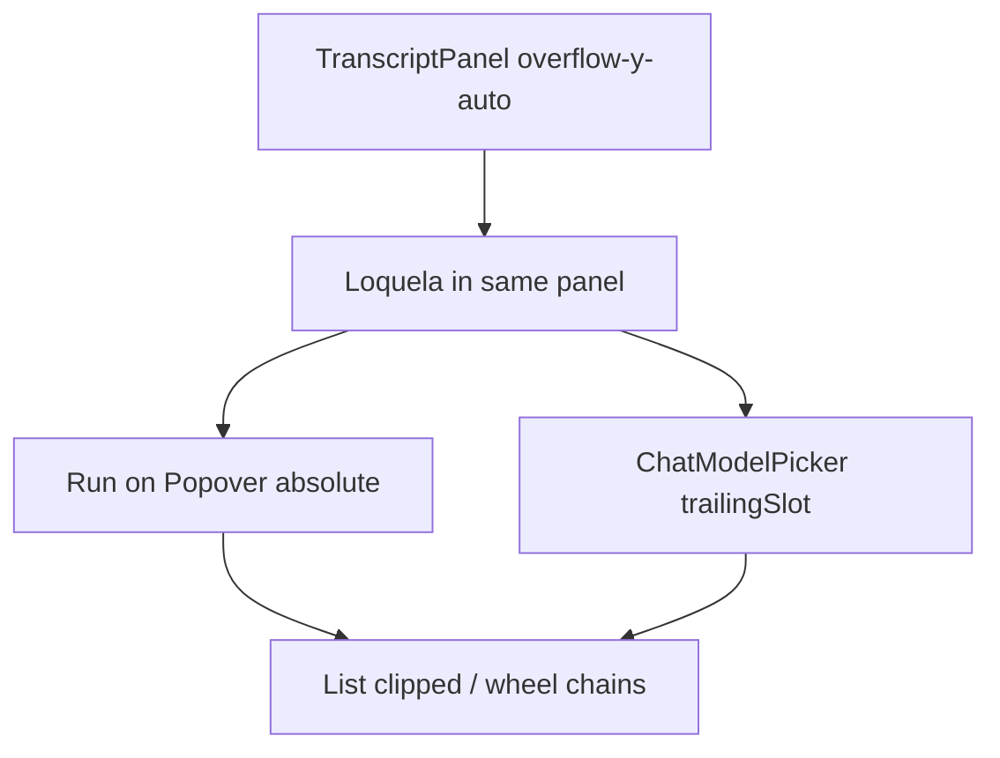

# Axis Chat Honesty, Theme, and Compression

> **For agentic workers:** REQUIRED SUB-SKILL: Use superpowers:subagent-driven-development (recommended) or superpowers:executing-plans to implement this plan task-by-task. Steps use checkbox (`- [ ]`) syntax for tracking.

**Goal:** Every visible chat control is reachable and matches the wire; the composer catalog can actually be scrolled to `mens/…`; leftover theme/dock bugs are fixed without re-doing completed KPI/Flow work.

**Architecture:** Unblock `vox-gui` compile first. Then fix picker **clip** and `send()`/`effectiveTierId`. Honesty next: hide knobs **no consumer honors**. Compression last. `dry_run` is emitted on both wires ([chat_turn.rs](crates/vox-gui/src/commands/chat_turn.rs) L196–201, [control_plane.rs](crates/vox-gui/src/commands/control_plane.rs) L92) but **neither** the sync loop nor daemon `SUBMIT_TASK` reads it — do not keep a Background-only Dry-run. Background **does** honor `priority` and `mode`; sync drops `mode` from `sync_tool_args`.

**Tech Stack:** React 19 + vitest in `crates/vox-gui/ui`, dockview 6.6.1, existing `useMetricSeries` / `append`, Tauri `chat_turn`. No new crate edges.

**On-disk copy (first execution step, before Task 0 code):** write this plan to [docs/superpowers/plans/2026-09-07-axis-chat-honesty-theme.md](docs/superpowers/plans/2026-09-07-axis-chat-honesty-theme.md) with required docs frontmatter.

## Global Constraints

- Retired names: `vox-gamify` not `vox-ludus`; `vox-orchestrator` not `vox-dei`.
- Test-first. Do **not** implement sync-path `dry_run` / `mode` / `priority` in the agent loop.
- Do **not** add a Plan/Act/Verify segment. Do **not** remap more Tailwind utilities. Leave unused `@utility overline`.
- Do **not** shrink composer hit targets (`size-6` is rejected — current `px-2 py-1` stays). Compress with `gap` / `pt` only.
- Do **not** assert `scrollHeight > clientHeight` in jsdom (no layout). Structural class + last-option-present tests only.
- Do **not** add crate-edge exceptions. Format with `cargo fmt -p <crate>` or `vox run scripts/fmt.vox`, never `cargo fmt --all`.
- When removing `ChatModelPicker` from Chat, **also** invert [ChatModelPicker.test.tsx](crates/vox-gui/ui/src/components/surfaces/Chat/ChatModelPicker.test.tsx) L155–160 and retarget [e2e/model-picker-interactions.spec.ts](crates/vox-gui/ui/e2e/model-picker-interactions.spec.ts) (it clicks `model: auto-route`). Leaving those is a guaranteed red.

## Auditor verdict (verified against tree)

Tracks: [composer honesty](e79eebad-d317-457f-b731-f757c199b112), [Rust/VoxLocal](8fe5bb1a-3eed-4e0d-b00c-5a67a5f848d5), [transcript](16c42755-ef45-4724-a091-e25eb9bfd59d), [dock IA](d885ffe7-6768-44a0-8858-a8778890f6a2), [theme](3cbd6714-e630-4fad-a5dc-f7ee970af562), [surface wiring](e7efeac2-53da-4bb7-b8f8-d195e9f61b82), [TDD fragility](df9bd7c3-1371-41ef-85ca-f84cd0d3f3fb), [UX gaps](a7a20dda-d4c8-4f06-8668-f6252240025e), [picker scroll](2dad01a5-7383-4381-906f-0746b86c2128). Local re-read of the cited lines.

**True positives (keep)**

- `send()` uses local `tier` ([Loquela.tsx](crates/vox-gui/ui/src/components/surfaces/Loquela/Loquela.tsx) L533–540); display uses `effectiveTierId` (L354–355). App prefers `p.model_override ?? chatModelOverride` ([App.tsx](crates/vox-gui/ui/src/App.tsx) L1618).
- Two pickers on Chat: Loquela “Run on” + `trailingSlot` `ChatModelPicker` (App L1640–1645).
- Dry-run always visible (L833–846). Sync ignores it; Background `SUBMIT_TASK` also ignores it (GUI still serializes `dry_run`). Existing Loquela test L348–359 asserts Quick-chat `dry_run: true`.
- `inference_provider_status` E0382: `local_availability(p, …)` then `format!("{p:?}")` ([llm_settings.rs](crates/vox-gui/src/commands/llm_settings.rs) L107–109).
- `stream_vox_local` hard-codes `"max_tokens": 64` ([transport.rs](crates/vox-gamify/src/ai/client/transport.rs) L107–112). Sibling chat paths use `Some(512)` (L255, L367).
- `case 'chat'` omits `attention`, `onOpenFeedbackContext`, `pendingApprovals` ([surfaceComponents.tsx](crates/vox-gui/ui/src/components/layout/surfaceComponents.tsx) L188–217). ChatSurface defaults `pendingApprovals = 0`.
- To-dos auto-create with no plan check ([ChatSurface.tsx](crates/vox-gui/ui/src/components/surfaces/Chat/ChatSurface.tsx) L838–851). `CORE_PANEL_IDS` includes `todos`. Reset-layout test asserts 3 cores (ChatSurface.test L765).
- Agents/Queue still 18px `Kpi` ([ChatExecutionRail.tsx](crates/vox-gui/ui/src/components/surfaces/Chat/ChatExecutionRail.tsx) L199–214); Mesh is already `Segment`.
- `Agent.progress == null` shows `0%` ([AgentFlow.tsx](crates/vox-gui/ui/src/components/surfaces/Flow/AgentFlow.tsx) L106–118).
- **User-confirmed:** catalog is not reachable past the first screen. Classes `max-h-72 overflow-y-auto` exist on both pickers, but the popover is **not portaled** and lives inside `TranscriptPanel` `overflow-y-auto` ([ChatSurface.tsx](crates/vox-gui/ui/src/components/surfaces/Chat/ChatSurface.tsx) L83) which also hosts the composer (L687–720). Wheel events chain to the panel; search sits **inside** the scroller; empty query dumps up to 2000 rows; `mens/…` is after routing tiers. Removing `ChatModelPicker` does **not** fix Loquela “Run on”.

**False positives (dropped or rewritten)**

- “Picker lacks overflow classes” — classes are present; ancestor clip is the bug.
- Task 2 test “Loquela exposes a single Choose model control” — **always green today** (Loquela never mounts `ChatModelPicker`). Dual-picker proof belongs in App / the existing readFileSync guard.
- Task 4 `queryByText('', { selector: '.vox-metric-rule' })` — invalid RTL usage.
- Task 3 `className.toMatch(/gap-1/)` — brittle; [ChatTranscript.test.tsx](crates/vox-gui/ui/src/components/surfaces/Chat/ChatTranscript.test.tsx) already exists.
- Task 6 progress slot text `"—"` — collisions with budget em-dash. Use `aria-label="Progress unknown"` and no `progressbar`.
- Task 1 “rewrite Intent copy to say queue priority” — [IntentPanel.tsx](crates/vox-gui/ui/src/components/surfaces/Loquela/IntentPanel.tsx) L38 already says `urgent — jump the queue`. Remaining honesty: Effort still shows on Quick chat, which ignores `priority`.
- “Background honors dry_run” — **false**. Hide Dry-run entirely; do not implement daemon `SUBMIT_TASK` dry_run in this plan.
- Task 4 reuse of `Kpi.sparkData` — **dead API** (`Kpi.tsx` accepts it, never draws). Spark must be a 40×16 SVG (or drop spark).
- Task 7 persisted-`flow` fixture — **always-green** (`fromJSON` throws like sessions). Drop it. Keep `close()` as untested defense-in-depth.
- jsdom `scrollHeight > clientHeight` — will not fail or will flake.
- Task 0 Step 2 running `vox-gui` (E0382) and `vox-gamify` assertion-flip in one breath — compile break blocks nothing else; fix E0382 **before** flipping the token assertion.
- Pairing “breaks on tool rows between turns” — **false** ([transcript](16c42755-ef45-4724-a091-e25eb9bfd59d): chips live inside the assistant bubble). Pairing is still **deferred** (YAGNI); keep Task 3 as sr-only You only.

**False negatives (added)**

- [ChatModelPicker.test.tsx](crates/vox-gui/ui/src/components/surfaces/Chat/ChatModelPicker.test.tsx) L155–160 **requires** `trailingSlot` to contain `ChatModelPicker`. [e2e/model-picker-interactions.spec.ts](crates/vox-gui/ui/e2e/model-picker-interactions.spec.ts) clicks `model: auto-route`. Task 2 without those updates is a self-inflicted red.
- Loquela tier `Popover` has no Escape / outside-click ([Popover.tsx](crates/vox-gui/ui/src/components/ui/Popover.tsx) is a dumb shell).
- Skill popover is unbounded (same `Popover`).
- `size-6` compression would worsen tap targets — cut from Task 2.
- [App.tsx](crates/vox-gui/ui/src/App.tsx) L1818–1827 task-badge sets `openPlanSessionId` only — never `openPlanVersion`. [plan_panel.rs](crates/vox-gui/src/commands/plan_panel.rs) L160–165 returns `Option<String>`. Gating To-dos on both ids **without** this fix hides badge-opened plans forever.
- Loquela.test L348–359 will fail when Dry-run is removed — update in the same Task 1 commit.
- ~11 `ChatSurface.test.tsx` cases assume To-dos on default mount / Reset = 3 cores — migrate **before** implementing the gate.
- `waitingQuestions` / `blockedTasks` are already passed; do not remove them when wiring `attention`.
- Keep `onModelPick={setChatModelOverride}` and `selectedModelId={chatModelOverride}` when removing `ChatModelPicker`.
- Silent default `mode: "act"` on every submit (Loquela L189). Show a Background-only chip for the current mode; do not invent a third picker.
- Dual visible “Dry-run” labels (toolbar + Run button L697) go away when the toggle is removed; keep Run’s visible text as `Run`.

**Already done (do not re-do):** KPI rule under the figure; Flow gone from chat dock; Execution roster + Open topology; Dry-run toggle exists; model picker emits real ids; Intent “jump the queue” copy.




---

## File map

- Modify: [ChatSurface.tsx](crates/vox-gui/ui/src/components/surfaces/Chat/ChatSurface.tsx) — TranscriptPanel overflow (inner transcript scrolls; composer `shrink-0`); plan-gated To-dos; Reset 2 cores
- Modify: [Loquela.tsx](crates/vox-gui/ui/src/components/surfaces/Loquela/Loquela.tsx) — portal or unclipped list, sticky search, `send()` uses `effectiveTierId`, honesty, Escape/outside-click
- Modify: [App.tsx](crates/vox-gui/ui/src/App.tsx) — `trailingSlot` = Grounding only; keep `onModelPick` / `selectedModelId`; badge click sets `planVersion`
- Modify: [plan_panel.rs](crates/vox-gui/src/commands/plan_panel.rs) — `latest_plan_session_for_chat` returns id **and** version
- Modify: [ChatModelPicker.test.tsx](crates/vox-gui/ui/src/components/surfaces/Chat/ChatModelPicker.test.tsx) — invert trailingSlot guard
- Modify: [e2e/model-picker-interactions.spec.ts](crates/vox-gui/ui/e2e/model-picker-interactions.spec.ts) — use “Choose model tier” / Run on
- Modify: [ChatTranscript.tsx](crates/vox-gui/ui/src/components/surfaces/Chat/ChatTranscript.tsx) — sr-only You; keep 12px
- Modify: [ChatExecutionRail.tsx](crates/vox-gui/ui/src/components/surfaces/Chat/ChatExecutionRail.tsx) — Agents/Queue `Segment`; spend spark via `append`
- Modify: [surfaceComponents.tsx](crates/vox-gui/ui/src/components/layout/surfaceComponents.tsx) — pass attention props
- Modify: [AgentFlow.tsx](crates/vox-gui/ui/src/components/surfaces/Flow/AgentFlow.tsx), [dockview-vox.css](crates/vox-gui/ui/src/styles/dockview-vox.css), [index.css](crates/vox-gui/ui/src/index.css)
- Modify: [llm_settings.rs](crates/vox-gui/src/commands/llm_settings.rs), [transport.rs](crates/vox-gamify/src/ai/client/transport.rs)
- Modify: [EmptyState.tsx](crates/vox-gui/ui/src/components/ui/EmptyState.tsx) / [PlanPanel.tsx](crates/vox-gui/ui/src/components/surfaces/Chat/PlanPanel.tsx)

---

### Task 0: Persist plan + unblock compile + VoxLocal length

**Files:** create docs plan copy; [llm_settings.rs](crates/vox-gui/src/commands/llm_settings.rs) L77–109; [transport.rs](crates/vox-gamify/src/ai/client/transport.rs) L107–112

**Interfaces:** `local_availability` may stay by-value if `format!("{p:?}")` runs **before** the call. `stream_vox_local` body uses `max_tokens: 512` (match L255/L367 — do not omit and inherit Candle `unwrap_or(256)`).

- [ ] **Step 1:** Write `docs/superpowers/plans/2026-09-07-axis-chat-honesty-theme.md` (this plan + docs frontmatter).
- [ ] **Step 2:** Fix E0382: `let provider = format!("{p:?}");` then `local_availability(p, …)`.
- [ ] **Step 3:** `cargo test -p vox-gui vox_local -- --nocapture` — expect **PASS** (compile + existing ungated test).
- [ ] **Step 4:** In the existing `stream_vox_local` HTTP mock test, assert `body["max_tokens"] == 512` (change assertion first so it fails on 64).
- [ ] **Step 5:** `cargo test -p vox-gamify stream_vox_local -- --nocapture` — FAIL, then set `"max_tokens": 512`, PASS.
- [ ] **Step 6: Commit** `fix(gui): compile provider status and raise VoxLocal chat max_tokens`

---

### Task 1: Composer honesty

**Files:** [Loquela.tsx](crates/vox-gui/ui/src/components/surfaces/Loquela/Loquela.tsx), [Loquela.test.tsx](crates/vox-gui/ui/src/components/surfaces/Loquela/Loquela.test.tsx), [IntentPanel.tsx](crates/vox-gui/ui/src/components/surfaces/Loquela/IntentPanel.tsx)

`renderLoquela` already spreads props. **Rewrite** existing `'toggles dry-run and sends dry_run: true on submit'` (L348–359) — it will fail once Dry-run is gone.

- [ ] **Step 1: Failing tests**

```ts
it('does not expose a Dry-run control in either send mode', () => {
  renderLoquela();
  expect(screen.queryByRole('button', { name: 'Dry-run' })).toBeNull();
  fireEvent.click(screen.getByRole('button', { name: /choose send mode/i }));
  fireEvent.click(screen.getByRole('button', { name: /set send mode: background task/i }));
  expect(screen.queryByRole('button', { name: 'Dry-run' })).toBeNull();
});

it('always submits dry_run false', () => {
  const onSubmit = vi.fn();
  renderLoquela({ onSubmit });
  const ta = screen.getByLabelText('Task composer');
  fireEvent.change(ta, { target: { value: 'x' } });
  fireEvent.keyDown(ta, { key: 'Enter' });
  expect(onSubmit.mock.calls[0][0].dry_run).toBe(false);
});

it('hides Effort on Quick chat and shows it on Background task', () => {
  renderLoquela();
  fireEvent.click(screen.getByRole('button', { name: /structured intent/i }));
  expect(screen.queryByLabelText('Effort')).toBeNull();
  fireEvent.click(screen.getByRole('button', { name: /choose send mode/i }));
  fireEvent.click(screen.getByRole('button', { name: /set send mode: background task/i }));
  expect(screen.getByLabelText('Effort')).toBeInTheDocument();
});

it('shows an Interaction mode chip on Background task', () => {
  renderLoquela();
  expect(screen.queryByLabelText('Interaction mode')).toBeNull();
  fireEvent.click(screen.getByRole('button', { name: /choose send mode/i }));
  fireEvent.click(screen.getByRole('button', { name: /set send mode: background task/i }));
  expect(screen.getByLabelText('Interaction mode')).toHaveTextContent(/act/i);
});
```

- [ ] **Step 2:** `cd crates/vox-gui/ui && pnpm test src/components/surfaces/Loquela/Loquela.test.tsx` — FAIL (Dry-run still there; Effort always visible; no chip).
- [ ] **Step 3:** Remove the Dry-run button. `dry_run: false` in `send()`. Keep Run visible text as `Run` (`aria-label="Run (Enter)"`). Hide Intent Effort unless `executionMode === 'task'`. On Background, show `aria-label="Interaction mode"` chip with current `mode` (`Act` default / `Verify` after `/verify`). No Plan/Act/Verify segment. Do not rewrite Intent option strings. Do not implement daemon `dry_run`.
- [ ] **Step 4:** PASS
- [ ] **Step 5: Commit** `fix(gui): remove inert dry-run and hide effort on quick chat`

---

### Task 2: Reachable catalog + one picker + honest submit

This is the user-blocking usability task. Do not “just remove ChatModelPicker.”

**Clip fix (lock this, do not portal-only):**

1. [ChatSurface.tsx](crates/vox-gui/ui/src/components/surfaces/Chat/ChatSurface.tsx) L83: TranscriptPanel becomes `flex h-full min-w-0 flex-col overflow-hidden p-2` (no `overflow-y-auto`).
2. Center column: `ChatTranscript` (or empty-state wrapper) `min-h-0 flex-1 overflow-y-auto`; composer dock already `shrink-0`.
3. Loquela list: search **sticky outside** the scroller; list `data-testid="model-picker-scroll"` with `max-h-72 overflow-y-auto overscroll-contain`.
4. Escape + outside-click on `tierOpen` (copy ChatModelPicker L37–51).
5. Skill `Popover` children: `max-h-64 overflow-y-auto overscroll-contain`.
6. `send()` uses `effectiveTierId` for `tier` / `model_override`.
7. App `trailingSlot` = `GroundingCheckToggle` only. **Keep** `onModelPick={setChatModelOverride}` and `selectedModelId={chatModelOverride}`.
8. Invert ChatModelPicker trailingSlot guard; retarget e2e to `getByRole('button', { name: /choose model tier/i })`.

- [ ] **Step 1: Failing tests**

```ts
// Loquela.test.tsx
it('submits selectedModelId over a stale local tier', () => {
  const onSubmit = vi.fn();
  renderLoquela({ onSubmit, selectedModelId: 'mens/e2e-smoke-metal', onModelPick: vi.fn() });
  const ta = screen.getByLabelText('Task composer');
  fireEvent.change(ta, { target: { value: 'hello' } });
  fireEvent.keyDown(ta, { key: 'Enter' });
  expect(onSubmit.mock.calls[0][0].model_override).toBe('mens/e2e-smoke-metal');
});

it('keeps search outside the model list scroller and lists 25 catalog rows', async () => {
  mockListModels.mockResolvedValue(
    Array.from({ length: 25 }, (_, i) => ({
      id: i === 24 ? 'mens/e2e-smoke-metal' : `openrouter/vendor/model-${i}`,
      provider_type: i === 24 ? 'mens' : 'openrouter',
    })),
  );
  renderLoquela();
  fireEvent.click(screen.getByRole('button', { name: /choose model tier/i }));
  const search = await screen.findByRole('searchbox', { name: /search models/i });
  const scroller = screen.getByTestId('model-picker-scroll');
  expect(scroller.contains(search)).toBe(false);
  expect(scroller.className).toMatch(/overflow-y-auto/);
  expect(scroller.className).toMatch(/max-h-/);
  expect(screen.getByText('mens/e2e-smoke-metal')).toBeInTheDocument();
});

// ChatModelPicker.test.tsx — invert L156
it('App.tsx does not mount ChatModelPicker in Loquela trailingSlot', () => {
  const appSrc = readFileSync(path.resolve(__dirname, '../../../App.tsx'), 'utf8');
  const loquelaBlockMatch = appSrc.match(/const loquelaComposer = \(\s*<Loquela[\s\S]*?\/>\s*\);/);
  expect(loquelaBlockMatch?.[0]).not.toMatch(/<ChatModelPicker/);
  expect(loquelaBlockMatch?.[0]).toMatch(/<GroundingCheckToggle/);
});

// ChatSurface.test.tsx
it('transcript dock does not use overflow-y-auto on the panel that hosts the composer', async () => {
  render(/* existing ChatSurface harness */);
  const panel = await screen.findByTestId('chat-dock-transcript');
  expect(panel.className).not.toMatch(/overflow-y-auto/);
});
```

- [ ] **Step 2:** FAIL (submit still `tier`; search is inside scroller; App still mounts ChatModelPicker; panel still `overflow-y-auto`).
- [ ] **Step 3:** Implement the eight items above. Toolbar: `gap-x-2 gap-y-1 pt-1.5` only — no `size-6`.
- [ ] **Step 4:** `pnpm test` Loquela + ChatModelPicker + ChatSurface tests PASS. Update e2e spec trigger/listbox names to Run on (`Choose model tier`) and assert the last mocked `mens/…` option is in the DOM after open (Playwright can then `scrollIntoViewIfNeeded`).
- [ ] **Step 5: Commit** `fix(gui): unclip model catalog and submit the shown id`

---

### Task 3: Transcript type — no pairing

**Why slim:** Pairing is feasible (tool chips are **inside** the assistant bubble, status/summary append at the end — [transcript audit](16c42755-ef45-4724-a091-e25eb9bfd59d)). Still deferred as YAGNI. Body is already `text-[12px]`. Visible “You” (L45) is the density win. Preserve `#msg-*` ids (e2e).

- [ ] **Step 1:** In existing [ChatTranscript.test.tsx](crates/vox-gui/ui/src/components/surfaces/Chat/ChatTranscript.test.tsx):

```ts
it('exposes user role as sr-only, not a visible You label', () => {
  render(<MessageBubble message={msg({ role: 'user', text: 'hi', id: 'u1' })} />);
  expect(screen.getByText('You').className).toMatch(/sr-only/);
});
```

- [ ] **Step 2:** FAIL (You is visible).
- [ ] **Step 3:** User label `sr-only`. Assistant label only when `!message.modelId`. List `gap-2` stays. No `chat-turn-pair`.
- [ ] **Step 4:** PASS
- [ ] **Step 5: Commit** `fix(gui): hide redundant You label on chat bubbles`

---

### Task 4: Compact rail + session-spend spark

**Files:** [ChatExecutionRail.tsx](crates/vox-gui/ui/src/components/surfaces/Chat/ChatExecutionRail.tsx), [ChatExecutionRail.test.tsx](crates/vox-gui/ui/src/components/surfaces/Chat/ChatExecutionRail.test.tsx)

`Segment` already exists (L46–75). Wrap with `LanguageProvider` (existing tests do). `Kpi.sparkData` is **not rendered** — do not pass it. OpenRouter `$` on the rail is a **different metric** from DriveConsole session `$spent/$cap`. Spark the **session** figure (`sessionBudget.spent` / pass `sessionSpentUsd` if needed), label `Session`. Keep the OpenRouter `Segment` as a point value. Mirror Dashboard: `prevRef` + `append` only when the number changes. Clear `localStorage` key `vox.metric.series.v1.chat.session-spend` in `afterEach`.

- [ ] **Step 1:**

```ts
it('renders Agents and Queue as compact segments, not KPI cards with metric rules', () => {
  const { container } = render(
    <LanguageProvider>
      <ChatExecutionRail tasks={[]} kpis={sampleKpis} onNavigate={vi.fn()} />
    </LanguageProvider>,
  );
  const rail = screen.getByRole('complementary', { name: /execution rail/i });
  expect(rail.querySelector('.vox-metric-rule')).toBeNull();
  expect(screen.getByTestId('execution-rail-agents').className).toMatch(/text-\[10px\]/);
});

it('shows a session-spend spark after sessionSpentUsd changes', async () => {
  const { rerender } = render(
    <LanguageProvider>
      <ChatExecutionRail tasks={[]} kpis={sampleKpis} onNavigate={vi.fn()} sessionSpentUsd={0.1} />
    </LanguageProvider>,
  );
  rerender(
    <LanguageProvider>
      <ChatExecutionRail tasks={[]} kpis={sampleKpis} onNavigate={vi.fn()} sessionSpentUsd={0.4} />
    </LanguageProvider>,
  );
  expect(await screen.findByTestId('execution-rail-spend-spark')).toBeInTheDocument();
});
```

- [ ] **Step 2:** FAIL
- [ ] **Step 3:** Agents/Queue → `Segment`. Add optional `sessionSpentUsd`. `useMetricSeries('chat.session-spend', [])` + `useEffect`/`append` on change. 40×16 SVG, label `Session` + `$x.xx`. No toolbar knob. DriveConsole point-in-time bar stays.
- [ ] **Step 4:** PASS
- [ ] **Step 5: Commit** `fix(gui): compact execution metrics and session spend spark`

---

### Task 5: Plan-gated To-dos + badge version

**Do this before coding the gate:** rewrite every default-mount / Reset test that expects `chat-dock-todos` (~11 in [ChatSurface.test.tsx](crates/vox-gui/ui/src/components/surfaces/Chat/ChatSurface.test.tsx), including L765 “3 core panels”). Open To-dos from Panels, or pass `planSessionId` + `planVersion`.

**Badge hole:** [App.tsx](crates/vox-gui/ui/src/App.tsx) L1818–1827 never calls `setOpenPlanVersion`. Extend [plan_panel.rs](crates/vox-gui/src/commands/plan_panel.rs) `latest_plan_session_for_chat` to return `{ plan_session_id, plan_version }` (Rust test first). App sets both. Without this, gating on both ids makes badge-opened To-dos stay empty forever.

**EmptyState:** do **not** add `density` to the shared component. Wrap PlanPanel empty in `className="[&_.py-16]:py-6"` or a local compact pad.

- [ ] **Step 1:** Rust test: command returns version for a session that has `append_plan_version`. UI test: default ChatSurface has no `chat-dock-todos`; with both plan props it mounts. Reset = transcript + execution only.
- [ ] **Step 2:** FAIL
- [ ] **Step 3:** `ALWAYS_CORE = ['transcript','executionRail']`. Auto-create / Reset `todos` only when both plan ids are set and not user-closed. Keep To-dos in the Panels menu (manual open always allowed). Wire badge → `{ id, version }`.
- [ ] **Step 4:** PASS
- [ ] **Step 5: Commit** `fix(gui): gate chat to-dos and return plan version on badge click`

---

### Task 6: Theme leftovers

**Files:** [AgentFlow.tsx](crates/vox-gui/ui/src/components/surfaces/Flow/AgentFlow.tsx) L106–118; [dockview-vox.css](crates/vox-gui/ui/src/styles/dockview-vox.css); [index.css](crates/vox-gui/ui/src/index.css) `vox-range`

- [ ] **Step 1:**

```ts
it('omits the progressbar when progress is null', () => {
  render(<AgentFlow agents={[{ ...base, progress: null, budget: 5 }]} selectedId="a1" />);
  expect(screen.queryByRole('progressbar')).toBeNull();
  expect(screen.getByTestId('agent-inspector-progress')).toHaveTextContent('…');
});
```

CSS tests: `dockview-vox.css` must not contain `rgb(244, 244, 245)` for tab fg; `vox-range` must not contain `background: #fff`.

- [ ] **Step 2:** FAIL
- [ ] **Step 3:** Copy [AgentRow.tsx](crates/vox-gui/ui/src/components/surfaces/Dashboard/AgentRow.tsx) (`…`, no `aria-valuenow`). Edge `strokeOpacity` ≥ 0.8; node fill `var(--color-bg-surface)`. Map the **four** zinc tab color lines only. Thumb `var(--color-text-primary)`. Remove `animate-vox-dash` / `animate-vox-spin-slow` **from AgentFlow JSX** (classes are applied today; keyframes do not exist — do not delete working `animate-vox-ping` / shimmer).
- [ ] **Step 4:** PASS
- [ ] **Step 5: Commit** `fix(gui): AgentFlow contrast, null progress, tokenized dock chrome`

---

### Task 7: Wire attention props (no flow fixture)

**Files:** [surfaceComponents.tsx](crates/vox-gui/ui/src/components/layout/surfaceComponents.tsx) L188–217. Prefer a new `surfaceComponents.test.tsx` at the **router** boundary — existing Approvals test passes `pendingApprovals={3}` **directly** on `ChatSurface` and will stay green even if the router stays broken.

Keep `waitingQuestions={props.attention?.needsYou.length}` and `blockedTasks={props.attention?.blockedTasksCount}` — they feed `AttentionBudgetMeter`.

- [ ] **Step 1:** `render(renderSurfaceContent('chat', stubProps))` with `attention.approvals.length === 2`, open Approvals from Panels, expect `2 pending`. Stub must include `data`, `pushToast`, `chatComposer`, LanguageProvider, QueryClient (Approvals). **Fails today** because `pendingApprovals` is omitted (default 0).
- [ ] **Step 2:** FAIL
- [ ] **Step 3:** Pass `attention={props.attention}`, `onOpenFeedbackContext={props.onOpenFeedbackContext}`, `pendingApprovals={props.attention?.approvals.length ?? 0}`. Do **not** add a persisted-`flow` localStorage fixture (always-green via `fromJSON` throw).
- [ ] **Step 4:** PASS
- [ ] **Step 5: Commit** `fix(gui): wire chat dock attention and approval counts`

---

### Task 8: Verification

- [ ] `cargo test -p vox-gui vox_local` and `cargo test -p vox-gamify stream_vox_local`
- [ ] `cd crates/vox-gui/ui && pnpm test` on Loquela, ChatSurface, ChatExecutionRail, ChatTranscript, ChatModelPicker, AgentFlow, Kpi, `index.css.test.ts`
- [ ] Rebuild GUI (`vox run scripts/gui-build.vox`) before claiming the catalog is reachable — browser tools cannot see the Tauri webview. Open Run on, confirm the list scrolls to a late `mens/…` row **without** typing search.
- [ ] Re-run requesting-code-review on the same file list vs `849e690cbb` (or new HEAD)

## Out of scope

- Agent-loop or daemon `SUBMIT_TASK` consumption of `dry_run` (hide the control instead)
- Sync-path `mode` / `priority` consumption on `vox_chat_message`
- Turn pairing / `chat-turn-pair` (feasible, deferred)
- `EmptyState` `density` prop (PlanPanel-local pad only)
- Persisted-`flow` layout fixture (cannot fail)
- Virtualizing 2000 model rows
- Travertine-wide zinc cleanup; full dockview rgba retokenize
- Deleting `ChatModelPicker.tsx`
- Re-adding a Flow dock
- `size-6` toolbar icons
- Implementing `Kpi.sparkData` rendering

