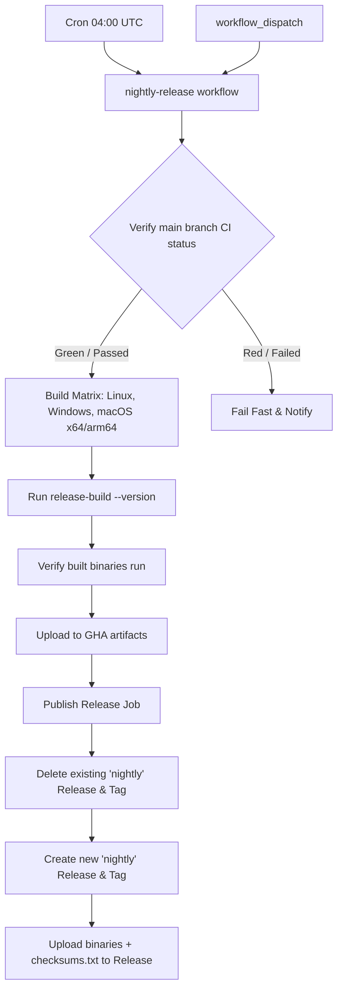

# Nightly Release Pipeline Design

This specification defines the architecture, design, and implementation plan for a daily cross-platform nightly release build pipeline for the Vox codebase. The pipeline will build, verify, and publish development binaries for all supported targets to a rolling GitHub Release.

## User Review Required

> [!IMPORTANT]
> **Workspace Binary Cleanup**: The workspace previously had `vox-bootstrap` and `vox-schola` packages, which have been retired and deleted. Therefore, the nightly build will only compile and package the currently active binaries: `vox` (core CLI), `vox-ml-cli` (ML plugin), and `voxup` (toolchain multiplexer).
>
> **GitHub-Hosted Linux Runner**: For maximum reliability of scheduled nightly runs, the Linux build job will use `ubuntu-latest` instead of the self-hosted runners used for official releases.

## Core Architecture & Workflow

We propose a scheduled workflow `release-nightly.yml` that runs daily at 04:00 UTC.



### 1. The Git/GitHub CI Gate (Approach B)

The workflow first verifies if the latest commit on `main` has passed all status checks. This avoids releasing binaries with regression bugs.
Using GitHub CLI (`gh api`), the first job queries the status checks of the commit:

```bash
# Get the SHA of the latest commit on main
commit_sha=$(git rev-parse HEAD)
# Query combined status
status=$(gh api repos/:owner/:repo/commits/$commit_sha/status -q '.state')
if [ "$status" != "success" ]; then
  echo "Commit $commit_sha has state: $status. Aborting nightly release."
  exit 1
fi
```

### 2. Version Naming Scheme

Nightly versions will be formatted as:
`{workspace_version}-nightly.YYYYMMDD+{short_sha}`
Example: `0.6.0-nightly.20260617+abc1234`

To embed this version into the compiled binary:
1. `crates/vox-cli/src/lib.rs`'s `VOX_VERSION` constant will be updated to check `option_env!("VOX_VERSION_OVERRIDE")`.
2. `crates/vox-cli/src/commands/ci/release_build.rs` will be modified to forward the `--version` override value as `VOX_VERSION_OVERRIDE` in the `Command` environment when invoking `cargo build`.

### 3. Build & Package Selection

Since `vox-bootstrap` and `vox-schola` are retired, we will modify `release_build.rs` to clean up the unused packages and update `ReleasePackage::All` to target only the active packages:
- `ReleasePackage::Vox` -> `vox`
- `ReleasePackage::Mens` -> `vox-ml-cli`
- `ReleasePackage::All` -> `vox`, `vox-ml-cli`, `voxup` (replacing the old `vox-bootstrap` and `vox-schola` entries).

### 4. Rolling Release Lifecycle

To manage the rolling release:
1. The publish job deletes the old `nightly` release and tag:
   ```bash
   gh release delete nightly --cleanup-tag --yes || true
   ```
2. It creates a new pre-release:
   ```bash
   gh release create nightly \
     --prerelease \
     --title "Vox Nightly Build" \
     --notes "Automated nightly build for main branch commit ${commit_sha:0:7} generated on $(date -u +'%Y-%m-%d %H:%M:%S UTC')."
   ```
3. Uploads all built archives and `checksums.txt`.

---

## Proposed Changes

### CI Workflows

#### [NEW] `.github/workflows/release-nightly.yml`
Creates the nightly release workflow with schedule, gate check, build matrix, and publish jobs.

### Rust Command Changes

#### [MODIFY] [release_build.rs](file:///c:/Users/Owner/vox/crates/vox-cli/src/commands/ci/release_build.rs)
- Remove `vox-bootstrap` and `vox-schola` build steps.
- Add `voxup` build step for `ReleasePackage::All`.
- Pass `VOX_VERSION_OVERRIDE` environment variable to the `cargo build` command when a custom `--version` is provided.

#### [MODIFY] [lib.rs](file:///c:/Users/Owner/vox/crates/vox-cli/src/lib.rs)
Update `VOX_VERSION` constant to fallback to `option_env!("VOX_VERSION_OVERRIDE")` when present:
```rust
pub const VOX_VERSION: &str = match option_env!("VOX_VERSION_OVERRIDE") {
    Some(v) => v,
    None => concat!(
        env!("CARGO_PKG_VERSION"),
        "+build.",
        env!("VOX_BUILD_NUMBER"),
        " (",
        env!("VOX_GIT_HASH"),
        ")",
    ),
};
```

---

## Verification Plan

### Automated Tests
- Ensure `cargo test -p vox-cli` passes.
- Run `cargo run -p vox-cli -- ci release-build --target x86_64-pc-windows-msvc --version 0.6.0-nightly.20260617+test --out-dir dist --package all` locally on Windows to verify it compiles, packages `vox`, `vox-ml-cli`, and `voxup`, and creates `checksums.txt` without error.
- Verify that `dist/vox.exe` prints the overridden version.

### Manual Verification
- Commit changes and run local CI check to verify formatting and doc compliance.
