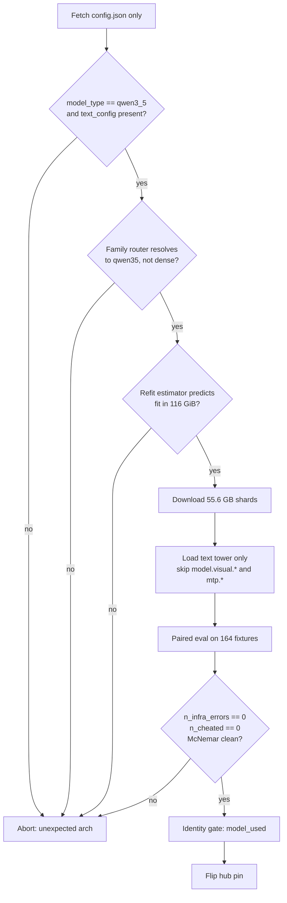

# Qwen3.8-27B as the Mac flagship MENS hub

## 1. Goal

Ship `Qwen/Qwen3.8-27B` as the flagship MENS **hub** model on
128 GB Apple Silicon. Keep `Qwen3-8B` as the 16 GB **spoke** train default.
Nothing about the CUDA 4080 lane changes.

This is a design spec: decisions, arithmetic, and gates. Task sequencing lives
in the companion plan doc.

## 2. Model reality (verified against the published `config.json`)

| Fact | Value |
|---|---|
| License / shards | Apache-2.0, 18 BF16 shards |
| Size | 55,571,299,280 bytes = 55.6 GB / ~51.8 GiB |
| `model_type` | `qwen3_5` |
| `architectures` | `["Qwen3_5ForConditionalGeneration"]` |
| Config shape | text fields **nested under `text_config`**; a sibling `vision_config` exists |
| Layers / hidden / head_dim | 64 / 5120 / 256 |
| Heads | 24 attention, 4 KV |
| Intermediate / vocab | 17408 / 248320 |
| Extras | `attn_output_gate: true`, `partial_rotary_factor: 0.25`, mrope, 262144 native context |
| `full_attention_interval` | 4 → 48 × linear_attention + 16 × full_attention |

The 48 linear-attention layers are Gated DeltaNet: `A_log`, `dt_bias`,
`conv1d`, `in_proj_{qkv,z,a,b}`.

**Three towers, not two.** Weights split into `model.language_model.*` (text),
`model.visual.*` (vision — **not** `vision_tower.*`), and `mtp.*` (multi-token
prediction head). The load skip list is therefore `model.visual.*` **and**
`mtp.*`.

**Vision skipping is a correctness requirement, not a bandwidth optimization.**
Text-only load saves ~1.3 GB of 55.6 GB — 2%. We skip those tensors because a
text-tower loader that meets an unhandled `model.visual.*` / `mtp.*` prefix must
not silently mis-map or half-initialize; the byte savings are noise. (An earlier
draft framed this as a memory win. It is not.)

Community quants exist (`mlx-community/Qwen3.8-27B-4bit`,
`unsloth/Qwen3.8-27B-GGUF`) and are a legitimate fast path for **serving**.
They do nothing for QLoRA training, which needs the BF16 originals.

## 3. Central design inversion: no `is_qwen38` predicate

**Qwen3.8-27B *is* the Qwen3.5 architecture.** Do not add a family predicate for
it.

The actual bug: `is_qwen3()`
(`crates/vox-populi/src/mens/tensor/memory_budget.rs:296-299`) matches the
substring `"qwen3"` inside `"qwen3.8"`, routing the model to the **dense**
planner. `QWEN3_LADDER` holds only 0.6 / 8 / 14 / 32, so
`params_b_from_model_hint` correctly returns 27.0 and the planner then
**silently retreats to Qwen3-14B**. A quiet downgrade, no error.

Correct fix: route `3.8` into the existing Qwen3.5 handling. This also fixes
sizing for free — `get_resident_per_b` is 3.5 GiB/B for `qwen35` versus 5.0 for
dense.

**Related latent hole, to fix in the same pass.** `is_qwen3` *negates*
`"qwen3_5"` but `is_qwen35` never *positively matches* it, so `"qwen3_5-4b"`
matches **neither** predicate; and `"Qwen3-5B"` wrongly matches `is_qwen35`.
There are four leaky substring predicates today; adding a fifth widens the hole.
Decision: one normalizer producing a family token, and predicates that compare
the token — not `contains()` on a raw hint.

## 4. Memory arithmetic

### 4.1 27B QLoRA actual footprint (~24.4 GiB)

| Component | GiB |
|---|---|
| NF4 weights | 12.97 |
| bf16 embed + lm_head | 3.05 |
| LoRA params | 0.28 |
| AdamW state | 1.68 |
| Grads | 0.28 |
| Activations (checkpointing on) | 2.15 |
| Allocator slack | ~4.0 |
| **Total** | **~24.4** |

Training uses no KV cache.

### 4.2 The linear estimator is wrong by ~4x and must be refit first

`RESIDENT_GIB_PER_B_PARAMS` (`memory_budget.rs:27-45`) is **linear** and was
fitted at 4B. For the same model it predicts `27 × 3.2 + 1.6 = 88.0 GiB`
against a measured ~24.4. Every downstream threshold inherits that error.

**Decision:** split the constant into a fixed term plus a per-B term and refit
against two known points **before** adding any ladder rung. Adding a 27B rung on
top of a 4x-wrong estimator ships the error, it does not reveal it.

### 4.3 Machine budget

A 128 GB Mac has **116 GiB** usable: `128 − 12` where 12 is
`DEFAULT_UNIFIED_MEM_RESERVE_GIB` (`vram_autodetect.rs:362`). Not the "~110" an
earlier draft invented.

## 4.4 Accepted risk: `rope_scaling` and `rms_norm_eps`

Neither is read from config anywhere in the tree today: `rope_scaling` has zero
repo hits (no YaRN/linear-scaled/mRoPE support), and `rms_norm_eps` is
hardcoded `1e-6` in both trainers rather than parsed. **Decision: accept this
risk rather than fix it in Phase 0.** Qwen3.8-27B's native context is 262144
tokens and nothing in Phases 0-3 exercises long-context RoPE scaling or a
non-default eps, so the gap is invisible to every gate this program runs.
Fixing it would add a fifth touch to the same `model.rs` / `vox-hf-layout`
files already carrying P0.1, P0.2, P0.4, and P0.7's changes, for no
gate-blocking benefit. Cost if wrong: a future long-context or non-default-eps
checkpoint degrades silently until this is revisited.

## 5. Quantization policy

`vox-quantize` is real and shipped: `policy.rs`, `engine.rs`, CLI at
`crates/vox-ml-cli/src/main.rs:40-43` behind feature `quantize`. The on-disk
format ADR is at
`docs/src/architecture/adr-043-quantized-safetensors-ondisk-format.md`
(**not** under `docs/src/adr/`).

### 5.1 Q4_K_M does not fit a 16 GB 4080

The Q6_K-boosted role share is **0.303**, measured from the checkpoint's own
safetensors headers (every tensor classified with `TensorRole::from_key`,
element counts summed) — not estimated:

| role | shape | count | params |
|---|---|---|---|
| `down_proj` | 5120 × 17408 | 65 (64 layers + 1 MTP) | 5,793,382,400 |
| `embed_tokens` | 248320 × 5120 | 1 | 1,271,398,400 |
| `lm_head` | 248320 × 5120 | 1 (untied — counted separately) | 1,271,398,400 |
| `v_proj` | 1024 × 5120 | 17 (16 full-attn + 1 MTP) | 89,128,960 |
| **boosted total** | | | **8,425,308,160** |
| **all params** | | | **27,781,427,952** |

`8,425,308,160 / 27,781,427,952 = 0.3033`.

Mixture: `0.697 × 4.500 + 0.303 × 6.5625 = 5.125` bpw.
Weights alone: `27e9 × 5.125 / 8 = 16.11 GiB` (at the checkpoint's real
27.78e9 params, 16.57 GiB).
A live 16 GB device reports **13926 MB** usable
(`vram_autodetect.rs:309-310`) ≈ 15.1 GiB — the weights already overflow before
any cache. Add ~2.0 GiB KV at 8k and ~0.8 GiB buffers → **18.9 GiB needed**,
short by ~3.8 GiB at any useful context.

Fitting 16 GB requires **≤ 3.9 bpw** (Q3_K_M ≈ 12.3 GiB). `QuantMixture`
(`crates/vox-quantize/src/policy.rs:50-56`) has **no Q3 variant** —
`vox quantize --to q3_k_m` errors today.

**Decision: drop the 4080 consume target for 27B.** The minimum consume tier for
this model is **24 GB**. Q3_K_M is a named future option, not scope. Building a
Q3 mixture to serve a tier nobody has asked for is speculative work; if a 16 GB
consume target is later required, add `Q3KM` to `QuantMixture` then.

### 5.2 Keep-F32 list must cover linear attention

The keep-F32 set must include the **linear-attention** tensors — `A_log`,
`dt_bias`, `conv1d.weight`, `linear_attn.norm.weight` — across all **48** linear
layers. Listing only `q_norm` / `k_norm` covers just the 16 full-attention
layers and leaves three quarters of the model's sensitive small tensors
quantized.

## 6. Eval gate

The previously drafted gate was statistically void. Replace it.

### 6.1 Why the old gate cannot work

The held-out corpus is genuinely **31 fixtures**. Metrics are `pass_at_k`
(unbiased Chen estimator), `compile_rate`, and `n_cheated` (a real behavioral
canary: candidates are run against `assert(false)`).

- A 3pp non-inferiority margin is **smaller than one fixture** (1/31 = 3.226pp).
  It is a 0pp allowance dressed as a tolerance.
- Wilson 95% CI at n=31, p=0.677 is [0.501, 0.814] — **31.3pp wide**.
- A real 3pp NI claim needs ~3,663 items/arm unpaired, or ~1,745 paired.
- Repeats cannot rescue it: the between-fixture cluster variance floor is
  ±14.1pp at n=31; reaching ±3pp needs ~683 fixtures.
- The repo already asserts this: a test requires
  `min_detectable_difference(31) >= 0.20`
  (`crates/vox-eval/src/corpus_stats.rs:170-186`).

### 6.2 Replacement gate

Score **both arms on all 164 fixtures** — `--include-training-eligible` already
exists — and gate on **paired** regressions.

The machinery is already written and unwired: `paired_compare` and
`mcnemar_exact_p` in `crates/vox-eval/src/corpus_stats.rs` have **zero call
sites**, and `corpus_score.rs:105` already emits `per_problem_pass_at_1` for
exactly this purpose.

`evaluate_gate` expects `paired` to come from
**`paired_compare(baseline, challenger)`** — argument order is load-bearing.
Under that order `paired.b_only` is the **regression** count (baseline passed,
challenger failed) and `paired.c_only` is the **improvement** count (challenger
passed, baseline failed). The field names read as "the first/second argument's
exclusive passes", not "baseline/challenger" — do not swap the call order or
rename the fields to match intuition, or the gate inverts (blocking
improvements, passing regressions).

| Rule | Threshold |
|---|---|
| Regression definition | failed **all 3** greedy draws |
| Block | `b_only > 3` on 164 (regressions: baseline passed, challenger failed) |
| Block | `b_only > c_only` **and** McNemar p < 0.05 (net regression) |
| Absolute floor | `n_cheated == 0` |
| Absolute floor | `compile_rate >= 0.90` |
| Absolute floor | `pass_at_1 >= 0.60` |
| Aggregate delta | printed, **never gated on** |

**Hard-fail on `n_infra_errors > 0`.** An infra error `continue`s without pushing
an attempt, and `corpus_pass_at_k` drops `n == 0` fixtures from the denominator —
so a **slower local server scores higher** pass@1. This is a live false-green
path, not a hypothetical.

**Keep this gate out of `mens/config/eval-gates.yaml`.** Adding a
`pass_at_k`-shaped section there would block training CI.

### 6.3 Confounds to pin before running

- OpenRouter economy routing re-picks the cheapest (most quantized) provider
  **per request**.
- No `seed` / `top_p` / `top_k` / `min_p` anywhere in `LlmConfig`.
- Qwen3 thinking mode is unpinned.
- No `finish_reason` capture — truncation scores as a wrong answer.
- `config_digest` omits provider and `base_url`, so a local run and a cloud run
  produce an **identical digest**.

### 6.4 Local generation needs no new code

The `OPENROUTER_BASE_URL` env override is honored verbatim by `resolve_egress`
(`crates/vox-config/src/inference.rs:77-88`, `resolve_egress.rs:160-171`), and
llama.cpp / vLLM / Ollama are OpenAI-compatible. Point it at localhost. Do not
build a local-inference client.

## 7. SSOT decisions

- **`hub.base` in `mens/config/domain-profiles.yaml` has zero readers** —
  `HubConfig::validate` checks only `embedder`. **Delete the field.** Do not
  build a reader for a field nothing consumed.
- The real SSOT is `mens/config/gpu-specs.yaml` `train_bases` plus
  `spoke_base_resolver.rs` (disk read first, `include_str!` fallback at `:80-83`).
- `VOX_MENS_DEFAULT_MODEL` already overrides the base model end-to-end.
  Selecting a 27B hub needs **no schema surgery**; a new ladder rung is needed
  only to make it the **AUTO-resolved** choice on big boxes.
- `gpu-specs.yaml:248` warns the `@<sha>` pins are "placeholders" — the
  SHA-pinned-base property may not currently hold. Prerequisite, flagged.

### 7.1 Gates a new rung trips

| Gate | Location | What it asserts |
|---|---|---|
| `qwen3_ladder_matches_gpu_specs_train_bases` | `memory_budget.rs:854-897` | distinct param sizes equal those in `train_bases.qwen3_code` |
| pinned-revision guard | `memory_budget.rs:887-892` | base refs carry `@<sha>` |
| `each_real_rung_maps_to_a_size_class` | `preset_schema.rs:757-788` | every rung has a size class |

Also: `QwenSizeClass::Other` has an **empty** ladder-policy arm
(`preset_schema.rs:163`), so a 27B currently receives **no** rank / seq / batch
clamps at all.

## 8. Identity gate

Use `model_used` / `ChatTurnDto.model_id`
(`crates/vox-gui/src/commands/chat_turn.rs:83`, `chat.rs:437-441`,
`chat_tools/chat/message.rs:1099`). **Not** `cost_incurred.model` — cost events
are off by default whenever a DB is present (`llm_bridge/infer.rs:45-60`), so a
cost-based identity check reads empty on the normal configuration.

**Drive currently discards `model_id`.** `useDriveBus.ts` `interpretDriveSubmit`
reads only `{ok, error, text}` and builds bubbles as `{role, content}`. Wiring
the identity gate through Drive therefore **requires a `vox-gui` edit**. That is
an accepted cost of this design, stated plainly — not a firewall violation to be
routed around.

Three Drive facts to carry:

- `pin_policy` is real and enforced.
- `orch_fresh` is declared (`drive/protocol.rs:140,167`) and **never written** —
  yet `scripts/axis-drive-metal-e2e.vox:105` fails the run when it is false.
- `refresh_catalog` is allow-listed and contract-documented but **inert** in both
  Rust and TS.

The latter two are prerequisites **owned by the Axis stream**, not by this work.

## 9. Gate order

Cheap `config.json` gates run **before** the 55.6 GB download. A family-routing
or tensor-prefix mistake costs seconds at the config stage and an hour at the
weights stage.

## 10. Vision capability: skip at load, keep on disk, never merge, route at serve

"Text tower only" is not one decision. It is three, and they have different
answers. Conflating them is what would irreversibly discard vision.

| Decision | Answer | Rationale |
|---|---|---|
| What to **load** for training | Skip `model.visual.*`, `mtp.*` | The vision tower receives no gradient from text-only data. Loading it is waste; skipping loses nothing. |
| What to **keep** on disk and quantize | Keep the full VLM | Vision is ~466M params ≈ 0.93 GB of 55.6 GB — **1.7%**. Deleting it saves ~nothing and cannot be undone. |
| What to **apply** at serve | Adapter stays a separate, detachable artifact | See below. |

**LoRA never touches the vision pathway.** Adapters attach to language-model
projections; `model.visual.*`, the merger, and the patch embedding are frozen
and structurally untouched by text-only QLoRA. Text tuning and vision capability
are therefore not in tension — *provided the adapter is never merged into the
base.*

> **Invariant.** The quantize step MUST NOT produce a merged text-only
> checkpoint. Base (full VLM) and adapter (text delta) remain separate
> artifacts; serving applies the adapter at load time.

Merging is the only irreversible act in this pipeline, and quantization is
exactly where it would happen by accident.

**Consequence: preserving vision is a routing decision, not a training
decision.** Image requests serve the vanilla base; text requests serve base +
adapter. The base is shared, so the marginal cost is one small adapter rather
than a second 27B — an adapter toggle at inference, far smaller than any
vision-training work.

### 10.1 The actual risk is alignment drift, not weight deletion

The vision tower stays frozen, but the language model is what consumes vision
tokens. Fine-tuning the LM hard on text drifts it away from the embedding space
the merger was aligned to produce, so vision can degrade with **no vision weight
ever changing**. Mitigations, cheapest first: modest LoRA rank and learning
rate; prefer attention-only adaptation over attention+MLP; above all keep the
adapter detachable so drift is opt-in per request.

### 10.2 This cannot be measured yet — say so plainly

Vox has **no vision inference path at all**: no image preprocessing, no patch
embedding, no 2-D mRoPE. Current inference is a Qwen3.5 text forward. So:

- Skipping vision loses nothing vox currently has.
- The only thing that matters now is **not foreclosing the option** — 0.93 GB of
  disk and one rule (do not merge).
- Vision serving is a separate project; it stays in §11 Non-goals.
- **Ordering constraint, recorded now:** on the day vision serving lands, a
  vision probe must exist *before* a text-tuned adapter becomes the vision
  default. The hook already exists — `vox mens eval collateral-damage
  --pre-score/--post` is already a hard gate before serve
  (`crates/vox-ml-cli/.../dispatch.rs:352-370`). A 20–50 image/question probe
  hangs off that gate once there is something to run it against.

### 10.3 Quantization consequence

Quantize the **text tower**; leave the vision tower **BF16 on disk,
unquantized**. At 0.93 GB it is not worth a keep-F32 list for patch embeddings,
merger, and vision norms, and it sidesteps a category of vision-quantization
quality bugs outright. Result: quantized text + full-precision vision, at
trivial cost.

## 11. Non-goals

Reject PRs that touch these under this banner:

- Vision Layer 2/3 native ViT, and any vision **serving** path (see §10)
- Flash-Next / Coder-Next as hub
- MoE LoRA
- A second quant engine
- Changing `DEFAULT_PRESET`, or CUDA byte-for-byte behavior
- Cloud burst
- Flipping the hub pin before the eval **and** identity gates are green
- Replacing skill BM25 with `vox-search`
