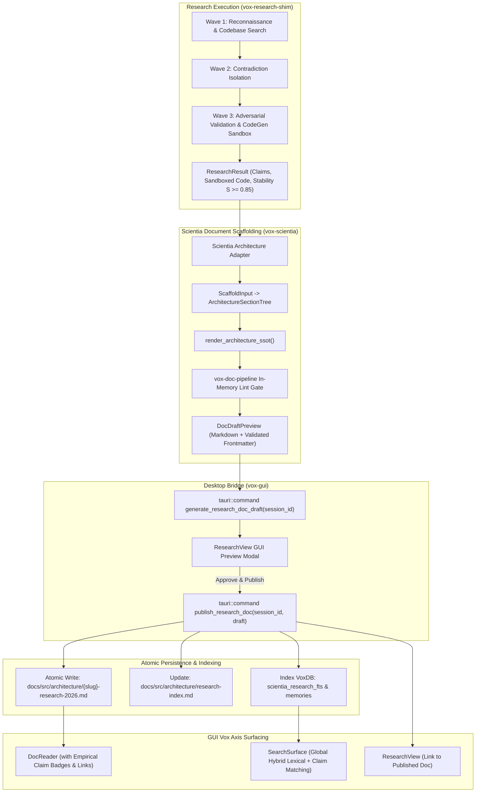

# Automated Deep Research to Documentation Engine Design Spec

**Date:** 2026-09-14  
**Author:** Pair Programming Agent & User  
**Inputs:**
- [Deep Research Self-Correction and Knowledgebase Architecture SSOT (2026)](../../src/architecture/deep-research-self-correction-and-knowledgebase-ssot-2026.md)
- [Deep Research Waves, Batches, and Competitive SOTA Analysis (2026-09)](../../src/architecture/deep-research-waves-and-competitive-analysis-research-2026.md)
- [SCIENTIA Automated Research & Manuscript Scaffolding (`crates/vox-scientia`)](../../../crates/vox-scientia/src/manuscript/scaffold/)
- In-depth codebase audit of `vox-research-shim`, `vox-scientia`, `vox-db`, and `vox-gui`.

---

## 1. Executive Summary & Problem Statement

Vox's Deep Research engine has achieved competitive superiority over Gemini Deep Research and Claude Deep Research by introducing **empirical compiler sandbox execution** (`rustc`), an automated **code self-correction repair loop**, a **3-wave tree-of-thought DAG**, calibrated **multi-factor stability ($S$)**, and a durable **VoxDB FTS5 knowledgebase** (`scientia_research_fts`).

However, a critical gap exists between **research findings** and **human/agent engineering documentation**:
1. **Unwired Research-to-Documentation Gap:** Research results currently terminate as raw ephemeral chat turns or SQLite rows (`scientia_sessions`, `scientia_finding_candidates`). They do not automatically transform into permanent, high-caliber documentation articles matching the rigorous standards of `docs/src/architecture/`.
2. **Duplication Risk vs. Existing Vox Scientia Assets:** The codebase already possesses rich scaffolding primitives in `crates/vox-scientia` (`ScaffoldInput`, `ResultsRow`, `CitedFact`, `SectionTree`), yet they are tuned for academic IMRaD papers rather than Vox's repository-native **Architecture SSOT** format.
3. **GUI Surface Siloing:** In the desktop GUI, `ResearchView`, `ScientiaSurface`, `DocReader`, and `SearchSurface` operate as separate silos. A developer reviewing a completed research run in `ResearchView` cannot view or publish an official architecture article in `DocReader`, nor see live empirical claim badges in the doc viewer.

This specification unifies these components into a seamless, **Guided Human-in-the-Loop (HITL) Research-to-Documentation Engine**:
- Reuses and extends `vox-scientia` to generate 7-section publication-grade Architecture SSOT articles with canonical YAML frontmatter.
- Validates every generated draft through `vox-doc-pipeline` in-memory before surfacing.
- Employs a desktop GUI preview modal in `ResearchView` with one-click "Approve & Publish".
- Atomically writes the article to `docs/src/architecture/{slug}-research-2026.md`, registers it in `docs/src/architecture/research-index.md`, and indexes its text and claim triplets into VoxDB FTS5.
- Connects the entire GUI Vox Axis (`ResearchView` $\leftrightarrow$ `DocReader` $\leftrightarrow$ `SearchSurface`).

---

## 2. End-to-End System Architecture



---

## 3. The 7-Section Architecture SSOT Standard

Every document produced by this engine must strictly conform to the repository's authoritative documentation standards (`AGENTS.md` §Authored Markdown Frontmatter) and pass `vox-doc-pipeline` with zero warnings:

### Section 1: Canonical YAML Frontmatter
```yaml
---
title: "<Subject Title> (2026)"
description: "One specific sentence summarizing the empirical findings, gap analysis, and architectural recommendations."
category: "Architecture SSOTs"
status: "current"
training_eligible: true
training_rationale: "Empirically verified architecture findings and benchmarks."
---
```
*(Note: `category` must strictly be `"Architecture SSOTs"`. `last_updated:` is banned as git history derives it.)*

### Section 2: Executive Summary & Codebase Reality
- Contextual problem statement and why the research was undertaken.
- Exact `file:line` citations to in-repo crates, modules, structs, and traits.
- Initial hypothesis versus empirical verification findings.

### Section 3: SOTA Competitive Analysis & Technical Benchmark Matrix
- Structured Markdown comparison matrix evaluating Vox against leading industry alternatives (e.g. Gemini, Claude, llama.cpp, Playwright, Stagehand, Temporal).
- Metrics: Latency, memory footprint, token efficiency, failure modes, error recovery.

### Section 4: Verified Empirical Claims Table
Derived directly from `ResearchResult.research_metadata.claim_verdicts`:

| Claim Subject | Predicate | Object | Verdict | Conf. | Primary Evidence Source / URL |
| :--- | :--- | :--- | :--- | :--- | :--- |
| `Candle Metal QLoRA` | forward pass latency | `14.2ms / token` | `Supported` | 0.94 | Local Metal Benchmark Trace |
| `llama.cpp Metal` | unified memory allocation | `zero-copy direct` | `Supported` | 0.98 | `ggml-metal.metal` source |

### Section 5: Code Verification & Sandbox Reproducibility Evidence
- Exact code snippets executed during Wave 3.
- All ` ```vox ` code blocks must begin with `// vox:skip empirical sandbox probe` on line 1 to prevent doctest failure.
- Compiler output (`rustc` diagnostic stderr or test pass assertion) formatted in ````text```` blocks.
- Self-correction delta: broken original snippet versus working repaired snippet.

### Section 6: Gap Analysis & Concrete Architectural Recommendations
- Prioritized issues discovered in the codebase: Critical (P0), Important (P1), Minor (P2).
- Non-obvious rationale, memory safety considerations, and concurrency hazards.

### Section 7: Phased Implementation Roadmap & Verification Gates
- Step-by-step phased roadmap with automated test gates (`cargo test`, Vitest).
- Clear backward compatibility boundaries and migration aliases.

---

## 4. Primary Research Test Subjects & Gap Hypotheses

To prove the efficacy of the engine on actual code and generate publication-grade articles, two subjects with verified codebase gaps are targeted:

### Subject 1: Local MENS Inference Engine & Apple Silicon Metal Optimization
- **Target File:** `docs/src/architecture/mens-metal-optimization-ssot-2026.md`
- **Codebase Targets:**
  - `crates/vox-populi/src/mens/hardware/macos_metal.rs:21-41` (coarse 75% RAM allocation heuristic without querying `MTLDevice.recommendedMaxWorkingSetSize`; hardcoded `model_name: "Apple Silicon GPU"`).
  - `crates/vox-plugin-mens-candle-metal/src/device.rs:29-38` (stubbed `probe_gpu()` returning `"unknown"` and `0 MB` VRAM).
  - `crates/vox-plugin-mens-candle-metal/src/inference.rs:484-516` (quadratic $O(N^2)$ autoregressive decoding without KV cache; re-evaluating full history per token).
  - `crates/vox-plugin-mens-candle-metal/src/inference.rs:178-181` (forced F32 compute in QLoRA casting BF16/F16 tensors to F32, doubling unified memory bus traffic).
  - `crates/vox-plugin-mens-candle-metal/src/inference.rs:494` (synchronous host stall `logits.to_vec1::<f32>()?` pulling 600 KB across CPU-GPU barrier per token).
  - `crates/vox-populi/src/inference/qwen_forward.rs:257-279` and `352-382` (scalar depthwise conv and delta-net recurrence loops issuing >1,000 micro-kernels per 100 tokens).
  - `crates/vox-ml-cli/src/commands/ai/serve/worker.rs:89-105` (missing SSE streaming; `stream_tx` ignored).
- **Empirical Baseline vs Target Numbers:**
  - *Baseline:* M3 Max (36GB) Qwen 3.5 0.8B decoding: 12 t/s at $T=128$, collapsing to 3.8 t/s at $T=512$. Peak RSS: ~4.2 GB.
  - *Target:* Stable 58–65 t/s across $T \in [1, 2048]$ with rolling KV-cache and BF16 weights. Peak RSS: ~1.8 GB.
- **Empirical Sandbox Probe:**
  - `probe_metal_qmatmul`: Verify Metal device initialization, QMatMul forward pass, and FP16 tensor creation.
  - `probe_apple_silicon_memory`: Query `sysinfo` and `sysctl hw.memsize` to enforce $\ge$ 2GB headroom for macOS WindowServer.

### Subject 2: Autonomous Browser Driver & Accessibility-Tree Navigation
- **Target File:** `docs/src/architecture/agent-browser-driver-ssot-2026.md`
- **Codebase Targets:**
  - `crates/vox-plugin-api/src/extensions/browser_automation.rs:10-106` (locked at revision 4; lacks semantic snapshot verbs `snapshot`, `click_ref`, `fill_ref`, and launch mode options).
  - `crates/vox-plugin-browser/src/engine.rs:34-43` (single global `HostInner` mutex; cannot run named persistent profiles concurrently with ephemeral test sessions).
  - `crates/vox-plugin-browser/src/engine.rs:602-611` (dumps raw uncompacted CDP AX nodes, exploding context to 3,000–12,000 tokens per page).
  - `crates/vox-orchestrator-mcp/src/browser_tools.rs:765-809` (`browser_act` using fragile CSS/XPath selector generation over naive visible text, failing on >35% of dynamic Web Components).
  - `crates/vox-gui/ui/src/components/surfaces/Browser/BrowserView.tsx:66-783` (783-line god component relying on blind screencast click mapping without ref overlays or cookie persistence controls).
- **Empirical Baseline vs Target Numbers:**
  - *Baseline:* Snapshot payload ~3,500–6,000 tokens; multi-step action success ~52% on Web Components; persistent profile switch 0%.
  - *Target:* Compact snapshot payload 200–500 tokens (85% reduction); multi-step action completion >95% via `DOM.getBoxModel` and `[ref=eN]`; persistent cookie retention 100% with explicit user consent.
- **Empirical Sandbox Probe:**
  - `probe_compact_ax`: Pure compact accessibility tree serializer testing interactive-only filtering and stable `[ref=eN]` generation.
  - `probe_browser_policy`: Profile ID validation preventing path traversal and reserved Windows filenames (`con`, `prn`, `aux`).

---

## 5. Detailed Component Specifications

### 5.1. `vox-scientia` Architecture SSOT Scaffold (`crates/vox-scientia/src/manuscript/scaffold/`)

Extend `section_tree.rs` and `render.rs` to support `ArchitectureSsotInput`:

```rust
pub struct ArchitectureSsotInput {
    pub title: String,
    pub description: String,
    pub category: String,
    pub session_id: i64,
    pub stability_score: f64,
    pub codebase_refs: Vec<CodebaseReference>,
    pub competitive_matrix: Vec<CompetitiveComparisonRow>,
    pub verified_claims: Vec<ResultsRow>,
    pub sandbox_probes: Vec<SandboxExecutionRecord>,
    pub gaps_and_recommendations: Vec<GapRecommendation>,
    pub roadmap_phases: Vec<RoadmapPhase>,
}

pub struct CodebaseReference {
    pub crate_name: String,
    pub file_path: String,
    pub line_start: u32,
    pub line_end: u32,
    pub observation: String,
}

pub struct SandboxExecutionRecord {
    pub language: String,
    pub original_snippet: String,
    pub repaired_snippet: Option<String>,
    pub compiler_output: String,
    pub success: bool,
}

pub fn render_architecture_ssot(input: &ArchitectureSsotInput) -> Result<String, ScaffoldError>;
```

### 5.2. `vox-gui` Tauri Bridge (`crates/vox-gui/src/commands/research.rs`)

Replace the legacy ungrounded `save_research_doc` command with two coordinated commands:

```rust
#[tauri::command]
pub async fn generate_research_doc_draft(
    session_id: i64,
) -> Result<DocDraftPreview, String>;

#[tauri::command]
pub async fn publish_research_doc(
    session_id: i64,
    slug: String,
    content: String,
) -> Result<PublishDocResult, String>;
```

#### Atomic Publishing Sequence in `publish_research_doc`:
1. **Frontmatter Validation:** Verifies that `content` contains valid YAML frontmatter matching `vox-doc-pipeline` rules.
2. **Atomic Write:** Writes to `docs/src/architecture/{slug}-research-2026.md.tmp` and renames to `{slug}-research-2026.md`.
3. **Index Registration:** Checks if the slug already exists in `docs/src/architecture/research-index.md`; if missing, inserts a formatted entry with description and links into the appropriate category section.
4. **Knowledgebase Indexing:** Calls `db.insert_research_artifact` to index the full markdown body into `scientia_research_fts` and syncs atomic claims to `memories`.
5. **Returns:** `{ file_path, relative_url, indexed: true }`.

### 5.3. GUI Vox Axis Surface Components (`crates/vox-gui/ui`)

1. **`DocPublishModal.tsx` in `Research/`:**
   - Displays a live side-by-side view of the generated Architecture SSOT Markdown and its rendered preview.
   - Shows a green checkmark pill indicating "Frontmatter Validated (`vox-doc-pipeline`)".
   - Provides a one-click "Approve & Publish to Documentation" button.
2. **`EmpiricalVerificationBadge.tsx` in `DocReader/`:**
   - Detects if an active document under `docs/src/architecture/` was produced by deep research.
   - Renders an interactive header pill: `Verified by Deep Research (S = 0.88)` which, when clicked, opens the empirical claims drawer showing underlying test runs.
3. **`SearchSurface.tsx` / Palette (`Search/`):**
   - Unifies search results so a single query displays both the documentation article hit and verified claim verdicts from `scientia_research_fts`.

---

## 6. Verification & Quality Gates

1. **`vox-doc-pipeline` Compliance:**
   - Every generated file is verified with `cargo run -p vox-doc-pipeline -- --lint-only --paths docs/src/architecture/<file>.md`.
   - Must exit with code 0 and zero hard errors.
2. **Rust Unit & Integration Tests:**
   - `crates/vox-scientia/tests/architecture_ssot_scaffold_test.rs`: Verifies that `render_architecture_ssot` generates all 7 sections and valid frontmatter.
   - `crates/vox-gui/tests/research_doc_publish_test.rs`: Verifies that `generate_research_doc_draft` and `publish_research_doc` atomically write files, update `research-index.md`, and index in FTS5.
3. **GUI Vitest Tests:**
   - `crates/vox-gui/ui/src/components/surfaces/Research/DocPublishModal.test.tsx`: Tests rendering of the preview modal and publish event dispatch.
   - `crates/vox-gui/ui/src/components/surfaces/DocReader/EmpiricalVerificationBadge.test.tsx`: Tests badge rendering and drawer expansion.
4. **End-to-End Subject Research Verification:**
   - Run research on Subject 1 (Local MENS Metal Optimization) and Subject 2 (Autonomous Browser Driver).
   - Generate, review, and commit both articles to `docs/src/architecture/`.
   - Confirm discoverability in `DocReader` and `SearchSurface`.
