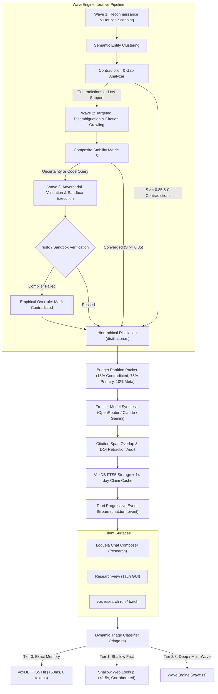

# Deep Research Waves, Batches, and Orchestration Design Spec (Hardened)

**Date:** 2026-09-14  
**Inputs:** 
- [Deep Research Waves, Batches, and Competitive SOTA Analysis (2026-09)](../../src/architecture/deep-research-waves-and-competitive-analysis-research-2026.md)
- [Deep Research Full-Surface Audit, Architecture, and Roadmap (2026-09)](../../src/architecture/deep-research-full-surface-audit-and-roadmap-2026.md)
- Six-track codebase audit by specialized research subagents (WaveEngine, Triage, Distillation, Batch/Hopper, Chat Integration, GUI/Trust UI).

---

## 1. Executive Summary of Audited Bugs & Architectural Hardening

A forensic six-track audit of the live codebase and initial design surfaced seven critical vulnerabilities and architectural defects that this hardened specification resolves:

| Subsystem | Live Code / Prior Spec Defect | Architectural Remedy in this Spec |
| :--- | :--- | :--- |
| **Claim Extraction** | `pipeline.rs:325` extracts claims from `&query.query` (user's prompt) rather than retrieved evidence documents! | Extract claims from retrieved web hit snippets and draft summaries, preserving stable FNV-1a hashes. |
| **Synthesis Verdicts** | `stages.rs:204-225` allows `evidence_text` to consume the entire `context_budget`, silently stripping **ALL claim verification verdicts** from the synthesis prompt! | Pre-reserve 15% of the context budget (min 1,500 chars) exclusively for claim verdicts and contradicted evidence spans. |
| **Crate Topology** | `vox-orchestrator` cannot depend on `vox-research-shim` without creating an illegal cyclic dependency (`vox-orchestrator` $\leftrightarrow$ `vox-research-shim`). | Implement `triage.rs` directly in `vox-orchestrator::task_dispatch::triage` using `VoxDb` and `vox-search`, preventing circular crate dependencies. |
| **Stability Formula** | The initial stability equation $S = 1.0 - \frac{\text{unresolved}}{\text{total}} \times (1.0 - \text{avg\_confidence})$ drops to zero penalty under overconfident LLMs, exiting early even with 100% contradictions. | Multi-factor stability metric with hard contradiction gating: requires $S \ge 0.85$, $N_{\text{unresolved}} = 0$, and $\ge 60\%$ supported claims. |
| **Batch Concurrency** | Unbounded `tokio::spawn` creates $O(N^2)$ Hopper SQLite table scans; parallel workers trigger HTTP 429 rate limits on SearXNG/Tavily. | Atomic batch intake (`hopper_submit_batch`) with `PriorityHint::Background` and a `ProviderSafetyGovernor` token bucket / semaphore. |
| **Chat Streaming** | Preamble blocking in `message.rs:714` freezes the Tauri IPC turn for 30–90s, triggering the 90s frontend watchdog failure in `chatCorrelation.ts`. | Non-blocking turn execution emitting progressive milestone events (`chat:turn:event`) per wave to keep the UI interactive. |
| **GUI Security & XSS** | `ResearchClaimAccordion.tsx` renders raw `cite.url` in `<a href>` with zero protocol validation, exposing the Tauri webview to `javascript:`/`data:` XSS. | `SafeExternalLink.tsx` enforcing strict protocol allowlisting (`http:`, `https:`, normalized DOI) and isolated Tauri shell opening. |

---

## 2. Component Architecture & End-to-End Flow



---

## 3. Detailed Specifications

### Track 1: Multi-Wave DAG Iteration Engine (`WaveEngine`)

#### Location: `crates/vox-research-shim/src/research/orchestrator/wave.rs`

```rust
use std::collections::{HashMap, HashSet};
use serde::{Deserialize, Serialize};

#[derive(Debug, Clone, Serialize, Deserialize)]
pub struct WaveExecutionPlan {
    pub session_id: i64,
    pub current_wave: usize,
    pub max_waves: usize,
    pub phase: WavePhase,
    pub executed_query_hashes: HashSet<u64>,
    pub accumulated_hits: Vec<crate::research::types::ResearchHit>,
    pub claim_ledger: HashMap<u64, ClaimVerdict>,
    pub contradictions: Vec<ContradictionRecord>,
    pub stability_score: f64,
    pub stability_history: Vec<f64>,
    pub budget: WaveResourceBudget,
    pub termination_reason: Option<TerminationReason>,
}

#[derive(Debug, Clone, Copy, PartialEq, Eq, Serialize, Deserialize)]
pub enum WavePhase {
    Wave1Reconnaissance,
    Wave2ContradictionResolution,
    Wave3AdversarialAndSandbox,
    DistillationAndSynthesis,
    Completed,
}

#[derive(Debug, Clone, Serialize, Deserialize)]
pub struct WaveResourceBudget {
    pub tokens_used: u64,
    pub max_tokens: u64,
    pub wall_clock_ms: u64,
    pub max_wall_clock_ms: u64,
    pub search_queries_executed: usize,
    pub max_search_queries: usize,
    pub sandbox_runs_executed: usize,
    pub max_sandbox_runs: usize,
}

#[derive(Debug, Clone, Serialize, Deserialize)]
pub struct ContradictionRecord {
    pub contradiction_id: u64,
    pub claim_id_a: u64,
    pub source_url_a: String,
    pub claim_id_b: u64,
    pub source_url_b: String,
    pub category: ContradictionCategory,
    pub severity: f64,
    pub status: ContradictionStatus,
    pub disambiguation_query: Option<String>,
}

#[derive(Debug, Clone, Copy, PartialEq, Eq, Serialize, Deserialize)]
pub enum ContradictionCategory {
    DirectFactualOpposition,
    NumericDiscrepancy,
    TemporalVersionMismatch,
    ScopeOrPlatformDifference,
}

#[derive(Debug, Clone, Serialize, Deserialize)]
pub enum ContradictionStatus {
    Unresolved,
    ResolvedByAuthority { winning_claim_id: u64, authoritative_url: String, rationale: String },
    ResolvedByEmpiricalSandbox { winning_claim_id: u64, compiler_stdout: String },
    DismissedAsContextDifference { explanation: String },
    IrreconcilableDispute,
}

#[derive(Debug, Clone, Serialize, Deserialize)]
pub enum TerminationReason {
    StabilityThresholdMet,
    MaxWavesReached,
    BudgetExhausted,
    StagnantContradiction,
}
```

#### Multi-Factor Stability Stopping Criterion:
$$S = 0.40 \cdot \frac{N_{\text{supported}}}{N_{\text{total}}} + 0.30 \cdot \bar{\sigma}_{\text{resample}} + 0.30 \cdot \left(1.0 - \frac{N_{\text{unresolved\_contradictions}}}{N_{\text{total}}}\right)$$

**Early Exit Condition:**
Terminate prior to `max_waves` if and only if:
$$S \ge 0.85 \quad \text{AND} \quad N_{\text{unresolved\_contradictions}} == 0 \quad \text{AND} \quad \frac{N_{\text{supported}}}{N_{\text{total}}} \ge 0.60$$

#### Empirical Sandbox Overrule Hierarchy:
- For `ResearchDomainMode::CodeGen`, Wave 3 generates isolated test harnesses and invokes `verify_rust_code_in_sandbox`.
- **Inviolable Rule**: If compiler execution fails (`rustc` exits non-zero), the compiler output **must overrule any LLM NLI verdict**. The claim is marked `Verdict::Contradicted`, confidence is locked to `1.00`, and compiler `stderr` is attached as evidence.

---

### Track 2: 4-Tier Dynamic Escalation Classifier (`ResearchTriage`)

#### Location: `crates/vox-orchestrator/src/orchestrator/task_dispatch/triage.rs`

```rust
#[derive(Debug, Clone, PartialEq, Serialize, Deserialize)]
pub enum ResearchTriageTier {
    InstantMemory {
        session_id: i64,
        cached_query: String,
        snippet: String,
        report_markdown: String,
        similarity: f64,
    },
    ShallowWeb { query: String },
    StandardDeep { query: String, domain_mode: String },
    MultiWaveAutonomous { query: String, domain_mode: String, max_waves: usize },
}
```

#### Classification Rules:
1. **Tier 0 (Instant FTS5 Memory)**:
   - Query `scientia_research_fts` with column-weighted BM25: `bm25(scientia_research_fts, 10.0, 1.0, 3.0)` with query text weighted 10x over report text.
   - Normalized token Jaccard similarity $J(Q_{\text{in}}, Q_{\text{cached}}) \ge 0.85$.
   - Age cutoff: $\le 14$ days for architectural queries; disqualified or $\le 24$ hours for volatile queries containing `"latest"`, `"today"`, `"version"`, `"pricing"`.
   - Quality gate: `quality_score >= 70`, `confidence >= 0.85`.
2. **Tier 1 (Shallow Web Lookup)**:
   - Queries with $< 14$ words matching factual patterns (`"what is"`, `"who is"`, `"when was"`, `"default port"`).
   - Anti-hallucination rule: Requires $\ge 2$ independent root domains in retrieved hits. If diversity $< 2$ and score $< 0.65$, automatically escalate to Tier 2.
3. **Tier 2 (Standard Deep)**:
   - Single-pass deep research for general queries with claim verification.
4. **Tier 3 (Multi-Wave Autonomous)**:
   - Comparative keywords (`"compare"`, `"vs"`, `"tradeoffs"`, `"benchmark"`, `"in-depth"`), domain modes (`CodeGen`, `Shopping`), or explicit `--waves=N` / `--deep` flags.

---

### Track 3: Hierarchical Context Distillation & RAG Budget Packing

#### Location: `crates/vox-research-shim/src/research/stages/distillation.rs`

```rust
#[derive(Debug, Clone, Serialize, Deserialize)]
pub struct ClaimEvidenceUnit {
    pub unit_id: u64,
    pub kind: EvidenceKind,
    pub subject: String,
    pub predicate: String,
    pub object: String,
    pub conditions: Vec<String>,
    pub modality: EpistemicModality,
    pub verbatim_quote: String,
    pub span_start: usize,
    pub span_end: usize,
    pub source_url: String,
    pub registrable_domain: String,
    pub trust_score: f64,
    pub corroborating_domains: Vec<String>,
}

#[derive(Debug, Clone, Copy, PartialEq, Eq, Serialize, Deserialize)]
pub enum EvidenceKind {
    AtomicFact,
    TabularRow,
    CodeExcerpt,
    NumericPricing,
}

#[derive(Debug, Clone, Copy, PartialEq, Eq, Serialize, Deserialize)]
pub enum EpistemicModality {
    Definite,
    Conditional,
    Hypothetical,
    Negated,
}
```

#### Verbatim Substring Grounding (`SpanChecker`):
Before entering the synthesis pool, each candidate unit is verified in-memory:
```rust
pub fn verify_span_grounding(raw_content: &str, unit: &ClaimEvidenceUnit) -> bool {
    if let Some(slice) = raw_content.get(unit.span_start..unit.span_end) {
        if slice == unit.verbatim_quote {
            return true;
        }
    }
    raw_content.contains(&unit.verbatim_quote) && unit.verbatim_quote.len() >= 20
}
```

#### Distinct-Domain Logarithmic Dampening & RAG Packing:
$$\text{Priority}(u) = 0.35 \cdot T(u) + 0.25 \cdot R(u, Q) + 0.20 \cdot \ln(1 + |D(u)|) + 0.15 \cdot S(u) - 0.30 \cdot P_{\text{redundancy}}(u)$$

- **Budget Partitioning:**
  - **15% Reserved**: Contradicted and contested claim units (guarantees contradictory evidence is never dropped).
  - **75% Primary**: Top-ranked verified units packed greedily by Priority.
  - **10% Metadata**: Citations and domain trust index.
- **Verdict Allocation Guarantee**: In `stages.rs`, pre-reserve 1,500 chars for `verdict_text` so claim verdicts are never silently dropped on hit budget saturation.

---

### Track 4: Batch Concurrency & Hopper Rate Governance

#### Location: `crates/vox-orchestrator/src/hopper/batch.rs`, `crates/vox-search/src/safety_governor.rs`

```rust
#[derive(Debug, Clone, Serialize, Deserialize)]
pub struct ResearchBatchRequest {
    pub batch_id: String,
    pub queries: Vec<ResearchBatchItem>,
    pub scope: vox_search::ResearchScope,
    pub max_sources_per_query: usize,
    pub comparative_synthesis: bool,
    pub min_success_ratio: f32, // e.g. 0.70
    pub timeout_per_item_secs: u64,
}

#[derive(Debug, Clone, Serialize, Deserialize)]
pub struct ResearchBatchItem {
    pub item_id: String,
    pub entity_label: String,
    pub query: String,
    pub site_scope: Option<String>,
}
```

#### `ProviderSafetyGovernor`:
- **SearXNG**: Max 2 concurrent requests, token bucket 4 req/sec, decorrelated jitter backoff.
- **Tavily**: Max 5 concurrent requests, 10 req/sec.
- **DuckDuckGo**: Max 1 concurrent request, 1200ms mandatory delay.
- **LLM Synthesis**: Max 4 concurrent inferences, 60,000 TPM reservation.

#### Map-Reduce Comparative Synthesis:
- **Map Phase**: Compress each successful result to an `EntityProfile` JSON ($\le 350$ tokens per item).
- **Reduce Phase**: Prompt synthesis judge with the array of profiles ($\approx 3,500$ tokens total for 10 items) to emit a clean Markdown comparison table, tradeoff analysis, and recommendation matrix without hitting token limits.

---

### Track 5: Chat Progressive Streaming & At-Will Saving

#### Location: `crates/vox-orchestrator-mcp/src/chat_tools/chat/message.rs`, `crates/vox-gui/src/commands/research.rs`

#### Progressive Milestones (`ChatResearchMilestone`):
Emitted over Tauri event channel `chat:turn:event`:
- `wave_started { wave_index, total_waves, focus }`
- `sources_retrieved { wave_index, count, top_domains }`
- `contradiction_detected { claim_a, claim_b, resolution_strategy }`
- `empirical_validation_completed { sandbox, passed, output_snippet }`
- `synthesis_completed { summary, supported_claims, refuted_claims }`

#### At-Will Persistence Commands:
1. **`save_research_doc`**: Persists synthesis to `docs/src/architecture/<slug>-research-2026.md` with validated YAML frontmatter (`title`, `description`, `category: "Research Findings"`, `status: "current"`), updating `docs/src/architecture/research-index.md`.
2. **`persist_research_claims`**: Commits verified claims into `scientia_claims` and `scientia_claim_verdicts` in VoxDB, adding a high-confidence entry to the project's permanent knowledge base.

---

### Track 6: GUI Surfacing, Observability & Safe Links

#### Location: `crates/vox-gui/ui/src/components/surfaces/Research/`

1. **`SafeExternalLink.tsx`**:
   - Enforces strict protocol allowlisting (`http:`, `https:`).
   - Normalizes bare DOIs to `https://doi.org/...`.
   - Neutralizes `javascript:`, `data:`, `file:`.
   - Delegates navigation to Tauri isolated shell open (`@tauri-apps/plugin-shell`).
2. **`MultiWaveProgressTimeline.tsx`**:
   - Displays real-time progress across Wave 1 (Recon), Wave 2 (Contradictions), and Wave 3 (Adversarial/Sandbox).
   - Shows active focus, sources retrieved, conflicts detected, and empirical compiler pass/fail counts.
3. **`VerdictBadge.tsx`**:
   - Handles `Supported`, `Contested`, `Contradicted`, `Refuted`, `Unverified`, and `Abstain`.
   - Features accessible icons (`✓`, `⚠`, `✕`, `?`, `○`) and descriptive tooltips.
4. **`ResearchClaimAccordion.tsx`**:
   - Surfaces exact character evidence quotes with `[SUPPORTING]` and `[CONTRADICTORY]` visual flags.

---

## 4. Verification & Testing Matrix

| Test Suite | Command | Coverage Verified |
| :--- | :--- | :--- |
| **WaveEngine Unit** | `cargo test -p vox-research-shim wave::tests` | Contradiction detection, multi-factor stability formula, early exit, compiler overrule. |
| **Triage Unit** | `cargo test -p vox-orchestrator triage::tests` | FTS5 BM25 memory matching, Jaccard similarity, volatile query disqualification, shallow escalation. |
| **Distillation Unit** | `cargo test -p vox-research-shim distillation::tests` | `SpanChecker` verbatim grounding, budget partition packing, distinct-domain logarithmic dampening. |
| **Batch & Governor** | `cargo test -p vox-orchestrator batch::tests` | Semaphore concurrency limits, partial quorum evaluation, Map-Reduce matrix synthesis. |
| **Safe Links & UI** | `pnpm --dir crates/vox-gui/ui test ResearchClaimAccordion.test.tsx` | XSS protocol neutralization, evidence span rendering, verdict normalization. |
| **Slash Parser Unit** | `pnpm --dir crates/vox-gui/ui test slashRouter.test.ts` | Flag validation (`--waves=N`, `--deep`, `--domain`), error reporting, clean query extraction. |
| **E2E Playwright** | `pnpm --dir crates/vox-gui/ui exec playwright test e2e/chat-research.spec.ts` | Multi-wave progress milestone streaming, watchdog timeout prevention, at-will save action. |
| **Doc Pipeline** | `cargo run -p vox-doc-pipeline -- --lint-only --paths docs/superpowers/specs/2026-09-14-deep-research-waves-and-orchestration-design.md` | Frontmatter validation, link integrity. |
