# Axis GUI Visual Debugger and Deep Research Inspection Lab

## 1. Problem & Context

### 1.1 Deep Research Failures in Production
During previous testing of the Vox deep research pipeline, multiple runs claimed completion and produced synthesized reports while actually retrieving **zero results from web search sources**.
* **Root Cause 1: Silent Fallback to Empty**: `WebSearchDispatcher` sequentially attempts SearXNG, Tavily, DuckDuckGo, and Wikipedia. When SearXNG is unconfigured or down, Tavily hits rate limits, and DuckDuckGo fails to parse, the dispatcher quietly returns `Ok(Vec::new())`.
* **Root Cause 2: Groundless Synthesis**: In `crates/vox-research-shim/src/research/orchestrator/pipeline.rs`, when `all_hits` is empty, `extract_claims_with_model` falls back to extracting claims from the user's raw query prompt rather than evidence sources. The pipeline then calls `synthesize_answer_with_llm` with empty citations, synthesizing a hallucinated report that masks the retrieval failure.
* **Root Cause 3: Black-Box Epistemic Judging**: Users and operators have no visibility into how claims are judged, what prompt was passed to the judge model, what evidence grounded or contradicted each claim, or why a verifiability score was assigned.

### 1.2 Systemic GUI Defect Classes (413-Cell Review Matrix)
The comprehensive audit of Axis (`docs/superpowers/reviews/2026-07-18-axis-frontend-comprehensive-review.md`) and prior remediation plans identified four recurring classes of frontend defects:
1. **"Fake Success" & Silent Degradation**: UI transitions to `completed` while primary collections are empty, or deduplication silently suppresses items without honest notices.
2. **Raw Error Leakage**: Caught or uncaught exceptions (`TypeError: s is null`, `can't access property 'invoke'`, `__TAURI_INTERNALS__`) leaking raw JavaScript traces directly into toasts or visible DOM nodes.
3. **Layout Occlusion & Transparent Bleed-Through**: Overlays, popovers, and floating rails occluding primary inputs or rendering with transparent backdrops that let underlying text bleed through on compact viewports and alternate rendering engines (Firefox).
4. **State Desynchronization & Watchdog Stalls**: Ghost "running" spinners where the backend finished or crashed without notifying the frontend, or event listener leaks causing duplicate dispatches and race conditions.

### 1.3 Goals
1. **Generalized GUI Visual Debugger**: A reusable, non-overfitted debugging framework in Axis that can step through, pause, inspect, and audit any multi-step workflow (Research, Chat, Tasks, Tool execution).
2. **Deep Research Lab Surface**: A dedicated workbench view providing complete step-by-step visual control over the 5 deep research stages, an isolated **Live Source Prober**, an **Epistemic Judge Inspector**, and a **Zero-Hits Hard Gate** that halts execution before hallucinated synthesis can occur.
3. **Automated Visual Evidence Capture**: Generalized snapshot capture (both in-app and via Playwright) that saves viewport PNGs and diagnostic metadata into `review-bundle/`.
4. **Codebase-Wide GUI Policy**: A normative policy in `AGENTS.md` and CI ensuring no GUI surface or flow is considered complete or mergeable without automated visual inspection evidence.

---

## 2. Architecture Overview

The system consists of three decoupled layers:

```mermaid
flowchart TD
    subgraph Axis Frontend Shell ("crates/vox-gui/ui")
        subgraph Universal Debugger Engine ("src/debugger/")
            Stepper[usePipelineStepper Hook\nFSM: idle, running, paused, error]
            Drawer[Global Inspector Drawer\nCmd+Shift+D]
            Sentries[Diagnostic Invariant Sentries\nHonesty | Error Leak | Occlusion | Watchdog]
            Snap[Snapshot Service\nViewport PNG + DOM + Sentry Report]
        end
        
        subgraph Surface Layer
            Lab[Deep Research Lab\n(Workbench Surface)]
            Research[Main Research Surface]
            Chat[Chat Surface / Loquela]
            Other[Tasks / Models / Settings]
        end
        
        Lab -->|Registers 5 Stages| Stepper
        Chat -.->|Optional Stepper| Stepper
        Stepper <--> Drawer
        Sentries --> Drawer
        Drawer --> Snap
    end

    subgraph Tauri IPC & Protocol Layer ("crates/vox-gui/src/commands/")
        TauriCmds[debugger.rs\n- pipeline_step_pause\n- pipeline_step_resume\n- gui_capture_snapshot]
        ProbeCmds[search_probe.rs\n- probe_search_provider\n- probe_all_search_providers]
    end

    subgraph Backend Engine & Daemon ("crates/vox-research-shim & vox-orchestrator-mcp")
        Daemon[Orchestrator Daemon]
        Pipeline[Deep Research Pipeline Stepper]
        Prober[Direct Web Search Prober Engine]
    end

    subgraph Verification & CI ("crates/vox-gui/ui/e2e/")
        PW[Playwright Stepper Spec\ne2e/review/stepper.spec.ts]
        ReviewBundle[review-bundle/latest/ & target/gui-snapshots/]
    end

    Stepper <--> TauriCmds
    Lab --> ProbeCmds
    TauriCmds <--> Daemon
    ProbeCmds <--> Prober
    Daemon --> Pipeline
    Snap --> ReviewBundle
    PW --> ReviewBundle
```

---

## 3. Core Universal Debugger (`crates/vox-gui/ui/src/debugger/`)

The debugger is built as a generic capability available across the entire Axis application.

### 3.1 Types and Contracts (`types.ts`)
```typescript
export type StepStatus = 'pending' | 'active' | 'paused' | 'completed' | 'failed' | 'skipped';

export interface DebugStep<TInput = unknown, TOutput = unknown> {
  id: string;
  label: string;
  description?: string;
  status: StepStatus;
  inputPayload?: TInput;
  outputPayload?: TOutput;
  error?: string;
  timingMs?: number;
}

export interface BreakpointConfig {
  pauseBeforeStepIds: Set<string>;
  pauseAfterStepIds: Set<string>;
  pauseOnError: boolean;
  pauseOnZeroData: boolean;
}

export interface InvariantViolation {
  kind: 'fake_success' | 'raw_error_leak' | 'occlusion' | 'watchdog_stalled' | 'a11y_contrast';
  severity: 'critical' | 'major' | 'minor';
  message: string;
  elementSelector?: string;
  location?: string;
  rawDetails?: unknown;
}

export interface SnapshotArtifact {
  snapshotId: string;
  surfaceId: string;
  stepId?: string;
  timestampMs: number;
  viewport: { width: number; height: number };
  imagePath: string;
  violations: InvariantViolation[];
  statePayload: unknown;
}
```

### 3.2 The 4 Active Diagnostic Invariants
The debugger continuously monitors active surfaces and fails step transitions or visual audits if any invariant is violated:

1. **Honesty & Zero-Data Sentry (`sentryHonesty.ts`)**:
   - Triggers when a stage or pipeline finishes with `status === 'completed'` but output payload collections (e.g., `hits`, `sources`, `claims`, `results`) are empty.
   - Detects "Silent Fallback": monitors search provider responses and flags if a fallback was triggered due to 429, timeout, or empty responses without alerting the user.
   - In Research: Blocks transition to Report Synthesis if `sources.length === 0`.
2. **Raw Error Leak Sentry (`sentryErrorLeak.ts`)**:
   - Observes DOM mutations and toast events.
   - Scans text nodes for forbidden diagnostic leak strings:
     - `TypeError:`
     - `__TAURI_INTERNALS__`
     - `undefined is not`
     - `null is not`
     - `[object Object]`
     - Uncaught Promise rejection traces.
   - Requires every error to be properly formatted with sanitized user-facing title and remediation advice.
3. **Layout, Occlusion & Backdrop Checker (`sentryOcclusion.ts`)**:
   - Runs `document.elementFromPoint` scans across all focusable interactive controls (inputs, action buttons) to verify they are not occluded by floating rails, modals, or toasts.
   - Inspects computed styles of overlays and modals: verifies `background-color` has an effective alpha >= 0.85 or has an explicit backdrop blur/fill to prevent Firefox text bleed-through.
   - Detects CSS overflow clipping on text containers lacking `text-overflow: ellipsis` or scrollbars.
4. **Liveness & Listener Watchdog (`sentryWatchdog.ts`)**:
   - Monitors active async operations. If an operation remains in `'active'` state for >15 seconds without a telemetry milestone event, the watchdog raises a `watchdog_stalled` warning.
   - Tracks Tauri event listeners registered through `transport.ts`: warns if `listen()` calls are made repeatedly without unlistening previous subscriptions.

### 3.3 Global Inspector Drawer (`InspectorDrawer.tsx`)
A dockable, collapsible bottom/side drawer opened via:
- Keybinding: `Cmd+Shift+D` (Mac) or `Ctrl+Shift+D` (Windows/Linux).
- Status bar icon in the Axis footer.

**Panels inside the Drawer:**
1. **Stepper Pipeline Bar**: Displays the sequence of steps, current active step, pause indicator, "Step Next", "Resume", "Pause", and "Restart" buttons.
2. **Payload Inspector & Editor**: Two-column JSON viewer (Input vs Output). When paused at a breakpoint, the developer or agent can directly edit the output JSON before resuming execution.
3. **Invariant Violations Strip**: Real-time counter of active warnings/violations (Honesty, Leaks, Occlusion, Watchdog).
4. **Fault Injection & Viewport Matrix**:
   - Quick toggles to simulate: `Empty State`, `Backend Error State`, and viewport toggles (`Wide 1440px`, `Laptop 1100px`, `Compact 900px`).
5. **One-Click Visual Snapshot**: Captures the exact screen state, evaluates all invariants, and writes the `.png` and `.json` metadata to `target/gui-snapshots/`.

---

## 4. Deep Research Lab Surface (`ResearchLabView.tsx`)

The Deep Research Lab is registered as a dedicated workbench surface in `SURFACE_REGISTRY` (viewKey: `'research-lab'`).

### 4.1 Research Stages Registered with the Stepper
The research pipeline registers five explicit, inspectable stages:

```mermaid
sequenceDiagram
    autonumber
    actor User as Operator / Agent
    participant Lab as Research Lab UI
    participant Stepper as Pipeline Stepper
    participant Daemon as Daemon Pipeline
    participant Prober as Web Search Dispatcher
    participant Judge as Epistemic Judge LLM

    User->>Lab: Enter Query + Set Breakpoints
    Lab->>Stepper: startPipeline(query, breakpoints)
    
    rect rgb(30, 30, 45)
    note right of Stepper: Stage 1: Decomposition
    Stepper->>Daemon: decompose_query(query)
    Daemon-->>Stepper: subqueries [sq1, sq2, sq3]
    opt Breakpoint active
        Stepper->>Lab: PAUSE (inspect/edit subqueries)
        User->>Stepper: Step Next
    end
    end

    rect rgb(30, 45, 30)
    note right of Stepper: Stage 2: Multi-Source Retrieval
    Stepper->>Prober: Query SearXNG, Tavily, DDG, Wiki, Local
    Prober-->>Stepper: raw_hits per provider + HTTP codes
    alt Zero hits returned
        Stepper->>Lab: HALT with ZeroSourcesError (Honesty Sentry)
    else Hits > 0
        opt Breakpoint active
            Stepper->>Lab: PAUSE (inspect hits, latency, status codes)
            User->>Stepper: Step Next
        end
    end
    end

    rect rgb(45, 45, 30)
    note right of Stepper: Stage 3: Evidence Extraction & Novelty
    Stepper->>Daemon: extract_evidence_and_filter(hits)
    Daemon-->>Stepper: curated_evidence (novelty scores, dropped affiliate spam)
    end

    rect rgb(45, 30, 45)
    note right of Stepper: Stage 4: Claim Extraction & Epistemic Judge
    Stepper->>Daemon: extract_claims(curated_evidence)
    Daemon-->>Stepper: draft_claims
    Stepper->>Judge: evaluate_claims(draft_claims, evidence)
    Judge-->>Stepper: verdicts, rationale, grounding_map
    opt Breakpoint active
        Stepper->>Lab: PAUSE (inspect Judge prompt, verdicts, rationale)
        User->>Stepper: Step Next
    end
    end

    rect rgb(30, 45, 45)
    note right of Stepper: Stage 5: Report Synthesis
    Stepper->>Daemon: synthesize_report(evidence, claims, verdicts)
    Daemon-->>Stepper: report_markdown + citations
    Stepper->>Lab: COMPLETE
    end
```



### 4.2 Standalone Live Source Prober (`LiveSourceProber.tsx`)
A dedicated diagnostic tool embedded in the Research Lab for isolating search failures:
* **Inputs**: Search query text, choice of providers (SearXNG, Tavily, DuckDuckGo, Wikipedia, Local DB), and timeout setting.
* **Execution**: Calls Tauri command `probe_search_provider` to query providers independently.
* **Results Display**:
  - HTTP Status Code (200 OK, 429 Rate Limit, 502 Bad Gateway, Timeout).
  - Round-trip latency in milliseconds.
  - Raw result count.
  - Raw payload viewer (headers, parsed snippets, full URLs).
  - Diagnostic error remediation tip (e.g. *"SearXNG URL empty: set VOX_SEARCH_SEARXNG_URL in secrets or settings"* or *"Tavily returned 429: API key quota exhausted"*).

### 4.3 Epistemic Judge Inspector (`JudgeInspector.tsx`)
Provides 100% transparency into how claims are evaluated:
* **Judge System & User Prompt**: Exact prompt text rendered with syntax highlighting.
* **Claim-to-Citation Grounding**:
  - List of extracted atomic claims.
  - For each claim: citations cited in favor, citations cited against, and snippets used as proof.
* **Verdict & Confidence**:
  - Verdict badge: `Supported`, `Contradicted`, `Contested`, or `Unverified`.
  - Verifiability score (0.0 to 1.0), Resample stability, and Domain diversity count.
* **Judge Written Critique / Chain-of-Thought**: Complete rationale provided by the judge model explaining the verdict.

### 4.4 Zero-Hits Hard Gate
In `crates/vox-research-shim/src/research/orchestrator/pipeline.rs`:
```rust
// HARD GATE: Do not allow pipeline to synthesize if zero sources were acquired
if all_hits.is_empty() {
    let err_msg = "Deep Research failed: Zero evidence sources retrieved across all search providers. Halting to prevent hallucinated synthesis.";
    tracing::error!(query = %query.query, "{err_msg}");
    set_session_stage(db, session_id, ResearchStage::Failed).await;
    return Err(anyhow::anyhow!(err_msg));
}
```

---

## 5. Backend DEI & Tauri Protocol Extensions

### 5.1 Tauri Commands (`crates/vox-gui/src/commands/debugger.rs`)
```rust
/// Pause an in-flight background pipeline at the requested step
#[tauri::command]
pub async fn pipeline_step_pause(
    daemon: State<'_, Arc<PersistentDaemon>>,
    session_id: i64,
    step_id: String,
) -> Result<(), String>;

/// Resume an in-flight pipeline, optionally injecting an overridden payload
#[tauri::command]
pub async fn pipeline_step_resume(
    daemon: State<'_, Arc<PersistentDaemon>>,
    session_id: i64,
    step_id: String,
    override_payload: Option<serde_json::Value>,
) -> Result<(), String>;

/// Save a visual snapshot and audit report to disk
#[tauri::command]
pub async fn gui_capture_snapshot(
    surface: String,
    step_id: Option<String>,
    image_png_base64: String,
    metadata_json: serde_json::Value,
) -> Result<String, String>;
```

### 5.2 Standalone Search Probe Command (`crates/vox-gui/src/commands/search_probe.rs`)
```rust
#[derive(Debug, Clone, Serialize, Deserialize)]
pub struct ProviderProbeResult {
    pub provider_name: String,
    pub http_status: u16,
    pub latency_ms: u64,
    pub success: bool,
    pub error_message: Option<String>,
    pub hit_count: usize,
    pub sample_hits: Vec<ResearchHit>,
}

#[tauri::command]
pub async fn probe_search_provider(
    provider_name: String,
    query: String,
) -> Result<ProviderProbeResult, String>;

#[tauri::command]
pub async fn probe_all_search_providers(
    query: String,
) -> Result<Vec<ProviderProbeResult>, String>;
```

---

## 6. Codebase-Wide GUI Policy & CI Invariant

To satisfy the requirement that GUI is never considered complete or mergeable without visual inspection:

### 6.1 Normative Policy in `AGENTS.md`
Add the following rule to [`AGENTS.md`](file:///Users/brbrainerd/dev/vox/AGENTS.md) under a new section `GUI Visual Verification Invariant`:
> **GUI Visual Verification Invariant (Normative)**:
> 1. Every new or modified GUI surface, drawer, or complex interactive pipeline flow MUST include Playwright visual inspection coverage in `crates/vox-gui/ui/e2e/review/`.
> 2. The surface MUST have registered states in `states.ts` (including default, empty, and error mock states).
> 3. Automated captures MUST pass the 4 Invariant Sentry checks:
>    - **Zero Raw Error Leaks**: No `TypeError`, `__TAURI_INTERNALS__`, or unhandled promise rejections visible in DOM or toasts.
>    - **Zero Severe Occlusions**: No interactive inputs occluded by overlays, drawers, or toast stacks.
>    - **Honest States**: No empty datasets masquerading as `completed` without clear empty indicators.
>    - **No Backdrop Bleed-Through**: Overlays and modals must have opaque backdrops preventing text collisions.
> 4. Automated screenshots must be saved to `crates/vox-gui/ui/review-bundle/latest/`.

### 6.2 Playwright Stepper Spec (`crates/vox-gui/ui/e2e/review/stepper.spec.ts`)
A dedicated automated E2E test that drives the Stepper:
1. Loads the `research-lab` surface.
2. Inputs a query with breakpoints set on every stage.
3. Steps through each stage:
   - Captures full-resolution screenshot at Decomposition.
   - Captures screenshot at Retrieval (asserts hits > 0).
   - Captures screenshot at Claim Extraction.
   - Captures screenshot at Epistemic Judge (asserts judge rationale visible).
   - Captures screenshot at Synthesis.
4. Simulates 0-sources failure and asserts that the Honesty Sentry halts the pipeline with an explicit `ZeroSourcesError` card and does not generate a fake report.

---

## 7. Verification Plan

### 7.1 Automated Tests
* **Unit Tests (Vitest)**:
  - `sentryHonesty.test.ts`: Verifies zero-data completed states are flagged.
  - `sentryErrorLeak.test.ts`: Verifies raw error strings in DOM/toasts trigger violations.
  - `sentryOcclusion.test.ts`: Verifies overlapping rectangles are detected as collisions.
  - `usePipelineStepper.test.ts`: Verifies pause, stepNext, resume, and payload override FSM transitions.
* **Rust Unit Tests**:
  - `crates/vox-gui/src/commands/search_probe.rs`: Tests independent provider probe parsing and error mapping.
  - `crates/vox-research-shim/src/research/orchestrator/pipeline.rs`: Tests zero-hits hard gate prevents report synthesis.
* **E2E Playwright Sweeps**:
  - `pnpm --dir crates/vox-gui/ui test:e2e e2e/review/stepper.spec.ts`
  - Visual review capture verification in Chromium and Firefox.

### 7.2 Manual Verification
1. Launch Axis via `pnpm --dir crates/vox-gui/ui dev`.
2. Navigate to `Research Lab` surface.
3. Use the **Live Source Prober** to test SearXNG, Tavily, DDG, and Wikipedia with a test query (`"Rust 2024 edition features"`). Verify HTTP status, latency, and snippets display honestly.
4. Run a Stepper query with breakpoints enabled. Step through manually, inspect raw payloads, and take screenshots using the in-app "Capture Visual Proof" button.
5. Disable network or simulate 0 hits; verify the pipeline halts honestly with `ZeroSourcesError` instead of hallucinating.
6. Press `Cmd+Shift+D` on other surfaces (`Chat`, `Tasks`, `Settings`) to verify the Inspector Drawer opens globally and reports invariant sentry status.
