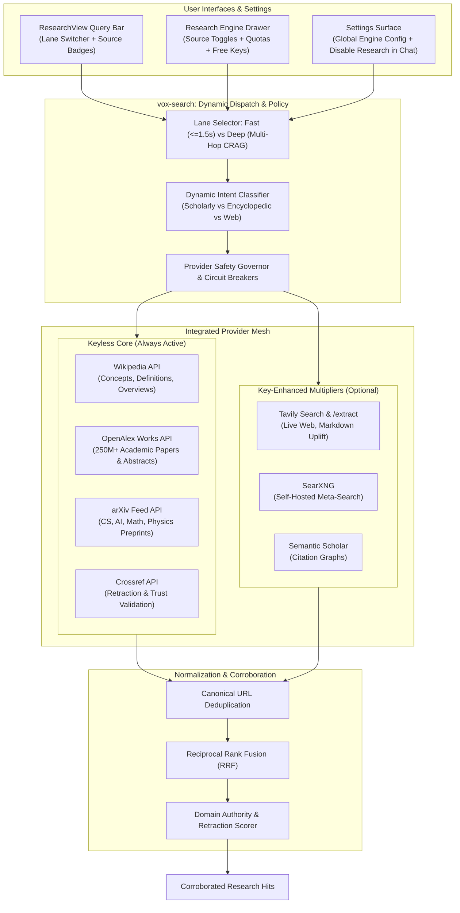

# Research Multi-Source Integration, Dual Lanes, and Free API Key Governance

## 1. Problem Statement & Motivation

### 1.1 The Fragility of the Legacy Search Cascade
Prior research retrieval in `vox-search` relied on a rigid, sequential cascade:
$$\text{SearXNG} \longrightarrow \text{Tavily} \longrightarrow \text{DuckDuckGo} \longrightarrow \text{Wikipedia}$$
In practice, this cascade frequently failed to produce grounded evidence:
1. **Unconfigured Primary Tiers**: SearXNG requires a self-hosted instance (`VOX_SEARCH_SEARXNG_URL`), and Tavily requires an API key (`TAVILY_API_KEY`), neither of which exists out of the box.
2. **Dead-Weight Instant Answer API**: The Tier 3 DuckDuckGo client queried `api.duckduckgo.com`, an Instant Answer / disambiguation endpoint. For arbitrary or technical research questions, it returns `HTTP 200` with empty topic lists (`RelatedTopics: []`). Because it returned `HTTP 200`, circuit breakers never tripped, yet zero hits were produced.
3. **Siloed Execution & Missed Corroboration**: In the rare cases where a tier returned a single low-quality hit, the cascade halted immediately, missing rich conceptual or scholarly grounding from remaining sources.
4. **All-or-Nothing Latency**: Users without keys endured sequential timeouts across multiple dead tiers before reaching Wikipedia.

### 1.2 The Vox Core Tenet: Zero-Key Baseline
Like everything in Vox, **research must function out of the box with zero API keys**. 
When a user launches Vox for the first time on any subject (software engineering, history, physics, law, or general facts), the research system must retrieve authoritative evidence, formulate citations, and corroborate claims without demanding setup or credit card entry.

### 1.3 Key Enhancement as an Explicit Multiplier
When keys (e.g., Tavily, Google Gemini, OpenRouter) are configured, they should act as **multipliers** that enrich the evidence mesh with live web scraping, deep markdown uplift, and higher rate limits. The presence of these keys, the specific enhancement they provide, and their remaining free quotas must be transparently surfaced to the user in the GUI. Furthermore, for services offering free tiers, direct, validated acquisition links must guide the user to acquire them in seconds.

---

## 2. High-Level Architecture & Principles



### 2.1 Core Architectural Principles
1. **Prune Dead Weight**: Remove the broken `api.duckduckgo.com` Instant Answer endpoint.
2. **Keyless-First Guarantee**: Built-in, high-reliability keyless providers (Wikipedia, OpenAlex, arXiv) guarantee comprehensive grounding for any query without credentials.
3. **Dual Execution Lanes**:
   * **Fast Lane**: Single-hop parallel dispatch bounded by a tight 1,500 ms deadline for conversational lookups.
   * **Deep Research Lane**: Multi-hop iterative CRAG loop with query expansion, deep web scraping, and multi-domain corroboration ($N \ge 2$).
4. **Transparent Quota Visualization**: Actively track and visualize remaining search credits and token limits on status badges.
5. **Direct Validated Acquisition**: Provide direct, one-click links to validated sign-up and key dashboards for all free-tier providers.
6. **Chat Debug Isolation**: A dedicated switch in Settings allows disabling research in chat interactions entirely for rapid offline debugging.
7. **Test-Driven Development (TDD)**: Every component is specified with unit tests and behavioral contracts before implementation.

---

## 3. Data Source Hierarchy & Dynamic Dispatch

### 3.1 Provider Specification

| Provider ID | Auth Model | Free Quota / Limits | Primary Utility | Failure Behavior |
| :--- | :--- | :--- | :--- | :--- |
| `wikipedia` | **Keyless** | Unlimited | High-level conceptual definitions, history, standards, overviews. | Fail-open (empty list on 4xx/5xx). |
| `openalex` | **Keyless** | Polite pool (100k requests / day) | 250M+ scientific papers, full abstracts, DOIs, open-access landing URLs. | Fail-open (timeout 2s). |
| `arxiv` | **Keyless** | Unlimited (polite rate limit) | Recent preprints in Computer Science, AI, Mathematics, Physics. | Fail-open (Atom parse fallback). |
| `crossref` | **Keyless** | Polite pool (user-agent header) | Validates DOIs for retractions and errata in `trust.rs`. | Fail-open (score defaults to 1.0). |
| `tavily` | **Keyed** (`TAVILY_API_KEY`) | 1,000 requests / month (Free tier, no credit card) | Live web search, current news, official docs, markdown URL extraction. | Circuit breaker (skips if key absent or cooldown). |
| `searxng` | **Keyed/Host** (`VOX_SEARCH_SEARXNG_URL`) | Self-hosted | Privacy-preserving meta-search aggregator across engines. | Circuit breaker (skips if URL unconfigured). |
| `semantic_scholar` | **Keyed/Keyless** (`VOX_SEMANTIC_SCHOLAR_API_KEY`) | 1 req/s unauthenticated; 10 req/s with free key | Academic citation graphs and paper similarity search. | Fail-open. |

### 3.2 Dynamic Intent Classification
Instead of invoking every engine indiscriminately, the dispatcher inspects the subquery:
* **Academic / Theoretical**: Queries matching patterns like `paper`, `survey`, `benchmark`, `algorithm`, `formal`, `proof`, `theorem`, `evaluation` route to **OpenAlex + arXiv + Wikipedia**.
* **Operational / Current / Syntax**: Queries matching `documentation`, `release`, `syntax`, `config`, `error`, `bug`, `changelog` route to **Tavily (if keyed) + Wikipedia + OpenAlex (technical repos)**.
* **Conceptual / General**: Route to **Wikipedia + OpenAlex + Tavily (if keyed)**.
* **Fallback Guarantee**: In a zero-key environment, all queries route across available keyless sources.

---

## 4. Dual-Lane Execution Model

### 4.1 Specification of Lanes

```rust
#[derive(Debug, Clone, Copy, PartialEq, Eq, Serialize, Deserialize)]
#[serde(rename_all = "snake_case")]
pub enum ResearchLane {
    /// Sub-second, single-hop parallel search for immediate definitions and factual lookups.
    Fast,
    /// Multi-hop CRAG iterative research with decomposition, deep scraping, and cross-source corroboration.
    Deep,
}
```

#### Lane Behavioral Contract:
1. **Fast Lane (`ResearchLane::Fast`)**:
   * Hops: Exactly 1 hop.
   * Query Expansion: None (runs the raw cleaned query).
   * Per-Engine Timeout: $1,500\,\text{ms}$.
   * Target Results: 3–5 deduplicated, high-precision hits.
   * Scraping: Disabled (engine snippets and abstracts only; zero headless rendering delay).
   * Target Total Latency: $400\text{–}1,200\,\text{ms}$.
   * Low-Evidence Guard: If evidence confidence is $< 0.35$, the UI returns the fast results accompanied by an explicit prompt: `⚠️ Low grounding evidence. [ 🔬 Re-run in Deep Research ]`.

2. **Deep Research Lane (`ResearchLane::Deep`)**:
   * Hops: Iterative CRAG loop up to $N = 4$ hops (stops when `quality >= 0.75` or hops exhausted).
   * Query Expansion: Generates 3–5 multi-faceted subqueries targeting distinct dimensions (background, implementations, benchmarks, trade-offs).
   * Per-Engine Timeout: $4,000\,\text{ms}$.
   * Target Results: 12–30+ hits.
   * Scraping & Uplift: Active markdown scraping via `scraper.rs` and Tavily `/extract` on thin snippets.
   * Corroboration: Strict multi-domain corroboration ($N \ge 2$ independent domains required for corroborated trust badge).
   * Target Total Latency: $3.5\text{–}8.0\,\text{s}$ with live stage progress streaming.

---

## 5. Dynamic Quota Tracking & Status Badges

For services with restricted free quotas, Vox dynamically reads and calculates the user's remaining balance to display on badges in real time.

### 5.1 Quota Discovery & Tracking Mechanisms

1. **Tavily Search Quota**:
   * **Persistence**: Persisted locally in SQLite (`vox_db`) via `TavilySessionBudget`. Each search call increments the local monthly counter.
   * **Reset Cycle**: Monthly calendar cadence (tracked from first recorded call timestamp).
   * **Badge Visualization**: Displays `✨ Tavily: {remaining} / 1000 searches` (e.g., `✨ Tavily: 840 left`).
   * **Exhaustion Handling**: When credits reach 0, Tavily gracefully transitions to idle; the keyless core continues without interruption.

2. **OpenRouter Tokens / Credits**:
   * **API Endpoint**: `GET https://openrouter.ai/api/v1/auth/key` with `Bearer {OPENROUTER_API_KEY}`.
   * **Payload Extraction**: Parses `data.limit`, `data.usage`, `data.limit_remaining`, and `data.is_free_tier`.
   * **Badge Visualization**: Displays `OpenRouter: Free Tier Active` or `OpenRouter: $X.XX remaining`.

3. **Google Gemini (AI Studio)**:
   * **Tracking**: Local in-memory sliding-window rate limiter in `ProviderSafetyGovernor` (15 RPM / 1M TPM).
   * **Badge Visualization**: Displays `Gemini: Active (Free Tier)`.

4. **Keyless Sources**:
   * **Wikipedia / OpenAlex / arXiv**:
   * **Badge Visualization**: Displays `✓ Wikipedia (Keyless)`, `✓ OpenAlex (Keyless)`, `✓ arXiv (Keyless)`.

---

## 6. GUI Surfaces & Interaction Design

### 6.1 Research View Query Bar (`ResearchView.tsx`)
Located directly in the primary research workspace:
* **Segmented Lane Switcher**:
  ```html
  <div class="lane-switcher">
    <button class="active">⚡ Fast (Sub-second)</button>
    <button>🔬 Deep Research (Multi-hop)</button>
  </div>
  ```
* **Active Status & Quota Badge Strip**:
  * Displays pills for all active engines.
  * Shows keyless indicators in green: `✓ Wikipedia`, `✓ OpenAlex`, `✓ arXiv`.
  * Shows key-enhanced status with live remaining quota: `✨ Tavily (840/1000 left)`.
  * If Tavily key is missing: displays a subtle action pill: `+ Tavily (Free 1,000/mo available)` which clicks directly into the drawer.
* **Configure Button (`[⚙ Sources & Keys]`)**: Opens the slide-out drawer.

### 6.2 Slide-Out Drawer: "Research Engine & Free Keys"
Divided into three distinct sections:
1. **Zero-Key Guarantee Callout**:
   * *"Vox is fully functional out of the box with zero API keys. Built-in keyless sources (Wikipedia, OpenAlex, arXiv) are currently powering your research."*
2. **Lane Controls & Timeouts**:
   * Sliders for Fast Lane timeout (500–3000ms, default 1500ms) and Deep Lane timeout (2000–10000ms, default 4000ms).
   * Checkbox toggles for each source (Wikipedia, OpenAlex, arXiv, Tavily, SearXNG).
3. **Free API Key Acquisition Hub**:
   * **Tavily Card**: Direct link `[ ↗ Get Free Key (1,000/mo) ]` opening `https://app.tavily.com/sign-up`. Inline key input and `[ Save Key ]` button writing to Clavis vault.
   * **Google AI Studio Card**: Direct link `[ ↗ Get Free Gemini Key ]` opening `https://aistudio.google.com/app/apikey`.
   * **OpenRouter Card**: Direct link `[ ↗ Get OpenRouter Key ]` opening `https://openrouter.ai/keys`.
   * **Semantic Scholar Card**: Direct link `[ ↗ Request Free Academic Key ]` opening `https://www.semanticscholar.org/product/api#api-key-form`.

### 6.3 Chat Research Isolation (Settings Surface)
In **Settings $\rightarrow$ Chat & Agent Behavior**:
* Setting: `VOX_CHAT_RESEARCH_ENABLED` (Boolean, default: `true`).
* Description: *"When enabled, the chat agent autonomously queries the research engine for external evidence. Disable this setting to run purely offline LLM chat for debugging or speed."*
* Stored in user settings and checked by `vox-orchestrator` before dispatching CRAG web-gather hops in chat.

---

## 7. Test-Driven Development (TDD) & Verification Plan

Following Vox's mandatory TDD discipline, all implementations will be developed red-green-refactor with explicit test fixtures.

### 7.1 Unit & Integration Test Matrix

```
crates/vox-search/
├── tests/
│   ├── web_dispatcher_keyless_test.rs    # Verifies Wikipedia, OpenAlex, arXiv succeed with 0 keys
│   ├── dual_lane_performance_test.rs     # Verifies Fast Lane <= 1500ms, Deep Lane multi-hop
│   ├── rrf_multi_source_fusion_test.rs   # Verifies RRF deduplication across heterogeneous sources
│   ├── quota_tracker_test.rs             # Verifies monthly usage counting and exhaustion fail-open
│   └── chat_research_toggle_test.rs      # Verifies VOX_CHAT_RESEARCH_ENABLED halts retrieval
```

### 7.2 Deterministic CI Suite (Mocked Latency & Responses)
* **`test_fast_lane_timeout_compliance`**: Simulates a 3,000 ms lagging provider alongside a 200 ms fast provider. Confirms the Fast Lane terminates at 1,500 ms with partial hits rather than hanging.
* **`test_zero_key_baseline_coverage`**: With all environment keys removed (`TAVILY_API_KEY`, `VOX_SEARCH_SEARXNG_URL`), queries for software, science, and history return non-empty, scored hits from Wikipedia and OpenAlex.
* **`test_tavily_quota_exhaustion_fail_open`**: Simulates Tavily returning HTTP 429 / quota exhausted. Verifies circuit breaker trips and keyless providers fulfill the query seamlessly.
* **`test_corroboration_scoring_multi_domain`**: In Deep Lane, hits from Wikipedia and OpenAlex covering the same fact produce `corroboration_count >= 2` and a verified trust chip.

### 7.3 Live Benchmark Suite (`--ignored`)
Run via `cargo test -p vox-search --test live_lane_benchmarks -- --ignored`:
* Executes live queries against real upstream endpoints (Wikipedia, OpenAlex, arXiv, Tavily if present).
* Emits a comparative performance table recording:
  * **Fast Lane**: Latency (ms), hit count, distinct domains.
  * **Deep Lane**: Latency (ms), hop count, total evidence snippets, corroboration percentage.
  * Asserts that Fast Lane latency is meaningfully lower ($\le 1,500\,\text{ms}$) and Deep Lane domain diversity is meaningfully higher.

---

## 8. Rollout & Migration Steps

1. **Step 1: Core Search Dispatcher Refactor (`vox-search`)**:
   * Implement `WikipediaClient`, `OpenAlexClient`, and `ArXivClient` as first-class asynchronous providers.
   * Deprecate `api.duckduckgo.com` and wire `WebSearchDispatcher` to the intent-aware parallel fan-out engine with RRF.
2. **Step 2: Dual-Lane Policy & Quota Tracking (`vox-search` + `vox-secrets`)**:
   * Add `ResearchLane` and lane timeouts to `SearchPolicy`.
   * Add metadata for free API key terms and direct acquisition URLs to `vox-secrets`.
   * Implement local monthly usage tracking in `tavily_budget.rs`.
3. **Step 3: Orchestrator & Research Shim Integration (`vox-research-shim`)**:
   * Wire `ResearchQuery.lane` through `gather_web_hits_for_plan`.
   * Implement the `VOX_CHAT_RESEARCH_ENABLED` check in `vox-orchestrator`.
4. **Step 4: GUI Surfaces (`vox-gui`)**:
   * Add the lane switcher and active quota badges to `ResearchView.tsx`.
   * Build the "Research Engine & Free Keys" slide-out drawer with direct acquisition links and key inputs.
   * Add the chat research toggle in Settings.
5. **Step 5: Automated Verification**:
   * Execute deterministic unit test suite via `cargo test -p vox-search`.
   * Run live benchmark verification and document latency and corroboration metrics.
