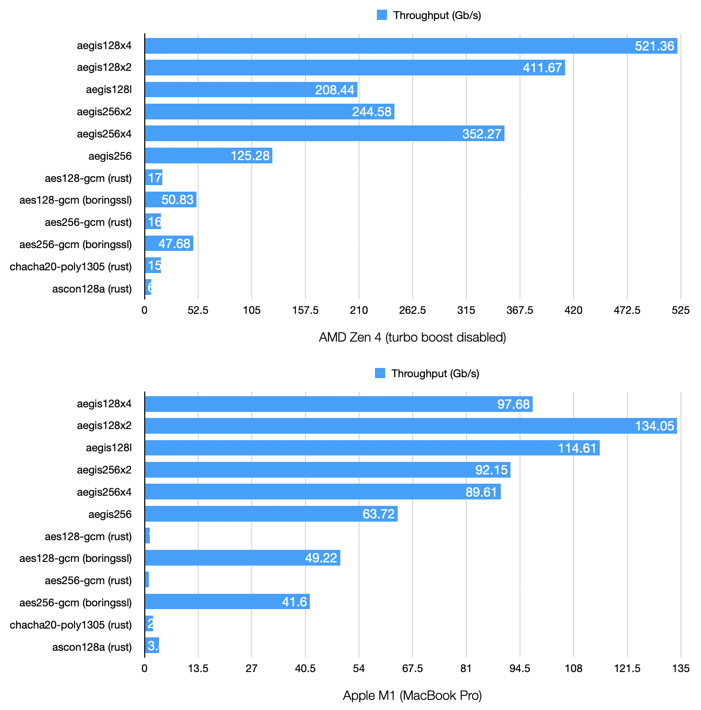
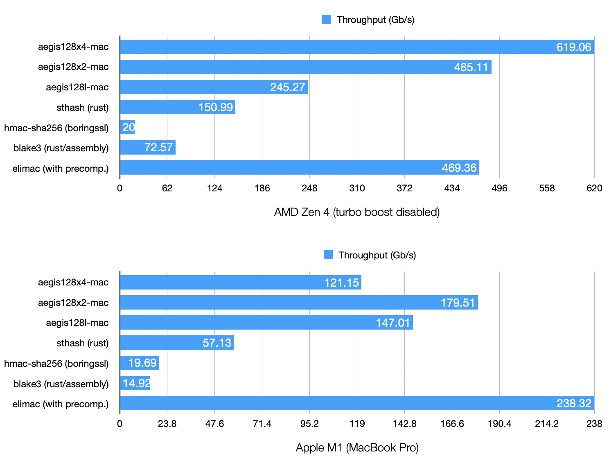
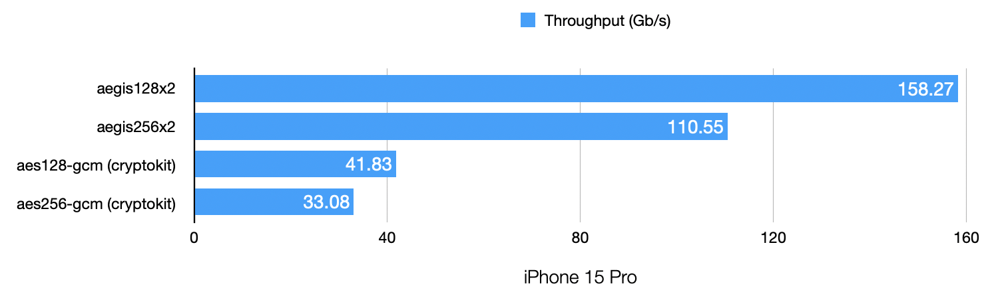

# libaegis

Portable C implementations of the [AEGIS](https://datatracker.ietf.org/doc/draft-irtf-cfrg-aegis-aead/) family of high-performance authenticated ciphers (AEGIS-128L, AEGIS-128X2, AEGIS-128X4, AEGIS-256, AEGIS-256X2, AEGIS-256X4), with runtime CPU detection.

## Features

- AEGIS-128L with 16 and 32 bytes tags (software, AES-NI, ARM Crypto, Altivec)
- AEGIS-128X2 with 16 and 32 bytes tags (software, VAES + AVX2, AES-NI, ARM Crypto, Altivec)
- AEGIS-128X4 with 16 and 32 bytes tags (software, AVX512, VAES + AVX2, AES-NI, ARM Crypto, Altivec)
- AEGIS-256 with 16 and 32 bytes tags (software, AES-NI, ARM Crypto, Altivec)
- AEGIS-256X2 with 16 and 32 bytes tags (software, VAES + AVX2, AES-NI, ARM Crypto, Altivec)
- AEGIS-256X4 with 16 and 32 bytes tags (software, AVX512, VAES + AVX2, AES-NI, ARM Crypto, Altivec)
- All variants of AEGIS-MAC, supporting incremental updates.
- Encryption and decryption with attached and detached tags
- Incremental encryption and decryption.
- Random-access encrypted file API (RAF) for building encrypted filesystems and databases.
- Unauthenticated encryption and decryption (not recommended - only implemented for specific protocols)
- Deterministic pseudorandom stream generation.

## Installation

Note that the compiler makes a difference. Zig (or a recent `clang` with target-specific options such as `-march=native`) produces more efficient code than `gcc`.

### Compilation with `zig`

```sh
zig build -Drelease
```

To build the library as a shared object using the `-Dlinkage` option:

```sh
zig build -Dlinkage=dynamic -Drelease
```

The library and headers are installed in the `zig-out` folder.

To favor performance over side-channel mitigations on devices without hardware acceleration, add `-Dfavor-performance`:

```sh
zig build -Drelease -Dfavor-performance
```

A benchmark can also be built with the `-Dwith-benchmark` option:

```sh
zig build -Drelease -Dfavor-performance -Dwith-benchmark
```

`libaegis` doesn't need WASI nor any extension to work on WebAssembly. The `wasm32-freestanding` target is fully supported.

WebAssembly extensions such as `bulk_memory` and `simd128` can be enabled by adding `-Dcpu=baseline+bulk_memory+simd128` to the command line.

### Compilation with `cmake`

```sh
mkdir build
cd build
cmake -DCMAKE_INSTALL_PREFIX=/install/prefix ..
make install
```

To build the library as a shared library, add `-DBUILD_SHARED_LIBS=On`.

To favor performance over side-channel mitigations on devices without hardware acceleration, add `-DFAVOR_PERFORMANCE`.

### Direct inclusion

Copy everything in `src` directly into your project, and compile everything like regular C code. No special configuration is required.

## Usage

Include `<aegis.h>` and call `aegis_init()` prior to doing anything else with the library.

`aegis_init()` checks the CPU capabilities in order to later use the fastest implementations.

### Encrypting and decrypting a message

```c
#include <aegis.h>
#include <string.h>

int main(void) {
    aegis_init();

    /* Use a secure random number generator for key and nonce. */
    uint8_t key[aegis256_KEYBYTES];     /* 32 bytes */
    uint8_t nonce[aegis256_NPUBBYTES];  /* 32 bytes */
    memset(key, 0x42, sizeof key);
    memset(nonce, 0x00, sizeof nonce);

    const char *message = "hello, world";
    size_t message_len = strlen(message);

    /* Encrypt (detached mode: ciphertext and tag are separate) */
    uint8_t ciphertext[128]; /* must be at least message_len bytes */
    uint8_t tag[32];         /* 256-bit authentication tag */

    aegis256_encrypt_detached(ciphertext, tag, sizeof tag,
                              (const uint8_t *) message, message_len,
                              NULL, 0,   /* no additional data */
                              nonce, key);

    /* Decrypt and verify */
    uint8_t decrypted[128]; /* must be at least message_len bytes */

    if (aegis256_decrypt_detached(decrypted, ciphertext, message_len,
                                  tag, sizeof tag,
                                  NULL, 0,
                                  nonce, key) != 0) {
        /* Authentication failed: the data was tampered with */
        return 1;
    }
    /* decrypted now contains the original message */

    return 0;
}
```

The one-shot `aegis256_encrypt()` / `aegis256_decrypt()` functions work the same way but append the tag to the ciphertext, so the output buffer must be `message_len + maclen` bytes.

All six variants follow the same API pattern -- just swap the prefix (`aegis128l_`, `aegis256_`, `aegis128x2_`, etc.) and adjust the key/nonce sizes.

### Computing a MAC

AEGIS can also be used as a standalone message authentication code. The MAC API supports incremental updates, so you can feed data in chunks.

```c
#include <aegis.h>
#include <string.h>

int main(void) {
    aegis_init();

    uint8_t key[aegis256_KEYBYTES];
    memset(key, 0x42, sizeof key);

    /* Initialize the MAC state (NULL nonce = all zeros) */
    aegis256_mac_state st;
    aegis256_mac_init(&st, key, NULL);

    /* Feed data in one or more chunks */
    aegis256_mac_update(&st, (const uint8_t *) "hello, ", 7);
    aegis256_mac_update(&st, (const uint8_t *) "world", 5);

    /* Finalize and get the 256-bit tag */
    uint8_t tag[32];
    aegis256_mac_final(&st, tag, sizeof tag);

    return 0;
}
```

The same key must not be used for both MAC and encryption. If you need to authenticate multiple messages with the same key, clone the initialized state with `aegis256_mac_state_clone()` or reset it with `aegis256_mac_reset()` rather than re-initializing.

### Random-Access File API

The RAF (Random-Access File) API lets you work with encrypted files as naturally as regular files. Read any byte range, write anywhere, extend or truncate at will, all with full encryption and authentication. Files can be arbitrarily large without ever loading them entirely into memory. This makes it straightforward to build encrypted filesystems, databases, or any application that needs to modify encrypted data in place without re-encrypting the entire file.

```c
#include <aegis.h>

// Allocate scratch buffer (can be stack, heap, or static)
CRYPTO_ALIGN(64) uint8_t scratch_buf[AEGIS128L_RAF_SCRATCH_SIZE(4096)];
aegis_raf_scratch scratch = { .buf = scratch_buf, .len = sizeof scratch_buf };

aegis128l_raf_ctx ctx;
aegis_raf_config cfg = { .scratch = &scratch, .chunk_size = 4096, .flags = AEGIS_RAF_CREATE };
aegis_raf_io io = { /* your I/O callbacks */ };
aegis_raf_rng rng = { /* your RNG callback */ };

aegis128l_raf_create(&ctx, &io, &rng, &cfg, master_key);
aegis128l_raf_write(&ctx, &written, data, len, offset);
aegis128l_raf_read(&ctx, buf, &bytes_read, len, offset);
aegis128l_raf_close(&ctx);  // automatically calls sync
```

The API requires pluggable I/O (`read_at`, `write_at`, `get_size`, `set_size`, `sync`) and RNG callbacks, making it usable with any storage backend. Callers provide a scratch buffer for internal use, enabling zero-allocation operation.

#### Merkle tree (optional)

Each chunk is already independently authenticated by its AEAD tag, so basic integrity is always guaranteed. The optional Merkle tree is a separate feature that maintains a live hash commitment over the entire file's plaintext content, updated incrementally as chunks are written or the file is truncated. This is useful when you need a single digest that represents the current state of the whole file, for instance to attest file contents to a remote party, detect out-of-band modifications (by comparing against a previously stored commitment), or anchor the file in an external data structure.

Most applications don't need this and can use the RAF API without it.

Leaf values come from your `hash_leaf` callback over plaintext chunk data. They are not the RAF per-chunk AEAD authentication tags.
Keep leaf hashing stable by depending on `chunk`, `chunk_len`, and `chunk_idx`.

`aegis128l_raf_merkle_commitment()` returns a context-bound commitment that includes the file's content, version, algorithm, chunk size, and identity alongside the structural tree root and file size.

```c
// Provide hash callbacks and a caller-allocated buffer
aegis_raf_merkle_config merkle = {
    .hash_leaf       = my_hash_leaf,       // hash plaintext chunk data (not the RAF auth tag)
    .hash_parent     = my_hash_parent,     // combine two child digests
    .hash_empty      = my_hash_empty,      // digest for missing/empty nodes
    .hash_commitment = my_hash_commitment, // hash(root, ctx, file_size)
    .hash_len        = 32,                 // digest size (8..64 bytes)
    .max_chunks      = 1024,
    .buf             = merkle_buf,
    .len             = sizeof merkle_buf,
};

// Pass merkle config when creating the RAF context
aegis_raf_config cfg = {
    .scratch = &scratch, .chunk_size = 4096,
    .flags = AEGIS_RAF_CREATE, .merkle = &merkle,
};

// After writes, verify Merkle state against current file contents or read the root commitment
aegis128l_raf_merkle_verify(&ctx, &corrupted_chunk);
uint8_t root[32];
aegis128l_raf_merkle_commitment(&ctx, root, sizeof root);
```

The tree uses a flat buffer layout with configurable hash callbacks, so it works with any hash function. `aegis_raf_merkle_buffer_size()` computes the required buffer size for a given `max_chunks` and `hash_len`.

## Bindings

- [`aegis`](https://crates.io/crates/aegis) is a set of bindings for Rust.
- [`go-libaegis`](https://github.com/aegis-aead/go-libaegis) is a set of bindings for Go.

## Libaegis TLS users

- [`fizz`](https://github.com/facebookincubator/fizz) is Facebook's implementation of TLS 1.3.
- [`picotls`](https://github.com/h2o/picotls) is a TLS 1.3 implementation in C, with support for the AEGIS cipher suites.
- [`h2o`](https://h2o.examp1e.net) is an HTTP/{1,2,3} server with support for the AEGIS cipher suites.

## Other implementations

[Other AEGIS implementations](https://github.com/cfrg/draft-irtf-cfrg-aegis-aead?tab=readme-ov-file#known-implementations) are also available for most programming languages.

Recommended for applications specifically targeting environments without AES instructions: [aegis-bitsliced](https://github.com/aegis-aead/aegis-bitsliced).

Recommended for applications targeting a specific x86_64 CPU: [aegis-jasmin](https://github.com/aegis-aead/aegis-jasmin).

The [aegis-aead GitHub organization](https://github.com/orgs/aegis-aead/repositories) also hosts AEGIS patches for [OpenSSL](https://github.com/aegis-aead/openssl) and [BoringSSL](https://github.com/aegis-aead/boringssl).

## Key differences between AEGIS variants

| **Feature**        | **AEGIS-128L**                                          | **AEGIS-256**                                           | **AEGIS-128X2**                                                           | **AEGIS-128X4**                                     | **AEGIS-256X2**                                                          | **AEGIS-256X4**                                    |
| ------------------ | ------------------------------------------------------- | ------------------------------------------------------- | ------------------------------------------------------------------------- | --------------------------------------------------- | ------------------------------------------------------------------------ | -------------------------------------------------- |
| **Key Length**     | 128 bits                                                | 256 bits                                                | 128 bits                                                                  | 128 bits                                            | 256 bits                                                                 | 256 bits                                           |
| **Nonce Length**   | 128 bits                                                | 256 bits                                                | 128 bits                                                                  | 128 bits                                            | 256 bits                                                                 | 256 bits                                           |
| **State Size**     | 1024 bits (8 x 128-bit blocks)                          | 768 bits (6 x 128-bit blocks)                           | 2048 bits (2 x 1024-bit states)                                           | 4096 bits (4 x 1024-bit states)                     | 1536 bits (2 x 768-bit states)                                           | 3072 bits (4 x 768-bit states)                     |
| **Input Rate**     | 256 bits per update                                     | 128 bits per update                                     | 512 bits per update                                                       | 1024 bits per update                                | 256 bits per update                                                      | 512 bits per update                                |
| **Performance**    | High on standard CPUs, optimized for small memory usage | High on standard CPUs, optimized for small memory usage | Generally faster than AEGIS-128L even without AVX2, even faster with AVX2 | Generally faster than AEGIS-128L, best with AVX-512 | Generally faster than AEGIS-256 even without AVX2, even faster with AVX2 | Generally faster than AEGIS-256, best with AVX-512 |
| **Security Level** | 128-bit security                                        | 256-bit security                                        | 128-bit security                                                          | 128-bit security                                    | 256-bit security                                                         | 256-bit security                                   |

## Benchmark results

AEGIS is very fast on CPUs with parallel execution pipelines and AES support.

The following results are derived from libaegis, which has been optimized primarily for portability and readability. Other implementations, such as `aegis-jasmin` or the Zig implementations, may demonstrate better performance.

### Encryption (16 KB)



### Authentication (64 KB)



### Mobile benchmarks


